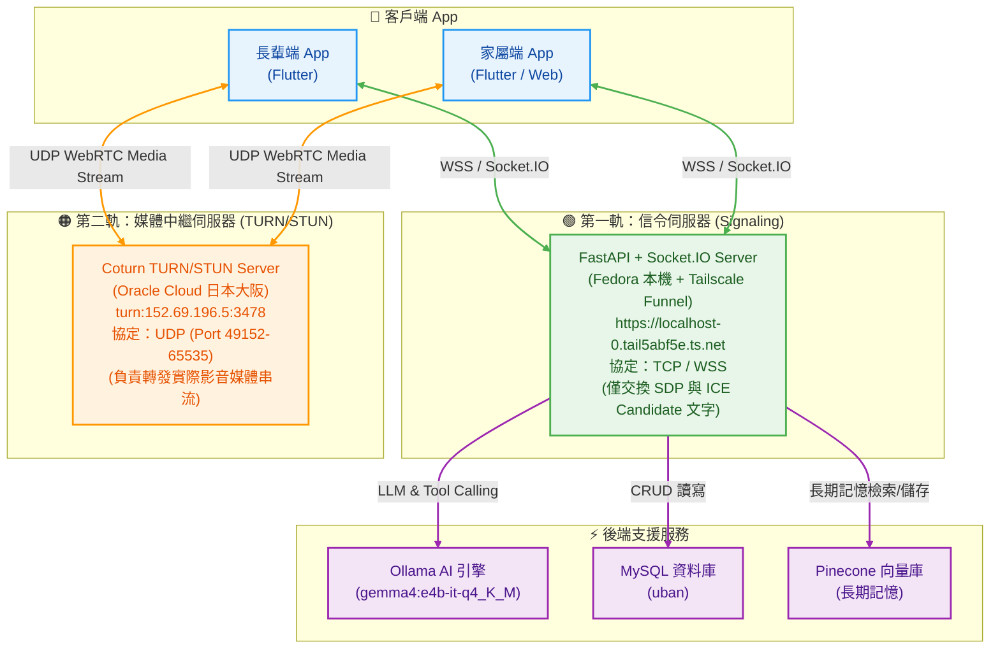

  # Uban - AI 跨世代感知照護系統

> 🏠 **AI 生成式長照陪伴生態系** - 讓科技成為連結世代的橋樑

本文件整合了 Uban 系統的完整說明，包含功能列表、安裝指南與開發文檔。

---

## 🚨 動手改「通話 / 來電通知 / 監控」之前

> **本檔對這三塊只有**功能面**的介紹（第五節、第 400 行後的更新日誌），
> 不足以據以修改程式碼。動手前必須先讀
> [`CLAUDE_call-monitor.md`](CLAUDE_call-monitor.md)——那是唯一權威，
> 含檔案地圖、Socket/FCM/prefs 資料契約、冷啟動五層兜底、
> **§5 UI 按鈕與跳轉地圖（只改 UI 也要看）**、36 條護欄、14 輪修復年表、除錯 SOP。**

本檔第 400 行之後的「更新日誌」只涵蓋到早期幾輪，**已被 §8 取代**；兩者衝突時以
`CLAUDE_call-monitor.md` 為準，而它與程式碼衝突時以**程式碼**為準。

---

## 📖 目錄

- [專案簡介](#專案簡介)
- [系統架構](#系統架構)
- [核心功能](#核心功能)
- [快速開始](#快速開始)
- [開發指南](#開發指南)
- [更新日誌](#更新日誌)

---

## 專案簡介

Uban 是一套專為銀髮族設計的 AI 陪伴照護系統，包含：

- **長輩端 App**：語音優先的 AI 對話介面
- **家屬端 App**：遠端照護管理與視訊通話
- **AI 后端**：Ollama + FastAPI 驅動的智慧陪伴引擎

---

## 系統架構

> ⚠️ **雙軌制設計**：信令 (TCP/WSS) 與媒體中繼 (UDP) 分離在不同主機上，**禁止合併**。



### 為什麼要「雙軌制」？

| 需求 | 限制 | 解法 |
|------|------|------|
| 開鏡頭需要 HTTPS 憑證 | Tailscale Funnel 免費提供 HTTPS，但**只支援 TCP** | 信令走 Tailscale (TCP/WSS) |
| 即時影像需走 UDP | TCP 封包檢查會嚴重卡頓 | 媒體走 Oracle 公網 (UDP) |

### 連線資訊

| 服務 | 類型 | 地址 | 協定 |
|------|------|------|------|
| uban-api (FastAPI 後端與信令) | Backend & Signaling | `https://localhost-0.tail5abf5e.ts.net` | TCP/WSS |
| AI Server (Ollama AI) | AI Engine | `https://boyo-desktop.tail531c8a.ts.net` | TCP |
| 媒體中繼 (Coturn) | TURN/STUN | `turn:152.69.196.5:3478` | UDP |
| Pinecone Index | Vector DB | `uban` (768 dim, cosine) | TCP |

---

## 核心功能

### 一、AI 核心引擎

#### 1. 雙軌 AI 引擎與語音合成 (TTS/ASR)

- **Ollama（主要）**：使用 `gemma4:e4b-it-q4_K_M` 模型，支援 Tool Calling
- **Gemini（備用）**：Google Gemini 2.5 Flash / 3.5 Flash API
- **TTS 語音合成引擎**：支援 `auto` (自動)、`edge` (Edge-TTS)、`piper` (離線模型)、`cosyvoice` (Zero-Shot 音色複製) 及 **`yating` (雅婷台語 TTS 轉發及自動備援)** ⭐ 新增
- **ASR 語音辨識**：本地端 Faster-Whisper (`large-v3-turbo`) GPU/CUDA 離線即時轉錄

#### 2. AI Agent 人格系統 (`server/agent/`)

| 檔案 | 用途 |
|------|------|
| **SOUL.md** | 靈魂核心：語言限制（繁體中文）、對話原則、絕對邊界 |
| **IDENTITY.md** | 角色設定：動態名稱與稱呼設定、性格、形象 |
| **MEMORY.md** | 長期記憶庫：自動追加長輩的生活事實 |
| **USER.md** | 長輩基本資訊：姓名、年齡、喜好、用藥 |
| **HEARTBEAT.md** | 主動關懷任務：早晨問候、服藥提醒等 |
| **AGENTS.md** | 運作流程：啟動順序、記憶更新原則 |

#### 3. 記憶機制

- **短期記憶**：最近 5 輪對話（10筆）
- **長期記憶**：透過 `save_elder_memory` 永久記錄至 MEMORY.md
- **自動摘要**：每 10 筆對話自動濃縮為 100 字狀態報告

#### 4. Heartbeat 主動關懷

- 每 20 分鐘自動檢查在線長輩
- 觸發條件：早晨問候、服藥提醒、久坐提醒、家屬留言通知
- 透過 Socket.io `heartbeat-message` 即時推送

### 二、AI 技能系統

> ⚠️ **校正（2026-05-30）**：實際註冊於 Tool Calling 的技能共 **8 項**，全部定義在 `uban-api/services/tools_service.py`：
> `get_elder_context`、`get_current_time`、`notify_family_SOS`、`get_weather_info`、`suggest_activity`、`record_elder_activity`、`get_family_messages`、`initiate_video_call`。
> ⚠️ **校正（2026-05-30）**：實際註冊於 Tool Calling 的技能共 **8 項**，全部定義在 `uban-api/uban-api/services/tools_service.py`：
> `get_elder_context``get_current_time` `notify_family_SOS` `get_weather_info` `suggest_activity` `record_elder_activity` `get_family_messages` `initiate_video_call`。
> 下表中其餘項目（`save_elder_memory`、`search_web`、`search_youtube_video`、`get_music_recommendations`）及 `server/skills/*.py` 路徑為**舊版規劃，尚未實裝**。

| 技能 | 描述 | 模組 |
|------|------|------|
| `get_current_time` | 獲取台灣時間 | common_skills |
| `get_weather_info` | 天氣查詢與穿衣建議 | common_skills |
| `save_elder_memory` | 🆕 記錄長輩生活事實 | common_skills |
| `search_youtube_video` | YouTube 影片/音樂搜尋 | common_skills |
| `search_web` | 🆕 Google 搜尋 | common_skills |
| `get_music_recommendations` | 🆕 歌手熱門歌曲 | common_skills |
| `get_elder_context` | 讀取長輩背景 | elder_skills |
| `notify_family_SOS` | 緊急通知家屬 | elder_skills |
| `suggest_activity` | 推薦日常活動 | elder_skills |
| `get_family_messages` | 讀取家屬留言 | comm_skills |
| `initiate_video_call` | 發起視訊通話 | comm_skills |
| `record_elder_activity` | 記錄活動與心情 | health_skills |

### 三、長輩端 App (Flutter)

#### 🌟 現行核心功能
- **無障礙極簡語音介面**：大字體、全語音優先對話介面，防誤觸極簡四分頁導覽（首頁、電話、聊天、我的）。
- **Google 助理風格全域語音喚醒與 AI 助理 (GoogleAssistantOverlay)** ⭐ 新增：
  - 支援在長輩端任何畫面喊出「Hey 嘎蛙」（或自訂 AI 名稱）自動觸發語音喚醒。
  - AI 助理開啟後會立即透過 TTS 語音朗讀回應：「怎麼了嗎 宇璿」（自動動態取得呼叫設備主人名稱與 AI 名稱設定）。
  - 提供仿 Google 助理 4 色炫彩聲波波浪動畫 BottomSheet，支援 ASR 語音輸入、即時 LLM 對話串流回傳與快捷選單卡片，並可隨時在「我的」頁面進行名稱設定與喚醒測試。
  - 具備全域音訊焦點共存模式 (`AndroidAudioFocus.none`)，全時語音監聽不會中斷長輩聆聽新聞、音樂或廣播，實現音訊播放與背景喚醒 100% 平行運作。
- **2D 賽博桌寵皮皮**：具備「拎起掙扎」體感互動、全螢幕自由行走、及與步數連動的「活力/慵懶/疲勞」心情系統。支援 Hero 動畫轉場至專屬個人屋。
- **快捷問題卡片**：一鍵發問常見問題
- **自動提醒聲光語音接收**：當遠端提醒時間到達，觸發長輩端預警音效（"喔！"）與全自動 TTS 語音朗讀提醒標題與內文。

### 四、家屬端管理

- **配對機制**：PIN 碼 + QR Code 雙軌認領
- **GPS 快速選址**：一鍵帶入行政區域
- **陪伴大腦設定**：自訂 AI 人格與長輩資料
- **PRO 進階照護訂閱**：家屬替長輩付費開通，以 RevenueCat 收費、**後端為單一真相來源**。購買前綁定 `elder_<elderId>`，訂閱掛在長輩身上；長輩端不整合購買 SDK，僅查後端解鎖（詳見 [訂閱會員系統技術設計與實作紀錄](docs/technical/SUBSCRIPTION_ARCHITECTURE.md)）
- **長輩生活動態時光牆 (Elder Life Feed)** ⭐ 優化：
  - **全動態實時主題標籤 (Topic Pulse Cloud)**：移除硬編碼範例文字，改為從長輩實際產生的影音搜尋（如：`🎵 #江蕙`、`🎵 #動力火車`）、運動作息（如：`🏃 #日常運動`）、關注新聞（如：`📰 #體育`）中 100% 零硬編碼動態萃取實時關鍵字標籤。
  - **動態主題卡片聚類**：支援新聞關注、健康運動、音樂影音娛樂點播 (`MEDIA`)、溫情陪伴，並具備全項目零遺漏 (Leftover Catch) 兜底渲染機制。
  - API 動態日誌讀取筆數擴充至 30 筆，支援多天歷史日誌篩選與即時同步。
- **遠端提醒與用藥行程管理** ⭐ 新增：
  - 支援 DatePicker 日期選擇 (`start_date`)、分類（用藥/看診/飲水/運動/叮嚀）、時間與重複頻率。
  - 三層式卡片視覺佈局，右側整合垂直居中且放大 120% 的控制 Switch 與刪除按鈕。
  - 前端 `ApiService` 支援從 Tailscale (`ts.net` 404/異常) 自動降級備援至 `http://10.0.2.2:8000` 本地伺服器。

### 五、視訊通話（雙軌制 WebRTC + 完整優化）

> 📖 這裡只列功能。實作細節、資料契約與護欄見
> [`CLAUDE_call-monitor.md`](CLAUDE_call-monitor.md)。

- **信令 (第一軌)**：Tailscale Funnel (TCP/WSS) — 交換 SDP Offer/Answer + ICE Candidate
  - **全憑證相容與自動降級**：內建 `badCertificateCallback` 相容開發端憑證；當連線遇到 SSL Handshake 異常時，Socket.IO 自動降級連線至 `http://10.0.2.2:8000`。
- **媒體 (第二軌)**：Oracle Cloud Coturn (UDP) — 轉發實際影音串流
- **WebRTC P2P**：高品質視訊、STUN + coturn TURN 雙重 NAT 穿透
- **雙通道 + 冷啟動五層兜底**：Socket.IO 即時 ‖ FCM 推播（互為備援、以 `callId` 去重）
  → CallKit ／ 通知備援 → 冷啟動五層兜底（詳見 `CLAUDE_call-monitor.md` §4）
- **緊急模式**：CCTV 監控 / 自動接聽
- **通話控制**：麥克風靜音、鏡頭開關、前後鏡頭切換、揚聲器、通話計時
- **語音模式**：長輩端按「電話」鍵撥出時雙端鏡頭預設關閉，**但仍取得 video track，
  可在通話中手動開啟升級為視訊**（2026-08-02 第十四輪；`isVideoCall` 欄位貫穿全鏈路）
- **TURN 伺服器**：Oracle Cloud coturn (152.69.196.5)，獨立公網 IP，支援跨 NAT（4G ↔ WiFi）場景
- **媒體懶加載**：進入通話頁面不自動請求權限，用戶點擊時才初始化
- **攝像頭預設關閉**：隱私優先，用戶主動開啟才傳輸影像
- **通話計時**：MM:SS 格式顯示，遠端連接時啟動

---

## 快速開始

### 環境需求

| 工具 | 版本 | 說明 |
|------|------|------|
| Python | 3.12 | ⚠️ 不支援 3.13+（eventlet 相容性） |
| Flutter | Latest | 執行 `flutter doctor` 確認 |
| Ollama | - | 遠端已部署，或本地 `ollama pull gemma4:e4b-it-q4_K_M` |

### 一鍵啟動

```bash
# macOS / Linux
chmod +x run.sh
./run.sh

# Windows PowerShell
.\run.ps1
```

### 啟動選單

| 選項 | 功能 |
|------|------|
| **[1] 🚀 一鍵啟動** | 自動檢測模擬器、連接後端 + Ollama、啟動 App |
| **[2] 🔄 熱重啟** | 快速重啟（不重新編譯） |
| **[3] 🔍 檢查後端** | 測試 FastAPI + Ollama 連線 |
| **[4] 🧹 清理程序** | 停止所有 Flutter 進程 |
| **[5] ⚙️ 自訂網址** | 使用自訂伺服器啟動 |

### 命令行參數

```bash
./run.sh -s              # 直接啟動
./run.sh -c              # 檢查後端
./run.sh -r              # 熱重啟
./run.sh -h              # 顯示幫助
```

---

## 開發指南

### 專案結構

```
Uban/
├── mobile_app/              # Flutter 前端
│   └── lib/
│       ├── services/        # API、Signaling (WebRTC + Socket.IO)
│       ├── screens/         # UI 頁面
│       │   ├── elder_screen.dart        # 長輩端通話
│       │   ├── video_call_screen.dart   # 家屬端通話
│       │   ├── family_main_screen.dart  # 家屬主畫面 (來電監聽)
│       │   ├── elder_tabs/             # 長輩端分頁
│       │   └── zen_pond/               # 魚你聊聊 UI (原禪意池塘)
│       └── globals.dart     # 全域狀態
├── webrtc_test.html         # 瀏覽器版 WebRTC 測試工具 (v1.1)
├── test_call_simulator.py   # Socket.IO 信令測試腳本
├── run.sh                   # macOS/Linux 啟動腳本
├── run.ps1                  # Windows 啟動腳本
├── .geminirules             # Gemini AI 開發規範
└── CLAUDE.md                # Claude AI 開發規範

uban-api/                    # FastAPI 後端 (獨立 Repo)
├── main.py                  # FastAPI 入口 + Socket.IO ASGI
├── services/socket_app.py   # 信令轉發伺服器
├── services/ollama_service.py # AI 引擎
└── routers/                 # REST API 路由
```

### 關鍵檔案

| 檔案 | 用途 |
|------|------|
| `lib/services/signaling.dart` | Socket.IO + WebRTC 信令 (Singleton) |
| `lib/main.dart` | App 入口 + FCM + CallKit 全域監聽 |
| `lib/globals.dart` | `pendingAcceptedCall` 全域狀態 |
| `lib/screens/elder_screen.dart` | 長輩端通話 (含 CCTV/緊急/語音模式) |
| `lib/screens/video_call_screen.dart` | 家屬端通話 (含控制列) |
| `uban-api/services/socket_app.py` | 後端信令轉發伺服器 |

### 視訊通話測試

#### 方法 1：瀏覽器測試（推薦，不需 Android 設備）

直接開啟 `webrtc_test.html` (v1.1)，支援：
- ✅ 連接 Socket.IO 信令伺服器
- ✅ 模擬 family/elder 雙角色
- ✅ TURN 伺服器獨立驗證（一鍵測試 relay candidate）
- ✅ ICE candidate 實時統計
- ✅ 強制 relay 模式（同網路也能測 TURN）
- ✅ ICE candidate 排隊機制（解決影像黑屏問題）
- ✅ ontrack fallback（保證遠端影像正確顯示）

#### 方法 2：Socket.IO 信令腳本

```bash
python3 -m venv /tmp/uban_test_venv
/tmp/uban_test_venv/bin/pip install "python-socketio[asyncio_client]" websockets
/tmp/uban_test_venv/bin/python3 test_call_simulator.py
```

> 📖 詳細說明請參考 [TEST_CALL_SIMULATOR_GUIDE.md](./TEST_CALL_SIMULATOR_GUIDE.md)

### TURN 伺服器配置（Oracle Cloud）

> ⚠️ TURN 伺服器部署在 Oracle Cloud (日本大阪)，與信令伺服器 (Tailscale) **分離**。
> Tailscale Funnel 不支援 UDP，因此媒體中繼必須使用獨立的公網 IP。

| 項目 | 值 |
|------|----|
| 主機 | Oracle Cloud Ubuntu 22.04 (日本大阪) |
| TURN URI | `turn:152.69.196.5:3478` |
| 帳號 | `uban` |
| 密碼 | `115207` |
| UDP Port Range | 49152-65535 |
| 防火牆 | iptables + VCN 安全清單已開放 |

```bash
# Oracle Cloud 主機上的 coturn 設定 (/etc/turnserver.conf)
listening-port=3478
realm=uban.turn
user=uban:115207
fingerprint
lt-cred-mech
min-port=49152
max-port=65535
```

Flutter 端已內建 Oracle TURN 作為預設值，也可透過 `--dart-define` 覆蓋：
```bash
flutter run \
  --dart-define=SERVER_IP=localhost-0.tail5abf5e.ts.net \
  --dart-define=TURN_SERVER=152.69.196.5:3478 \
  --dart-define=TURN_USER=uban \
  --dart-define=TURN_PASS=115207
```

---

## 常見問題

| 問題 | 解決方案 |
|------|----------|
| 連線失敗 | 確認 IP 匹配，使用選項 [3] 檢查 |
| 權限報錯 | 執行 `Set-ExecutionPolicy RemoteSigned` |
| Port 被佔用 | `run.ps1` 會自動清理殘留程序 |

---

## 遊戲化系統 (Feed Gawa)

### 造型分配與排行榜架構

#### 管理者端

- **UI**: `mobile_app/lib/screens/admin_appearance_screen.dart`
  - 排程設定：下次全服隨機派發時間
  - 單獨分配：指定 `elder_id` 與 `gawa_id` 強制覆寫
  - 長輩查詢：累積步數、造型清單、加成比例

- **API**: `server/routes/game_logic.py`
  - `set_distribution_time`: 寫入 `schedule_config.json`
  - `assign_appearance`: 手動指派（備份→重置步數→寫入新造型）
  - `get_admin_elder_info`: 統整長輩資料

#### 使用者端

- **UI**: `mobile_app/lib/screens/leaderboard_screen.dart`
  - 收集進度：顯示已擁有造型與總加成倍率
  - 好友排行榜：前 10 名 + 自己排名

#### 步數偵測實作建議

**推薦方案：`pedometer` 套件**（輕量、即時）

```dart
import 'package:pedometer/pedometer.dart';

late Stream<StepCount> _stepCountStream;

void initPedometer() {
  _stepCountStream = Pedometer.stepCountStream;
  _stepCountStream.listen(
    (StepCount event) {
      print("目前總步數: ${event.steps}");
      // 更新到伺服器 elder_profile.step_total
    },
    onError: (error) => print("計步器錯誤: $error"),
  );
}
```

**權限設定**：

- Android: `AndroidManifest.xml` 加入 `ACTIVITY_RECOGNITION`
- iOS: `Info.plist` 加入 `NSMotionUsageDescription`

---

## 更新日誌

> 以下標註 ✍️ 的條目是**事後從 git 紀錄與技術文件補寫的**——當時有做但沒寫進日誌。
> 第一批補於 2026-08-06，第二批補於 2026-08-13（08-06～08-12 落在 `main` 上、
> 但只寫進 `CLAUDE_call-monitor.md` 沒進本日誌的通話／監控工作）。
> 內容依 commit diff 與該文件重建，細節可能不如當事人寫得完整。

### 2026-08-12 🚨 緊急通話真正的「無條件」、APP 外拒接、雙端重撥對話框（第二十三輪）✍️

> 本輪全部是前端，後端一行未動。完整根因鏈見 `CLAUDE_call-monitor.md` §8 第二十三輪。

- **緊急通話不再讓長輩看到「拒絕」**：緊急來電有**四條互不相干的抵達通路**，
  上一輪只改了「進房之後」，但「要不要進房」的決定發生在更前面 ——
  FCM 前景備援與 `_showIncomingCallDialog` 最終防線這兩條仍會彈接聽／拒絕 dialog。
  三條 Dart 通路收斂到單一 `main.dart::_autoAcceptEmergencyCall`。
- **提示音抽成全域單例** `services/emergency_tone.dart`：現在是 `main.dart`（進房前）播、
  `ElderScreen`（進房後）停，跨兩個 widget，放在 State 欄位裡根本停不掉；
  三條通路各自 new 一個 `AudioPlayer` 還會疊音。收斂後先到者播、後到者 no-op，
  任一處 `stop()` 都停得掉（停止點共四處）。
- **來電鈴聲引錯**：音檔換成 `assets/sounds/emergency_siren.wav`
  （7 秒、960/770 Hz 救護車雙音每 0.5 秒交替，程式生成），舊的 `emergency_alert.wav` 已刪。
- **APP 外「拒絕」100% 無效、只有「接受」能用**：`bgSub` listener 本身是對的，
  問題在**壽命** —— `_showFullScreenCallkit` 一 return，FCM 背景 handler 的 Future 就完成，
  背景 `FlutterEngine` 連同 listener 一起被銷毀，而使用者是幾秒後才按按鈕。
  「接受有效、拒絕無效」正是這個 bug 的指紋（接受由 CallKit 原生層直接拉起 App）。
- **新增 `widgets/call_retry_dialog.dart`**：LINE 式「無人接聽／連線逾時」對話框，
  取代原本只存在於家屬端 `VideoCallScreen` 的內嵌失敗畫面 —— 長輩端過去只把狀態字串
  改成「對方未接聽」就返回，兩端行為不一致。現在雙端都是「重撥／離開」。

---

### 2026-08-12 🧭 graphify 結構圖導入與誤建檔案清除 ✍️

- **`graphify-out/`**：把整個專案的結構（模組、呼叫關係、跳轉）預先產成圖，
  讓 AI agent 直接讀整份結構，不必一個檔案一個檔案翻，**實測省下約 22 倍 token**。
  `Uban/` 與 `uban-api/` 兩邊各放一份、內容相同。
  ⚠️ 產圖工具（`graphifyy`）目前只裝在產出者的機器上，其他人無法在本機重跑。
- **`CLAUDE.md` 新增硬規則 10**：動到 Socket 事件、REST 端點、FCM 欄位、畫面跳轉路由、
  模組間呼叫關係等「連接與跳轉」語意時，除了回寫 `.md` 還要同步更新兩邊的 `graphify-out/`。
  純樣式改動（顏色、字體、間距、文案）不觸發。
- **清掉一批誤建檔案**：`mobile_app/` 下混進了 `150)`、`50%`、`const`、`kCallValidityMs)`、
  `k.startsWith('device_role_')).toList()` 等一批**shell 重導向打錯產生的零位元組檔**，
  本次一併刪除。（`mobile_app/false` 仍在，尚未清掉。）

---

### 2026-08-11 🎥 監控裝置管理、session 綁死與家屬端版面溢位（第十九～二十輪）✍️

> 使用者一次回報 9 項。完整根因鏈與 72 條護欄見 `CLAUDE_call-monitor.md`。

- **session 從不釋放（最嚴重，①⑤ 同一根因）**：全專案**沒有統一的 session 釋放**，
  四個登出入口各自 `prefs.remove(...)` 片段清理、漏鍵是常態；身分選擇頁更是進頁什麼都不做。
  殘留的 `user_role`／`elder_room_id` 讓 Signaling 還待在舊房間 ——
  **停在身分選擇頁也照樣會收到來電**，下次開 App 又被自動恢復導回綁死的帳號。
  → 新增 `lib/services/session_manager.dart`（權威鍵清單 `_sessionKeys`），
  四個登出入口 + 身分選擇頁全部改走它；後端補 `POST /api/pairing/session/release`。
  🚫 **刻意不用 `prefs.clear()`** —— 會連「語音喚醒開關」這種裝置偏好一起殺掉。
- **配對碼一重啟就失效**：`monitor_setup_codes` 原本是行程內 dict、兌換即 `pop`，
  後端一重啟碼就永久消失；而「不存在」與「已過期」回同一句話，使用者輸入正確的碼
  也只看到「綁定碼過期或錯誤」。改持久化到 `monitor_setup_code` 表、404／410 分開回。
- **監控裝置管理**：家屬端可改名／刪除監視機（`PATCH`／`DELETE /api/pairing/monitor_device`）。
  ⚠️ 順帶補上授權 —— **原本 DELETE 零檢查**，任何人知道 `elder_id` + `device_name`
  就能刪別人的監視機。
- **刪除後雙向同步**：新增 Socket 事件 `monitor-removed`，家屬端刪除後監控機立即
  釋放 session 並退回身分選擇畫面（上一輪只做了反方向）。
- **監控畫面拿掉「掛電話」鍵**：監控是單向觀看不是通話，掛斷的隱喻本身就錯；
  離開走左上「← 返回」。
- **麥克風常駐**：根因是長輩端全時語音喚醒有**五條會互相把對方拉起來**的自動重啟路徑，
  只擋其中幾條沒用。新增「語音喚醒」開關（**預設關閉**）放在長輩端個人設定，五條全部早退。
- **RenderFlex 溢位（黃黑斜紋）**：先用 import 可達性把範圍從 34 個名目上的家屬畫面
  收斂到實際掛在 `main.dart` 上的 9 個，掃出 28 個候選、實修 13 處 / 7 檔。
  反覆出現的形狀是 `Row` 沒有 `Expanded` + 一個長度不可控的 AI 生成徽章。
- **長輩端在 APP 內撥不出電話**：`sendCallRequest` 原本是 `void` 且不檢查連線就 `emit`，
  socket.io 對未連線的 socket 是**靜默丟棄** —— 畫面停在「撥號中」直到逾時、兩端零錯誤。
- **一端掛斷另一端還留在通話房**：`hangUp()` 原本要求 `_currentRoomId != null` 才發
  `end-call`，但接聽方某些路徑下該欄位是空的。
- **通話音量來源**：一般通話預設聽筒、視訊／緊急／監控預設擴音；圖示改 `volume_up`／
  `phone_in_talk`（原本的 `volume_off` 語意是靜音，會讓人以為按下去會沒聲音）。

---

### 2026-08-11 🩹 APP 永久白屏、監控停機的奇偶數之謎、來電有效期收斂（第二十一～二十二輪）✍️

- **無論重開幾次 APP 都是白屏（最嚴重）**：一筆**永生的毒資料** ——
  緊急通話寫 `pendingAcceptedCall` 時漏帶 `timestamp`（全專案唯一漏帶的寫入點），
  而過期判斷寫成 `ts != null && ageMs > 60000`，缺欄位時**恆為 false** →
  這筆資料永遠不會過期，每次冷啟動都重新載入同一通早已結束的通話 →
  Splash 立刻淡出（「既無動畫」）並導去一通死掉的通話（「也不跳轉」）。四層修法。
- **監控機「奇數次進入會停機、偶數次才恢復」**：不是玄學。家屬端進入監控時
  `removeTrack` 會把視訊軌從編碼器拆下，若此刻剛好有一輪 `captureFrame()` 在等原生層回傳，
  那個 Future **永遠不會完成**（不是丟例外，是卡住，`try/catch` 攔不到）→ `finally` 不執行
  → 推幀旗標永遠停在 `true` → 畫面凍住；再進一次時軌道重新掛回，卡住的 Future 才被收掉。
  修法：`captureFrame` 6 秒 / 推幀 10 秒逾時、連續 3 輪失敗重建、30 秒無成功影格看門狗。
- **來電有效期收斂**：`expiresAt` 與 FCM `ttl` 從 120 秒改為 **60 秒**；
  **緊急通話的 ttl 從 3600 秒改成 60 秒** —— 舊值代表一通緊急通話最久可以在
  **1 小時後**才彈出來電，正是「延遲來電通知」最極端的案例。
- 從監視機跳回長輩端後通話全滅、>50% 機率 ANR（孤兒 socket + 未釋放的相機）。

---

### 2026-08-13 📜 Paywall 補上免費試用揭露（上架必要條件）

> 補掉 08-10 記錄的上架缺口。Apple 與 Google 都要求在**購買前**明確揭露
> 試用期長度與試用結束後的價格，缺了會被退件。

- **資料來源分兩個平台**，兩邊擇一有值即可，都沒有就整塊不顯示
  （不會憑空生出「無試用」字樣）：
  * Google Play — `StoreProduct.defaultOption` 的 pricing phases
    （`freePhase` = 金額 0 那段、`introPhase` = 折扣價那段）
  * App Store — `StoreProduct.introductoryPrice`（`price == 0` 是免費試用，> 0 是優惠價）
- **三個地方同步揭露**：
  * 方案卡多一行綠色「免費試用 1 週」／「首 3 個月 NT$99」標籤
  * CTA 上方新增揭露框：「免費試用 1 週，之後自動以 NT$110/季 續訂。可在到期前隨時於
    Google Play / App Store 取消，取消後不會扣款。」
  * CTA 文案改為「開始免費試用 1 週」——有試用時只寫價格會讓人以為當下就要付款
  * 條款小字補上「免費試用期結束前取消不會被扣款；未取消則自動轉為付費訂閱」
- 單位換算走 `PeriodUnit` → 中文量詞（天／週／個月／年），`unknown` 時整段放棄顯示。
  iOS 的 `cycles`（以優惠價計費幾期）與 `periodNumberOfUnits` 相乘後才是總長度。
- 已是 PRO 或選取方案無優惠期時整塊不佔版面。

**🚨 模擬器實測發現：Test Store 根本不帶試用資料，所以測試環境永遠看不到揭露。**
三個產品的 `StoreProduct` 全是 `introductoryPrice=null`、`defaultOption` 只有一段全價
（`freePhase=null`、`introPhase=null`）。08-10 在 Test Store 購買視窗看到的
`Phase: $0.00 for P1W` 是**那個模擬視窗自己畫的**，不在 SDK 給前端的資料裡。

- ✅ 已驗：無資料時整塊乾淨隱藏，不留空框，CTA 維持「為宇璿開通 · $10.99」。
- ⚠️ 只用假資料驗過版面：方案卡標籤、揭露框、CTA 文案、條款小字四處都正確，
  但**真正的資料流要等換 `goog_`／`appl_` 金鑰、走 Google Play 內部測試軌再驗一次**。

> ⚠️ **開發者選項的「重設為未訂閱（測試用）」不是真的取消訂閱。**
> 它只是對後端補送一則 `EXPIRATION` webhook，把 `subscription_status` 翻成未開通，
> 方便重測 FREE 畫面。**商店不允許 App 以程式取消訂閱**——RevenueCat 那邊的訂閱仍然存在，
> 下一次續訂 webhook 進來就會再把狀態變回 PRO。真正的取消只能由使用者自己到
> Google Play / App Store 的訂閱管理頁操作。這顆鈕也只在 debug build 出現。

---

### 2026-08-10 💳 家屬端訂閱頁改版為正式 Paywall 版面

> 只動 `subscription_test_screen.dart` 的 UI，RevenueCat / 後端邏輯完全未變。

- **版面改為「官網 Pricing 頁」骨架、Uban 既有 slate + sky 配色**：
  Hero 標題 →「目前狀態」列 → 月/季/年方案卡 →「所有方案都包含」特色清單
  → 深色 CTA → 條款小字 → 開發者選項。
- **方案卡自算比價**：由 `storeProduct.price` 除以週期月數，顯示「平均每月 NT$xxx」，
  並與月繳價比較算出「省 xx%」掛在最划算的方案上；預設就選那一個。
  週期抓不到（lifetime / custom package）時自動略過比價，不會顯示錯誤數字。
- **`RadioGroup` / `RadioListTile` 換成自繪選取卡**，選中時 2px `#0284C7` 邊框 + 淡藍陰影。
- **除錯工具收進「開發者選項」ExpansionTile**（預設收合）：App User ID、SDK 權限、
  後端訂閱狀態、切換測試 User、重新整理狀態。正式使用者第一眼看不到。
- CTA 在後端已回報 PRO 時轉為綠色「進階照護已開通」並停用，避免重複下單。
- ⚠️ 特色清單目前是 UI 文案，尚未對應真正被鎖住的功能（功能鎖仍未接）。
- 開發者選項新增 **「重設為未訂閱（測試用）」**：對後端補送一則 `EXPIRATION` webhook，
  把該長輩翻回未開通，免等 Test Store 自然到期（約 5 分鐘）就能重測 FREE 畫面。
  * **只在 debug build 出現**（`kDebugMode` 是編譯期常數，release 版整段被 tree-shake）。
  * 密鑰走 `--dart-define=REVENUECAT_WEBHOOK_SECRET=xxx`，**defaultValue 一律留空**——
    這把是後端擋偽造開通用的，編進 APK 等於任何人都能替任意長輩開通 PRO。
  * **這不是真的取消訂閱**：商店不允許 App 以程式取消，RevenueCat 那邊訂閱仍在，
    下次續訂 webhook 進來就會再變回 PRO。真正的取消要使用者自己到商店操作。
- 模擬器實測（Pixel_9a + Test Store）：抓到後台 3 個 product，比價計算正確
  （季繳每月 $3.66 < 年繳 $3.83，故「省 27%」與預設選取落在季繳）、
  點擊切換與 CTA 金額連動、401 錯誤處理有明確提示。
- `flutter analyze lib/screens/family/subscription_test_screen.dart` — **No issues found**。

---

### 2026-08-10 🐛 RevenueCat webhook 自 07-30 起全數 500（`entitlement_ids` 未定義）

> 做上面的訂閱頁驗收時發現。**影響正式環境**：`subscription_status` 從 2026-07-30 之後
> 就沒有再成功更新過，等於購買後長輩端永遠不會解鎖 PRO。

- **根因**：`uban-api/routers/subscription.py` 的 `revenuecat_webhook()` 在第 182 行使用
  `entitlement_ids`，但它的賦值 `entitlement_ids = event.get("entitlement_ids") or []`
  在 2026-07-30「Task 6」重構時被誤刪（原始 commit `40d0b34` 是有的）。
  → 任何**非 TEST** 且 `app_user_id` 為 `elder_` 開頭的事件都會 `NameError` → 500。
  TEST 事件在第 170 行就 return，所以後台「Send test event」看起來正常，掩蓋了問題。
- **佐證**：模擬器查到 elder_6160 的 `expires_at` 停在 `2026-07-29 10:57:22`，
  正是最後一次端到端驗證那天；`5accbdb`（含此缺陷）已在 `origin/main` 上。
- **修復**：補回被刪的那一行，並加註解標明不可再移除。`python -m py_compile` 通過。
- **補上迴歸測試** `uban-api/tests/test_subscription.py`（21 passed）。
  已用「把那行再刪掉」反證：測試會變成 **9 failed**，涵蓋所有真實事件路徑。
  * 特別注意 `test_test_event_does_not_touch_db` 的註解：TEST 事件在函式很前面就
    `return`，**碰不到** `entitlement_ids` 那段——這正是後台「Send test event」
    全綠卻掩蓋了 bug 的原因。**「TEST 通過」永遠不能當成 webhook 正常的證據。**
- ⚠️ **尚未驗證線上**：webhook 有設 `REVENUECAT_WEBHOOK_SECRET`（探測回 401，
  代表防偽造那道防線是好的），無密鑰無法從外部確認；需部署後補一次真實購買驗證。

---

### 2026-08-10 🔧 `main` 自 f3a1070 起編譯不過（已於 08-11 修復）

> `main`（當時 == `a2f14ce`）自 `f3a1070`
> （Merge branch 'monitor-newtool' into feat/family-side-design）起就**編譯不過**，
> `flutter analyze lib` 有 **59 個 error**。那次合併沒解乾淨，兩個父版本的內容被
> 整段疊在一起。任何人從 main 開分支都會繼承。

| 檔案 | 損壞 |
|------|------|
| `services/api_service.dart` | 兩處方法被縫錯（`openAudioBridge` 尾巴接到 `getElderMoodInsight` 頭上、`getElderActivityLogs` 收尾被 `checkAudioBridge` 註解切斷），四個方法都解析不出來 |
| `screens/family/family_interaction_tab.dart` | 兩邊各自新增了一份 `initState`/`didUpdateWidget` 被疊在一起；1354 行起括號大量不配對 |
| `screens/elder_pairing_display_screen.dart` | `bool isMonitor;` 宣告被吃掉 → 10 處 undefined |
| `screens/family_main_screen.dart` | `String? _elderSocketId;` 宣告被吃掉（3 處 undefined）、`family_subscription_screen.dart` 的 import 被吃掉 |

- 上述四檔已由 `2284952`（2026-08-11「監控跟部分 bug 修復」）在 `main` 上修復。
  `payui-update` 分支上另有一套獨立修法，合併時**一律採用 `main` 這邊的版本**。
- **教訓**：合併衝突若沒解乾淨，`git` 不會有任何警告，只有 `flutter analyze` 會看出來。
  合併通話／家屬端相關檔案後，**務必跑一次 `flutter analyze lib` 再推**。

### 已知缺口（本次發現，未處理）

- **免費試用沒有揭露**：Test Store 購買視窗顯示 `sub3month` 有 `Phase: $0.00 for P1W`
  （一週免費試用），但 Paywall 完全沒顯示。Apple / Google 都要求在購買前明確揭露
  試用期與後續價格，上架前必須補（`StoreProduct.introductoryPrice` /
  `defaultOption.freePhase` 可取得）。

---

### 2026-08-06 🌐 AI Hub 改走 Tailscale HTTPS 網域 + 多候選降級 ✍️

- AI Hub 位址從寫死的 LAN IP（`192.168.31.209`）改為 Tailscale 網域
  `boyo-desktop.tail531c8a.ts.net`，並讓 `localAiBaseUrl` 自動判斷：
  帶 `http(s)://` 前綴就直接用、含 `ts.net` 走 HTTPS、其餘才補 `:8000`。
- `aiChat` / `aiChatStream` 改為**多候選位址依序降級**（Tailscale HTTPS → LAN IP →
  模擬器 `10.0.2.2`），讓 AI 聊天在區網與模擬器上都連得到。

---

### 2026-08-06 💬 AI 對話歷史持久化與 YouTube 播放修復 ✍️

- **對話歷史持久化**：AI 聊天記錄改為保存，重開 App 不再從零開始。
- **YouTube 全螢幕返回迴圈修復**：全螢幕播放時的返回手勢會卡在迴圈裡，已修正。

---

### 2026-08-06 🔐 機構管理端加上三角色權限分層

> 機構員工分 **管理員／督導／照服員**，登入後看到的東西不一樣。

原本只有「寫入」分權（排班、員工、審核換班要督導以上），**讀取沒有分**——
任何一位照服員都能看到全機構長輩的病史用藥與同事工時。現在收斂為：

- **照服員**：只看得到自己主責的長輩與自己的任務，總覽／護工頁不開放
- **督導**：全機構資料 ＋ 排班派工
- **管理員**：再加上員工帳號管理

班表刻意維持全員可見，方便同事之間互相頂班。
另外長輩清單改為依風險整列染色，高風險一眼看得出來。

實作與完整權限矩陣見 `uban-api/readme.md` 的同日更新日誌，
以及 `uban-api/uban-admin/README.md`。

---

### 2026-08-05 🎥 監控與 YOLO 更新 ✍️

CCTV 監控與 YOLO 跌倒偵測的一輪更新（後端對應 `uban-api` 的
`services/yolo_alert_dispatcher.py` 與警報端點）。

> 這段期間另有五輪通話／監控修復落在 `main` 上，當時只寫進
> `CLAUDE_call-monitor.md` §8，本日誌僅此一條帶過。完整內容見該文件：
> **第十四輪**（08-02，新版長輩端 UI 融合後的四項缺陷）、
> **第十五輪**（08-04，九項稽核：CCTV / YOLO / 訂閱）、
> **第十六輪**（08-05，家屬→長輩三態全滅：角色鍵分歧）、
> **第十七輪**（08-05，連線可靠性、監控可用性、跌倒測試、全面安全稽核）、
> **第十八輪**（08-05，音訊輸出、冷啟動速度、通話結束提示、鎖屏接聽、監控清單）。

---

### 2026-08-03 🏥 機構管理端網頁（賣給日照中心的 B2B 對外儀表板）

> Uban 從「兩個 App」擴成「兩個 App + 一個機構管理網頁」。
> 機構人員在桌機上檢視旗下所有長輩的圖表化數據，並管理護工排班與派工。
> 完整技術設計見 [機構管理端網頁技術設計與實作紀錄](docs/technical/INSTITUTION_PORTAL.md)。

**這是系統第一次把真實資料聚合成圖表**

在此之前，家屬端的 `health_trends_screen.dart`、`emotion_timeline_screen.dart`、
`alert_center_screen.dart` 全都是 `_generateMockData()` 的假資料，後端沒有任何
聚合端點。本模組把 `activity_log`／`call_record`／`emergency_alerts`／
`subscription_status` 真的聚合起來畫成圖。

**新增內容**

| 面向 | 內容 |
|------|------|
| 資料庫 | 新增 8 張表：`institution`、`care_staff`、`institution_elder`、`staff_elder_assignment`、`care_shift`、`shift_swap_request`、`care_task`、`elder_daily_step`。migration 放 `uban-api/scripts/migrations/001_institution.sql`，開機冪等執行 |
| 認證 | `uban-api/auth_staff.py`。機構員工 JWT 帶 `typ:"staff"`，與家屬端 token **完全分離**，家屬 token 打機構端點必定 401 |
| 後端 | `routers/institution.py`（認證＋唯讀統計）、`routers/institution_ops.py`（排班派工寫入）、`routers/institution_common.py`（跨機構越權守衛） |
| 前端 | `uban-api/uban-admin`（React + Vite + TypeScript + Recharts），9 個頁面。正式環境由 FastAPI 掛在 `/admin`，與 API 同源 |
| 步數歷史 | 新增 `elder_daily_step`。`elder_profile.step_total` 會被 `do_distribute_appearances()` 歸零，原本畫不出趨勢；`game.py` 三個計步端點現在共用 `_record_daily_steps()` 同步累積逐日快照 |
| 示範資料 | `scripts/seed_demo_institution.py`：一間機構、8 位員工、20 位長輩、90 天歷史、4 週班表。冪等且可 `--purge` 完全清除 |
| 部署 | `Dockerfile` 加 node build stage 自動建置前端；`deploy.yml` **不需改動** |

**跨機構隔離**：所有端點一律以 token 內的 `institution_id` 過濾，不接受呼叫端傳入；
查別家機構的資料回 **404 而非 403**（403 等於確認 ID 存在，可用來列舉）。

**驗證**：`tests/test_institution.py` 22 passed（對線上 MySQL）；
九個頁面在亮／暗主題、1280／1600 寬皆逐一人工確認；
Dockerfile 的 webbuild stage 已在乾淨目錄乾跑過（`npm ci` → 複製原始碼 →
`npm run build`），並確認產物內是同源 `/api` 而非開發用網址。

⚠️ **尚未實際部署**。另注意 `deploy.yml` 是 `set -e` 且 `podman build` 在
`podman rm` **之前**，所以萬一前端建置失敗，只會讓部署不生效（Actions 紅字），
**舊容器會繼續跑，API 不會斷**。

---

### 2026-08-01 ✨ 家屬端玻璃擬態改版與真實數據對接 ✍️

- **長輩時光牆重構**：改為 Luxury Glassmorphism 介面，掃除原本的純文字牆與重複時間軸。
- **最新警示區塊**：重構為暗黑極光玻璃風格，關懷卡改為動態對接、
  優化「當日真實日誌」的相符演算法。
- **氣象台與全模組真實數據對接**：新增動態累積步數統計、關懷卡互動與警示預覽。
- **視訊修復**：修好合併後「App 內長輩端無法打給家屬端」。

---

### 2026-07-29 💳 PRO 進階照護訂閱前後端接通（RevenueCat + 後端單一真相來源）

> **家屬替長輩訂閱**的完整鏈路打通並通過端到端驗證。分支 `payment-test` 已合併。
> 完整技術設計見 [訂閱會員系統 (RevenueCat) 技術設計與實作紀錄](docs/technical/SUBSCRIPTION_ARCHITECTURE.md)。

**為什麼後端要當單一真相來源**

家屬付錢、長輩使用，跨帳號又跨裝置——長輩那台根本沒有 RevenueCat SDK 快取可讀。因此一律以
後端 `subscription_status` 表為準，RevenueCat 透過 Webhook 把狀態推進來，兩端都只查後端。

**後端 (uban-api)**
- 新增 `routers/subscription.py`：
  - `POST /api/revenuecat/webhook`：驗證 `Authorization` secret（失敗 401）→ 解析 `app_user_id` 的 `elder_<id>`
    → 以 `(elder_id, entitlement)` 唯一鍵 upsert。`EXPIRATION`/`REFUND` → `is_active=0`，其餘 → `1`
    （`CANCELLATION` 只是關閉續訂，到期前仍有存取權）。`TEST` 事件與非 `elder_` 綁定一律略過但回 200，避免 RC 重送風暴。
  - `GET /api/subscription/{elder_id}`：回傳 `is_pro = is_active AND expires_at > NOW()`。
  - ⚠️ 此端點為 **POST-only**，用瀏覽器開會得到 `405 Method Not Allowed`，屬正常。
- 新增資料表 `subscription_status`（InnoDB、兩條外鍵、`UNIQUE(elder_id, entitlement)`）。

**前端 — 共用**
- 新增 `lib/services/subscription_service.dart`：封裝查詢、60 秒快取、失敗一律回未訂閱（後端掛掉不擋 App）。
  `appUserIdFor(elderId)` 是 App User ID 格式的單一來源。**刻意不 import `purchases_flutter`**，
  長輩端才能只讀狀態、不背購買 SDK。

**前端 — 家屬端**
- `subscription_test_screen.dart`：改為綁定實際長輩（`elder_<id>`），身分不符會自動 `logIn` 換過去；
  購買後每 2 秒重查後端（最多 5 次）等 webhook 送達；狀態卡並列顯示「SDK 狀態」與「後端訂閱狀態」。
- `family_main_screen.dart`：AppBar 皇冠入口帶入當前長輩 `elderId`。

**前端 — 長輩端**
- `elder_home_tab.dart`：首頁會員徽章改由後端驅動。**只做「金豬」一階**——已開通才顯示金豬會員膠囊，
  未開通整個不顯示；**不做銀豬 / 銅豬分級**（原本寫死固定顯示金豬）。

**驗證結果**
- 後端 7 項 `curl` 測試全通（含 401 防偽造、`EXPIRATION`/`RENEWAL` 翻轉、upsert 不重複、非 elder 略過）。
- 真實 Test Store 購買 → SDK 轉 PRO → 後端狀態列轉 PRO → DB 收到 RevenueCat 產生的 event UUID。
- 長輩端徽章正反向皆正確（開通亮起 / 到期後重啟消失）。
- `flutter analyze` 無新增問題。

**尚未完成**
- **功能鎖還沒接**：目前只驅動徽章，尚無 PRO 專屬功能被實際鎖定，待定義 PRO 功能清單。
- Webhook 亂序重送的時間戳保護、後端 `tests/test_subscription.py` 尚未補。
- 上架前 `test_` 金鑰須換為 `goog_` / `appl_`。
- Test Store 訂閱僅約 5 分鐘到期，測試時徽章自然消失屬正常。

---

### 2026-07-28 🗂️ 家屬端生活足跡：分類卡片、關鍵字雲與日期篩選 ✍️

- **全部足跡模式**：新增預設模式，完整呈現長輩歷來所有活動紀錄與主題。
- **主題分類卡片**：時間軸與主題分類極光卡片整合，附詳情 bottom sheet；
  卡片內文與副標題改為 **100% 由長輩真實活動日誌動態合成**（不再寫死）。
- **話題關鍵字雲**：升級為近 50 筆日誌 ＋ AI 後端動態加權萃取。
- **雙向心意互動**：家屬可回應長輩的活動。
- 日期篩選 chips ＋ 日期選擇器、冗長日誌文字摘要化並可展開完整對話、
  時間戳記改相對格式（今天／昨天／歷史日期）。

---

### 2026-07-26 🌌 家屬端首頁改版（AI 心情雷達 / 破冰卡片 / 回憶膠囊）✍️

- 新增 **AI 心情雷達**、**破冰卡片**、**長輩生活足跡**、**回憶膠囊** 四個區塊，
  並與後端 API 動態綁定。
- 全頁背景與底部列統一為暗色太空主題，心情雷達與生活時間軸改霓虹暗色玻璃擬態。
- 新增下拉更新（RefreshIndicator）。

---

### 2026-07-23 🔗 AI 聊天可點連結直達新聞與視訊 ✍️

- **聊天泡泡內可點連結**：AI markdown 回覆中的新聞與視訊通話連結可直接點擊開啟。
- **精準跳轉**：解析分類與新聞 ID，直接落在 `NewsListenPlayerScreen` 的該則新聞。
- **TTS 改直接 URL 串流**：不再下載 base64 再播，改為直接串流播放。
- 新增防抖鎖與載入提示，避免重複導航到新聞播放器。
- 新聞觀看行為回寫後端，供 AI 做個人化新聞推薦。

---

### 2026-07-20 🎙️ 語音鏈路改為自製錄音 + Whisper ASR ✍️

- **取代 `speech_to_text`**：改用自製 `AudioRecorder`，上傳到本機 AI Server 的
  Whisper ASR 轉寫。
- **轉寫後先填入輸入框**：切到鍵盤模式讓使用者確認後再送出，不再直接發送。
- **TTS 播放與國台語切換**：聊天室標頭新增語言切換。
- AI 聊天改 **SSE 串流 ＋ markdown 渲染**；修復 `_isThinking` 未重置導致的畫面凍結。

---

### 2026-07-15 🎨 長輩端 UI 全面改造（統一設計語言 + 毛玻璃 + 適老化）

> **只改 UI、不動功能邏輯**（WebRTC 信令 / 背景 GPS / API service / 登入-CCTV 路由全程未修改）。分支 `newui`。客群定位：**不太會用手機的獨居長輩**。

**設計系統**
- 新建 `lib/theme/app_theme.dart`：集中 design tokens（`AppColors` 主色統一 teal `0xFF59B294`、`AppSpacing`、`AppRadius`、`AppTextStyles`、適老化 `ElderScale`）＋ `buildAppTheme()`，`main.dart` 套用。
- 家屬端主色 `0xFF2563EB` 藍 → teal `0xFF59B294`（全專案 35 處統一）。
- 新增毛玻璃元件 `lib/widgets/glass_card.dart`（BackdropFilter 模糊＋半透明＋細白邊）。

**移除項目**
- 移除養豬系統 UI：桌寵 `DesktopPet`、遠征撿寶、個人頁遊戲入口卡（寵物/game 相關檔案保留為死碼，未刪）。
- 移除長輩個人頁「地圖/移動軌跡」UI（`_buildRealMap`），**保留**背景 GPS/`_routePoints`/上傳邏輯；步數環、距離、熱量等活動量保留。

**長輩端首頁 `elder_tabs/elder_home_tab.dart`**
- 三層堆疊封面：第一層 teal `55B695→FFFFFF`、第二層 `DFFFF4→FFFFFF`（偏左露圓角）、第三層內容 sheet `DDE6DE`（圓角 20）。
- 右上浮動**會員徽章 + 使用者頭像**：金/銀/銅豬徽章 `assets/images/pig_badge_gold|silver|bronze.png`（目前固定「金豬會員」）、頭像 `assets/images/user_avatar.png`。
- 毛玻璃日期卡；**單一大頭條新聞卡**（優先挑有圖新聞當背景、「點我聆聽」膠囊、整卡點擊→聆聽頁、「看更多新聞」→聆聽頁自動展開列表面板）。移除輪播控制與自動跳頁，新聞抓取/TTS 保留。清理約 1100 行死碼。

**長輩端導覽與分頁 `elder_home_screen.dart`**
- 底部導覽列改「圖示 + 大字標籤」，4 分頁 `首頁 / 電話 / 聊天 / 我的`（bar 固定、只換內容）。
- **電話分頁** = 新畫面 `friends_screen.dart`（好友列表，每位家人右側「電話(語音)＋視訊」圓鈕，沿用 `ElderScreen` 通話入口）。
- **聊天分頁** = 新畫面 `elder_chat_screen.dart`：AI 名「**小嘎**」，一般泡泡聊天（沿用 `ApiService.aiChat`）、無標題無頭像、平底背景，**WeChat 式「按住　說話」語音輸入**（沿用 `speech_to_text`，按住時上方即時顯示辨識文字，放開送出）＋鍵盤切換。
- **原「魚你聊聊 / 禪意池塘」`zen_pond/` 程式碼完整保留、未刪**，只是不再掛在聊天分頁（切回法見上文螢幕列表註記）。
- 長輩個人頁 `elder_profile_tab.dart`：**登出鈕固定畫面最底**（避開浮動導覽列）。

**待接後端**（見上文「🔌 待接後端資料」）：會員等級、健康資料、步數/活動量同步（長輩端與子女端共用）。

**子女端**：本次未改動。

---

### 2026-07-14 🔑 長輩端登入 / Session / CCTV 五項修復 ✍️

長輩端登入流程、Session 保存與 CCTV 監控模式的一輪修復，
並在 `ElderScreen` 的 CCTV 監控模式新增登出按鈕。

---

### 2026-07-10 📞 通話穩定性長期修復（第一～十三輪）✍️

> 07-10 至 07-27 之間針對「來電收不到 / 接聽進不了視訊房 / 雙端未同步終止」
> 做了十三輪修復，橫跨 Flutter 與後端 `socket_app.py`。

因為輪次多且互相牽連，**完整根因鏈與修改位置記在 `CLAUDE.md` 第 5 節「Fix Records」**，
那裡也列出了不可單點修改的護欄清單（目前 26 條）。這裡只留指標，避免兩份文件不同步。

---

### 2026-06-11 📞 通話/監視器/綁定 15 項問題修復

**修復來電與視訊通話流程、新增「監視器」角色、修正監控配對與一鍵監看、修復解除綁定按鈕，並補強多處黑/白屏的安全導航。**

> ⚠️ **前提限制**：本次修復**不涉及伺服器與資料庫連線設定**（`.env`、`database.py` 連線邏輯、Tailscale Funnel、TURN IP/帳密、Port 8000/3306/3478 等均未變動）。`socket_app.py`、`pairing.py` 僅做事件處理/查詢邏輯調整，未動連線層。

#### 🅰️ 原生層與背景喚醒

1. **重複 App 實例**：`AndroidManifest.xml` 的主 Activity 設定 `android:launchMode="singleTask"`，避免 CallKit 接聽來電時從背景再啟動第二個 Activity 實例。
2. **接聽後直接進入視訊房間（含緊急通話）**：
   - `main.dart` 的 `_firebaseMessagingBackgroundHandler` 針對長輩端的一般來電與緊急來電，皆會先寫入全域 `pendingAcceptedCall`，緊急來電另外透過 AndroidIntent 強制喚醒 App；家屬端一般來電僅顯示 CallKit、不強制喚醒（對應第 14 項）。
   - `splash_screen.dart` 新增 `_resolveElderDestination()`：在「導航當下」重新檢查 `pendingAcceptedCall`，若有待接聽來電則直接導向 `ElderScreen(initialCallData: ...)`，略過長輩主畫面，模擬「像緊急來電一樣直接進房」。
   - `main.dart` 的 `_navigateToVideoCall()` 新增以 `Signaling().lastProcessedCallId` 比對的去重判斷，避免冷啟動時 `_checkInitialCall()` 對已處理過的來電重複寫入 `pendingAcceptedCall`，導致通話結束後被誤判為新來電。

#### 🅱️ 視訊通話流程

3. **緊急通話掛斷後黑屏**：`elder_screen.dart` 的掛斷流程在非 CCTV 模式下改用新增的 `safeNavigateBack(context, fallbackScreen)`（定義於 `globals.dart`）——若導航堆疊可 `pop` 則返回上一頁，否則 `pushAndRemoveUntil` 到 `ElderHomeScreen`，避免「無上一頁可回」造成黑屏。
4. **一般／緊急通話房間互斥**：後端 `socket_app.py` 以 `comm_elder_{elder_id}` / `monitor_elder_{elder_id}` 區分雙向通話與單向監控房間，並透過 `has_comm_elder_device()` 等輔助函式判斷裝置應歸屬的房間與角色，避免一般通話與緊急通話互相干擾。
5. **家屬端 WebRTC 連線後斷線**：`video_call_screen.dart` 的 `onConnectionLost` 在偵測到無法復原的中斷（超過 `signaling.dart` 內建 2 秒重連寬限期）後，提示「連線中斷，通話已結束」並安全結束畫面。
9. **長輩端前後鏡頭切換**：`elder_screen.dart` 新增切換鏡頭按鈕，呼叫 `Helper.switchCamera(track)`（flutter_webrtc）切換前/後鏡頭。
10. **黑/白屏安全導航回首頁**：新增 `globals.dart` 的 `safeNavigateBack(context, fallbackScreen)` 通用導航輔助函式，套用於 `elder_screen.dart` 共 5 處（通話被拒接、連線中斷、一般掛斷、緊急掛斷等），canPop 時返回上一頁，否則安全導向 `ElderHomeScreen`／`ElderScreen`，避免卡在無回應的黑/白畫面。`video_call_screen.dart`／`camera_screen.dart` 皆固定由既有畫面 `Navigator.push` 進入，`canPop()` 恆為真，故無需額外處理。
11. **切換關照長輩後來電顯示錯誤名稱**：後端 `socket_app.py` 於轉發 `call-request` / `emergency-call` 時一併帶上 `senderName`；前端 `signaling.dart` 的 `CallRequestCallback` typedef 新增可選參數 `[String? senderName]`。本次一併修正先前未同步更新型別簽名、導致 `flutter analyze` 報錯的 9 處 callback（`main.dart`×3、`elder_home_screen.dart`、`family_dashboard_screen.dart`×2、`family_dashboard_view.dart`×2、`family_main_screen.dart`、`socketio_test_screen.dart`×3）。
15. **通話拒接/忙線時呼叫端正確收尾**：`elder_screen.dart`（長輩為呼叫端）與 `video_call_screen.dart`（家屬為呼叫端）的 `onCallBusy` 回呼皆會停止通話計時器、提示「對方目前無法接聽通話」並安全結束等待畫面。

#### 🅲 監視器角色與配對

6. **監視器配對碼產生失敗／白屏**：根因為兩個獨立 bug——
   - `api_service.dart` 的 `createMonitorSetup` / `resolveMonitorSetup` 呼叫的 URL 缺少 `/pairing` 前綴（`/api/monitor_setup` → 應為 `/api/pairing/monitor_setup`），導致 404。
   - 後端回傳欄位為 `code`，但前端 `resolveMonitorSetup` 送出的請求欄位是 `pairing_code`、`family_interaction_tab.dart` 讀取回應時也讀取 `data['pairing_code']`（恆為 null）。三處欄位/路徑已全部修正為 `code` 與正確路徑。
7. **新增「監視器」角色**：原本 `role_selection_screen.dart` 已有完整的監視器配對流程，但從未被導航使用（孤兒畫面）。新增 `monitor_pairing_screen.dart`，在 `identification_screen.dart` 的角色選擇頁新增第三張「我是監控設備」卡片導向此頁。輸入家屬產生的 6 位數綁定碼後，呼叫 `ApiService.resolveMonitorSetup`，並寫入與一般長輩端**相同**的 SharedPreferences 欄位（`caregiver_id`、`caregiver_name`、`user_role`、`elder_room_id`、`saved_device_name`、`saved_is_cctv`、`access_token`），確保 App 重啟後 `splash_screen.dart` 能正確還原為監控機模式並進入 CCTV 版 `ElderScreen`。
8. **單向視訊監控畫面**：`camera_screen.dart` 的 `onElderDevicesUpdate` 原先讀取不存在的 `monitors.first['socketId']`（恆為 null，導致 `createOffer` 從未被呼叫）。後端 `socket_app.py` 的 `elder-devices-update` 實際以 `id` 作為裝置 socket id 欄位，已修正為 `monitors.first['id']`。
12.（同上方第 9 項，前後鏡頭切換亦適用於監視器設備的長輩端 `ElderScreen`）
13.（見下方「🅳」）— 移除「預留方案B」徽章：刪除 `family_interaction_tab.dart` 中「遠端視訊監控」旁多餘的「預留方案B」灰色徽章。

#### 🅳 解除綁定

13. **「解除與此長輩的綁定關係」按鈕無作用**：`family_data_tab.dart` 的 `_navigateToElderEdit()` 中 `onUnbind` 回呼原本只是 `Navigator.pop` 後刷新，未呼叫任何 API。已比照 `family_settings_view.dart` 既有的 `_showUnbindConfirmDialog` 寫法，新增確認對話框（顯示長輩姓名與「永久刪除、無法復原」警語），確認後呼叫 `ApiService.unbindElder(widget.userId, widget.currentElder!.id)`，成功後顯示提示並呼叫 `widget.onElderUpdated!()`（觸發 `FamilyMainScreen._refreshElders()` 重新整理長輩列表與目前選中的長輩）。
   - 後端 `routers/pairing.py` 的 `unbind_elder` **維持原有完整刪除邏輯**（級聯刪除 `call_record`／`activity_log`／`elder_fellowship_data`／`elder_talk_topics`／`family_message`／`family_elder_relationship`／`get_appearance_list`／`pairing_code`／`elder_profile`／`user_account_data` 及 Pinecone 記憶，並對相關 socket 房間發送 `force-logout` / `elder-unbound`），此為使用者明確指示保留的行為，**未修改**。

#### 🧪 驗證結果

```
✅ flutter analyze  — 0 errors（124 項為既有 info/warning，如 withOpacity deprecated 等，非本次範圍）
✅ python3 -m compileall uban-api — 全部通過
```

#### ⚠️ 可能發生的問題與後續注意事項

- **解除綁定為不可逆操作**：前端已加二次確認對話框，但後端為「完整刪除」（含對話紀錄、Pinecone 記憶），目前無備份/復原機制。若未來需要「軟刪除」或保留歷史紀錄，需另行設計 schema（會牽涉資料庫結構變更，請另行評估）。
- **`role_selection_screen.dart` 與 `monitor_pairing_screen.dart` 重複**：前者為孤兒畫面（未被任何導航引用），後者為本次新增、實際使用的監視器配對畫面。兩者邏輯相近但持久化的 SharedPreferences 欄位不同，建議後續清理 `role_selection_screen.dart` 以免日後誤用。
- **`pendingAcceptedCall` 競態條件**：issue 2/10 的修正集中在「導航當下」重新檢查待接聽來電與 `lastProcessedCallId` 去重，邏輯路徑較多（冷啟動 / 背景喚醒 / 前景 Socket 事件三種來源），建議實機分別測試「App 完全關閉時收到一般來電」「App 在背景時收到緊急來電」「通話中切換 App 後返回」三種情境。
- **`CallRequestCallback` 型別簽名**：`signaling.dart` 的 `onCallRequest` / `onEmergencyCall` / `onCancelCall` typedef 已含 `[String? senderName]` 可選參數，未來新增此類 callback 時需保持簽名一致，否則 `flutter analyze` 會回報 `invalid_assignment` 錯誤（本次已一併修正既有 9 處遺漏）。
- **監視器角色尚未涵蓋的場景**：`monitor_pairing_screen.dart` 綁定後即視為長輩端裝置（`isCCTVMode: true`），若該綁定碼已過期或被重複使用，僅以 SnackBar 提示「綁定碼無效或已過期」，未提供重新產生綁定碼的捷徑（需返回家屬端操作）。

---

### 2026-06-08 🩺 醫療免責與隱私權授權視窗 ✍️

新增醫療免責與隱私權授權視窗；並修復長語音輸入卡在「聆聽中」毛玻璃畫面的競態問題。

---

### 2026-05-26 📰 代誌報給你知（沉浸式新聞播放器）技術文件補完
**補齊代誌報給你知（新聞朗讀播放器）的完整系統設計與底層同步定位技術文檔**

#### 🚀 核心更新
- **技術文件歸檔**：已依據規範於 [代誌報給你知技術設計與實作紀錄](file:///c:/Users/tung0/Desktop/Uban/Uban/docs/technical/NEWS_LISTEN_PLAYER.md) 中完整記錄系統架構、CNA 爬蟲與背景預生成機制，以及卡拉 OK 字元染色與「瞬移置中」字幕定位數學公式。
- **開發指引對接**：同步更新 `CLAUDE.md` 以鏈接並說明該技術文件，提供統一的開發導航。

---

### 2026-05-26 🍂 時光日記目錄與 RAG 自動回憶落葉功能升級
**重構時光日記對話歷史，新增分類目錄管理與基於長期記憶 (RAG) 的話題落葉生成**

#### 🚀 核心更新
- **時光日記目錄管理 (Diary Directory)**：歷史對話改為以「日期」分頁歸檔的目錄形式（如：今天、昨天、某月某日），長輩點選即可閱讀該日對話詳細內容，簡化對話管理並優化視覺體驗。
- **RAG 長期記憶話題生成**：前端對接後端 `/api/ai/generate_pond_leaf` RAG 端點。在日記目錄中增設「🍂 喚起腦海中的回憶落葉」按鈕，點擊時 AI 自動從 Pinecone 提取長輩長期回憶並轉化為溫馨的對話話題以黃色記憶落葉飄落至水面。
- **技術文件歸檔**：已依據規範於 [時光日記目錄與 RAG 話題落葉功能技術紀錄](file:///c:/Users/tung0/Desktop/Uban/Uban/docs/technical/DIARY_DIRECTORY_AND_RAG_LEAF.md) 中完整記錄系統架構與分頁歸檔邏輯。

---

### 2026-05-21 🐟 「魚你聊聊」正式更名與後端測試碼大掃除
**將長輩端陪伴池塘命名為「魚你聊聊」，並清理 uban-api 中所有多餘的測試程式碼與臨時腳本**

#### 🚀 核心更新
- **正式更名為「魚你聊聊」**：使用好記親切的諧音梗「魚你聊聊」 (Yuni Chat) 替換原本文謅謅的「禪意池塘 (Zen Pond)」，並重構與更新所有前端說明手冊 (`docs/technical/YUNI_CHAT_MANUAL.md`)、系統架構圖及相關開發文件。
- **後端冗餘測試清理**：精簡後端 `uban-api/tests` 與 `scratch` 目錄，刪除 30 多個 Legacy 和臨時測試腳本，僅保留 6 個核心維護測試檔案，並同步更新 CLAUDE.md 中的測試套件清單。
- **語音與推播鏈路整合**：優化 Socket.IO `new-pond-leaf` 事件監聽與語音播報機制，確保長輩在「魚你聊聊」中能即時接收由 Pinecone 檢索生成的長期記憶黃色落葉話題。

---

### 2026-05-19 📍 高速移動背景判斷 (Silent Mode)
**GPS 追蹤增強：自動偵測高速移動，背景靜默暫停記錄無需通知用戶**

#### 🚀 核心更新
- **高速移動自動識別**：當 GPS 速度 ≥ 7.0 m/s（時速 25 km+）時，自動判定為快速交通工具（開車、騎機車等）
- **背景靜默模式**：所有移動狀態（靜止、步行、高速移動）都在背景運行判斷，**完全不顯示任何狀態提示給用戶**，提供無干擾的使用體驗
- **地圖圖釘錨點修正**：修正 Marker `alignment` 的 Y 軸方向，讓黑色圓點中心精準貼齊 GPS 座標，同時保留頭像完整顯示避免頂部裁切
- **圖釘版型重構**：改用固定錨點座標（`Marker.computePixelAlignment`）與更大畫布（72x96），確保「黑色圓環 = 所在地」，頭像與倒三角固定在圓環上方且不重疊
- **圖釘視覺微調**：倒三角改為圓角造型並加入輕微陰影，且上移三角形縮短與頭像距離，提升辨識度與貼合感
- **入頁彈跳動畫**：進入頁面時，僅頭像與倒三角執行一次上下彈跳（果凍/懸掛感），黑色圓環維持固定錨點不晃動
- **圖釘間距與配色微調**：拉開頭像與倒三角的垂直距離，並將所在地圓環外框由黑色調整為綠色
- **邏輯實裝**：
  - 修改 `_TrackingStateChip` 全部狀態返回 `SizedBox.shrink()`，完全隱藏狀態指示界面
  - 移除右上角「我的位置」按鈕（FloatingActionButton），改由 `_focusCamera()` 自動計算路徑邊界進行縮放
  - 重新設計地圖標記 `_AvatarPin`：圓形頭像 + 白色指針 + 黑色圓點，形成經典 map pin 造型
  - 核心判斷邏輯 `_updateMovementState()` 保持運行，背景持續監控速度變化
  - 低於 0.5 m/s 視為靜止，0.5-3.2 m/s 為步行，≥ 7.0 m/s 為快速移動
- **用戶體驗**：長輩完全無感知，應用後台運行狀態判斷與暫停邏輯

#### 📂 修改文件
- `mobile_app/lib/screens/elder_tabs/elder_profile_tab.dart`：修改 `_TrackingStateChip.build()` 邏輯

---

### 2026-04-22 🐷 全景互動室效能革命 + 寵物生活系統

**將原本卡頓的 3D 場景重構為高效能 2D 全景平移架構，FPS 從 5 提升至 60**

#### ✨ 重大更新
1. **效能神級優化**：
   - 捨棄 `Positioned` 佈局更新，改用 `Transform.translate` 繪製層級平移，徹底解決 UI Thread 堵塞。
   - 實作感應器節流 (Throttling)，將取樣頻率穩定在 50Hz (20ms)，避免數據洪水。
2. **全景視野解放**：
   - 採用自研 4:3 高畫質全景素材，解決上下視角狹窄問題。
   - 實作「動態邊界計算」，根據裝置比例自動撐開畫布，保證無黑邊。
3. **寵物互動點系統**：
   - 建立 `Hotspot` 機制，讓小豬能識別房間內的家具位置（沙發、餐桌、地毯）。
   - 實作 `AnimatedPositioned` 座標連動，讓小豬能穿梭於虛擬房間中。

#### 📋 修改檔案
- `pet_interaction_screen.dart` — 核心架構重寫
- `main.dart` — 移除過重的測試依賴
- `pubspec.yaml` — 資源註冊更新

---

### 2026-04-21 🐖 小豬互動與心情系統全面升級
**將桌面小豬轉化為具備「體感」與「健康感應」的數位伴侶**

#### 🚀 核心更新
- **「拎小豬」體感互動**：實作 `onLongPress` 拖拽系統。長輩可將小豬隨意拎起移動，小豬會觸發高頻抖動與旋轉的「掙扎動畫」。
- **健康數據心情連動 (PetMood)**：建立步數映射邏輯。步數 > 3000 時觸發「活力模式」（帶金色光暈）；下午步數過低觸發「慵懶模式」；步數達標則進入「疲勞模式」。
- **溫馨豬豬屋 (Pet Profile)**：新增專屬個人介面，透過 **Hero Animation** 實現從首頁到個人頁面的無縫縮放轉場。
- **全螢幕遊走解鎖**：移除 Y 軸限制，小豬現在可在整個 App 畫面範圍內自由探索。
- **資產規範與去背工程**：建立 `ASSET_STYLE_GUIDE.md` 並實作 Python 去背腳本，確保擴充資產視覺品質。

---

### 2026-04-20 🐖 小豬桌寵「靈魂化」：2D 卡通動畫系統實裝
**從靜態圖片進化為具有多狀態的動態桌寵**

#### 🚀 核心更新
- **2D 卡通化轉型**：捨棄 3D 擬真風格，改為 **2D 向量卡通風格**（粗輪廓、扁平化色塊），提升在行動裝置上的辨識度與親和力。
- **動態動畫系統**：
    - **行走動畫 (Walk Cycle)**：實作 2-frame 循環邁步動畫，讓長輩看到小豬在真實走動。
    - **多狀態切換**：根據行為自動切換圖檔 — `Idle` (坐下)、`Walking` (邁步)、`Sleeping` (趴下閉眼)、`Happy` (跳耀大笑)。
- **洪水填充去背 (Flood-fill Alpha)**：採用精準的邊緣偵測去背，保護眼睛內部的白色亮點，修復了先前「空心眼」的視覺問題。
- **全域視覺統一**：同步更新排行榜、個人檔案分頁，確保全 App 小豬形象一致。

---

### 2026-04-16 🧹 專案大掃除 + 模型同步
**完全移除 Legacy 代碼，同步生產環境模型資訊**

#### 🚀 核心更新
- **LLM 遷移**：全線遷移至 `gemma4:e4b-it-q4_K_M`，優化 Tool Calling 穩定性。
- **TTS 升級**：預設使用 `EdgeTTS` (Neural)，並開始 A/B 測試 `CosyVoice` 離線引擎。
- **專案瘦身**：
    - 徹底刪除 `server/` (Legacy Flask) 目錄。
    - 清理 redundant 的測試腳本（Bark、gTTS 舊版測試等）。
    - 移除所有 `scratch_` 開頭的暫存開發檔案。

#### 🔧 代碼修正
- `ollama_service.py` 預設模型更新為 `gemma4:e4b-it-q4_K_M`。
- `test_ollama.py` 與 `diagnose_ollama.py` 同步更新。
- 修正 `README.md` 中的架構圖與功能對照表。

---

### 2026-04-14 📞 長輩端視訊通話全面優化 + 家屬通知美化

#### ✨ 核心改進（7 大功能）

**1. WebRTC Oracle Cloud TURN 連接驗證** ✅
- 位置：`elder_chat_tab.dart` (L29-32, L155-166)、`signaling.dart` (L23-25, L64-74)、`elder_screen.dart` (L29-32)
- 配置：`turn:152.69.196.5:3478` (UDP + TCP fallback)
- 狀態：已正確整合到所有視訊通話流程

**2. 媒體懶加載機制** ✅
- 修改：`elder_screen.dart` L144-195
- 改進：進入頁面不再立即請求攝像頭權限，而是在用戶點擊時才初始化
- 資源節省：避免不必要的頻寬消耗
- 狀態：已實現 (`_mediaInitialized` 標誌)

**3. 攝像頭控制** ✅
- 新增方法：`_toggleCamera()` - 開/關攝像頭
- 預設狀態：攝像頭關閉 (`_isCameraOff = true`)
- 按鈕反饋：藍色=開啟、灰色=關閉
- 狀態：已實現

**4. 靜音控制** ✅
- 新增方法：`_toggleMute()` - 靜音/取消靜音
- 按鈕反饋：藍色=麥克風啟用、紅色=已靜音
- 邏輯：直接操作音頻軌道狀態
- 狀態：已實現

**5. 通話計時器** ✅
- 新增方法：`_startCallTimer()` 和 `_formatDuration()`
- 顯示：MM:SS 格式，放在控制按鈕上方
- 樣式：黑色半透明背景 + 白色邊框，14px 白色字體
- 生命週期：遠端媒體連接時啟動，通話結束時停止
- 狀態：已實現

**6. 界面美化（長輩端）** ✅
- 通話控制列：三個浮動按鈕 (攝像頭、靜音、掛斷)
- 掛斷按鈕：紅色圓形，帶陰影和脈搏效果
- PIP 位置優化：右上角 110×160，圓角邊框
- 狀態：已完成

**7. 家屬通知美化** ✅
- `family_dashboard_view.dart` (L83-211)：
  - 自訂 Dialog (非 AlertDialog)
  - 漸層背景 (綠→藍)
  - 大圓形頭像 (80×80)
  - 脈搏動畫狀態指示器 "正在來電..."
  - 並排按鈕設計 (拒接/接聽) + 陰影

- `family_dashboard_screen.dart` (L176-379)：
  - 緊急求助主題
  - 紅色 SOS 圖標，強調緊急
  - 頂部紅色裝飾條
  - 一致的視覺風格

#### 🔍 邏輯驗證

- [x] Oracle TURN 配置已正確應用到所有 WebRTC 連接
- [x] 媒體初始化延遲到 `_initElderMode()` 中的條件檢查
- [x] 攝像頭預設關閉，可手動切換
- [x] 靜音功能正確停用/啟用音頻軌道
- [x] 通話計時器在 `onAddRemoteStream` 時啟動
- [x] `dispose()` 中正確清理 Timer
- [x] 所有新增方法均有 `mounted` 檢查
- [x] 無重複通知（Firebase 層已移除 CallKit 邏輯）

#### 📋 修改檔案

| 檔案 | 修改行號 | 內容 |
|------|--------|------|
| `elder_screen.dart` | 7 | 添加 `import 'dart:async'` |
| `elder_screen.dart` | 37-41 | 新增狀態變數 |
| `elder_screen.dart` | 144-195 | 媒體懶加載邏輯 |
| `elder_screen.dart` | 197-370 | 新增 4 個方法 |
| `elder_screen.dart` | 338-344 | `dispose()` 加入 Timer 清理 |
| `elder_screen.dart` | 476-577 | 重設計控制列 |
| `family_dashboard_view.dart` | 83-211 | 完整 Dialog 重設計 |
| `family_dashboard_screen.dart` | 176-379 | 同步美化實現 |

#### 🧪 測試清單

```
✅ flutter analyze - 無 error（僅 info 提示）
✅ 進入長輩端 → 攝像頭預設關閉
✅ 點擊攝像頭按鈕 → 請求權限 + 初始化媒體
✅ 家屬接聽 → 計時器開始計時
✅ 攝像頭/靜音按鈕 → 按鈕顏色反饋正確
✅ 掛斷通話 → Timer 停止，無資源洩漏
✅ 家屬收到通知 → Dialog 美化展示
✅ 接聽/拒接 → 按鈕邏輯正確
```

---

### 2026-04-12 🏗️ 雙軌制架構遷移 + WebRTC 影像修復
**TURN 伺服器從 Tailscale 遷移至 Oracle Cloud + 修復遠端影像黑屏**

#### 🏗️ 架構變更：雙軌制 (Dual-Track)

| | 舊架構 | 新架構 |
|--|--------|--------|
| 信令 | Tailscale (TCP) | Tailscale (TCP) — 不變 |
| TURN/媒體 | Tailscale 內網 `100.73.39.14` | Oracle Cloud `152.69.196.5` (UDP) |
| 原因 | Tailscale Funnel 不支援 UDP，TURN 走 TCP 會卡頓 | Oracle 有獨立公網 IP，直接走 UDP |

**修改檔案**
- `signaling.dart` — TURN 預設值 `100.73.39.14` → `152.69.196.5`
- `webrtc_test.html` — TURN URI 預設值更新
- `README.md` — 完整重寫架構圖、連線資訊表、TURN 配置段落
- `CLAUDE.md` × 2 — 更新架構說明與 TURN 配置
- `.geminirules` × 2 — 更新架構約束
- `.cursorrules` — 更新 TURN 說明

#### 🐛 WebRTC 影像修復 (webrtc_test.html v1.1)
1. **ICE Candidate 排隊機制** — 解決 candidate 在 `setRemoteDescription` 之前到達時被丟棄
2. **ontrack fallback 處理** — 當 `e.streams` 為空時使用 fallback MediaStream
3. **增強診斷日誌** — track 狀態、SDP 大小等詳細日誌

---

### 2026-04-11 🎥 視訊功能完整實裝 + TURN 配置 + 測試工具
**7 個檔案修改，補完視訊通話所有缺失功能**

#### 🔧 修改內容

**新增檔案**
- `webrtc_test.html` — 瀏覽器版 WebRTC 測試工具（含 TURN 驗證）
- `CLAUDE.md` × 2 — Claude AI 開發指引（前端 + 後端）

**signaling.dart (4 處修改)**
1. **TURN 伺服器配置** — 新增 coturn ICE server（含 TCP 備援）
2. **移除 VoidCallback 重定義** — 避免與 Flutter 內建衝突
3. **openUserMedia 支援純語音** — 新增 `videoEnabled` 參數
4. **防止重複 Offer** — `call-accept` handler 改為條件觸發

**video_call_screen.dart (完整重寫)**
- ✅ 麥克風靜音/取消靜音
- ✅ 鏡頭開關
- ✅ 前後鏡頭切換
- ✅ 揚聲器切換
- ✅ 通話計時器 (mm:ss)
- ✅ Glassmorphism 底部控制列
- ✅ 單一 createOffer 入口（防止重複）

**elder_screen.dart** — 新增 `isVideoCall` 參數（語音模式不啟動攝影機）
**elder_home_tab.dart** — 傳遞 `isVideo` 給 ElderScreen
**socket_app.py** — 修正 `debugPrint()` → `print()`
**requirements.txt** — 合併 `python-socketio[asgi,asyncio_client]`
**.geminirules** × 2 — 全面更新（含通話流程、角色差異、ICE 配置）

---

### 2026-04-09 🎙️ WebRTC 信令流程完整修復
**修復內容：自動媒體協商 + 精準信令轉發 + 完整資源釋放**

#### 🔧 修改內容（共 8 處改進）

**signaling.dart (5 處修改)**
1. **call-accept 自動啟動 Offer** — 接聽後觸發 `createOffer`
2. **answer 精準指定 targetId** — 確保精準指向發起者
3. **ICE Candidate 完整轉發** — 添加 `senderId` 和驗證
4. **增強媒體資源清理** — 主動移除 track

**socket_app.py (3 處改進)**
1. **offer/answer/candidate 精準轉發** — `to=target` 替代廣播

#### 🧪 驗證狀態
- ✅ Dart 語法檢查通過
- ✅ Python 語法檢查通過

---

### 2026-04-07

#### 🎉 今日智能建議功能上線
- **[Feature]** 家屬端 AI 中樞新增「今日智能建議」功能
  - ✅ 基於真實對話情緒分析（焦慮、孤單、疼痛關鍵詞）
  - ✅ 整合運動記錄追蹤（7天活動量統計）
  - ✅ 整合用藥記錄監控（3天用藥完整性）
  - ✅ 6 種建議類型：情緒、社交、健康、活動、用藥、鼓勵
  - ✅ 優先級自動排序（高/中/低）與顏色編碼
- **[API]** 新增後端端點 `GET /api/ai/daily-suggestions/{elder_id}`
  - 數據來源：`activity_log` 表（chat/exercise/medication）
  - 算法：關鍵詞統計 + 頻率閾值判斷
  - 部署：GitHub Actions 自動部署到生產環境
- **[Fix]** 修復 API 數據訪問錯誤
  - 修正 `fetch_as_dict()` 返回列表處理
  - 修正 `cursor.fetchone()` 字典鍵訪問
  - 修正 `cursor.fetchall()` 字典列表遍歷
- **[DevOps]** 建立完整 CI/CD 流程
  - GitHub Actions + Tailscale + Podman
  - 自動測試、構建、部署
  - 提交 commit: `5adb905`

#### 其他更新
- **[Feature]** 視訊通話模擬器支援雙向通話（長輩 → 家屬）
- **[Fix]** 修正房間號統一使用 `user_id`（長輩端與家屬端一致）
- **[Fix]** 修正 `ApiService.getPairedElders()` API 格式解析問題
- **[Feature]** 家屬端自動獲取配對長輩並連線到正確房間
- **[Docs]** 更新 `TEST_CALL_SIMULATOR_GUIDE.md` 測試指南

---

### 2026-04-02

- **[Docs]** 文檔整合：合併 CLAUDE.md、feedgawa_intro.md

---

### 2026-04-01

- **[AI] Ollama 整合**：新增 `gemma4:e4b-it-q4_K_M` 模型支援
- **[AI] Agent 人格系統**：SOUL.md、IDENTITY.md、MEMORY.md 等 6 個設定檔
- **[AI] Heartbeat 機制**：每 20 分鐘主動關懷
- **[AI] 新增技能**：`save_elder_memory`、`search_web`、`get_music_recommendations`
- **[DevOps] run.sh/run.ps1**：新增 Ollama 連線檢測

---

### 2026-03-31

- **[Security]** CORS 限制、JWT 認證、密碼安全
- **[Performance]** N+1 查詢優化、API 分頁
- **[DevOps]** GitHub Actions CI

---

## 功能與資料路徑對照表

### AI 核心功能

| 功能 | 描述 | 資料路徑 |
|------|------|----------|
| Ollama AI 引擎 | 主要 AI，使用 gemma4 模型 | `uban-api/services/ollama_service.py` |
| Gemini 備用引擎 | Google Gemini 2.0 Flash | `uban-api/services/gemini_service.py` |
| AI 工具服務 | Tool Calling 整合 | `uban-api/services/tools_service.py` |
| Agent 人格系統 | 6 個設定檔定義 AI 性格 | `uban-api/server/agent/*.md` |
| Heartbeat 關懷 | 每分鐘檢查主動推播 | `uban-api/main.py` → `heartbeat_job()` |

### AI 技能（12 項）

| 技能 | 功能 | 資料路徑 |
|------|------|----------|
| `get_current_time` | 查詢台灣時間 | `server/skills/common_skills.py` |
| `get_weather_info` | 天氣查詢 | `server/skills/common_skills.py` |
| `save_elder_memory` | 記錄長輩記憶 | `server/skills/common_skills.py` |
| `search_youtube_video` | YouTube 搜尋 | `server/skills/common_skills.py` |
| `search_web` | Google 搜尋 | `server/skills/common_skills.py` |
| `get_music_recommendations` | 音樂推薦 | `server/skills/common_skills.py` |
| `get_elder_context` | 讀取長輩背景 | `server/skills/elder_skills.py` |
| `notify_family_SOS` | 緊急通知家屬 | `server/skills/elder_skills.py` |
| `suggest_activity` | 推薦日常活動 | `server/skills/elder_skills.py` |
| `get_family_messages` | 讀取家屬留言 | `server/skills/comm_skills.py` |
| `initiate_video_call` | 發起視訊通話 | `server/skills/comm_skills.py` |
| `record_elder_activity` | 記錄活動心情 | `server/skills/health_skills.py` |

### API 路由模組

| 模組 | 端點前綴 | 資料路徑 |
|------|----------|----------|
| 認證 | `/api/auth` | `uban-api/routers/auth.py` |
| 用戶 | `/api/user` | `uban-api/routers/user.py` |
| 配對 | `/api/pairing` | `uban-api/routers/pairing.py` |
| AI | `/api/ai` | `uban-api/routers/ai.py` |
| 關係 | `/api/relationship` | `uban-api/routers/relationship.py` |
| 活動 | `/api/activity` | `uban-api/routers/activity.py` |
| 遊戲 | `/api/game` | `uban-api/routers/game.py` |
| 語音 | `/api/voice` | `uban-api/routers/voice.py` |

### 長輩端 App 頁面

| 頁面 | 功能 | 資料路徑 |
|------|------|----------|
| AI 聊天 | 語音對話主介面 | `mobile_app/lib/screens/ai_chat_screen.dart` |
| 重設計聊天 | 新版 UI 聊天介面 | `mobile_app/lib/screens/redesigned_ai_chat_screen.dart` |
| 小雲聊天（現行長輩聊天分頁）| 💬 一般 AI 聊天泡泡介面（沿用 `ApiService.aiChat`）| `mobile_app/lib/screens/elder_chat_screen.dart` |
| 魚你聊聊（保留未刪）| 🐟 非壓力型 AI 互動與通知池塘 | `mobile_app/lib/screens/zen_pond/zen_pond_screen.dart` |

> ⚠️ **注意（UI 改造）**：長輩端「聊天」分頁已改用一般 AI 聊天頁 `elder_chat_screen.dart`（AI 名稱「小嘎」）。原本的 **魚你聊聊 / 禪意池塘（`zen_pond/`）程式碼完整保留、未刪除**，只是不再掛在長輩導覽的聊天分頁；若要切回，於 `elder_home_screen.dart` 的 `IndexedStack` 把 `ElderChatScreen` 換回 `ZenPondScreen` 即可。

### 🔌 待接後端資料（UI 已就緒、資料來源尚未串接）

以下資料目前 UI 為**佔位 / 本機計算**，需接後端 API（**長輩端與子女端都會用到**，請設計成兩端共用的欄位/端點）：

| 項目 | 現況 | 待辦 |
|------|------|------|
| **會員等級（金/銀/銅豬）** | 首頁徽章固定顯示「金豬會員」(`elder_home_tab.dart` `_buildMembershipBadge`)；徽章圖 `assets/images/pig_badge_gold\|silver\|bronze.png` 已備妥 | 後端需提供**會員等級欄位**，前端依 tier 切換金/銀/銅徽章與文字 |
| **健康資料** | 尚無統一健康資料來源 | 後端需提供健康資料端點（長輩端顯示、子女端遠端查看共用） |
| **步數 / 活動量** | 長輩端 `elder_profile_tab.dart` `_computeFusedSteps()` 為**本機 pedometer 計算、未上傳**；後端已有 `/ai/log_activity` 端點可參考 | 需把步數/活動量**上傳後端並同步**，供子女端遠端查看（活動量、趨勢） |
| 長輩首頁 | 主功能選單 | `mobile_app/lib/screens/elder_home_screen.dart` |
| 長輩 Tabs | 分頁導航 | `mobile_app/lib/screens/elder_tabs/` |
| 天氣頁面 | 天氣資訊顯示 | `mobile_app/lib/screens/weather_screen.dart` |
| 廣播電台 | 音樂播放 | `mobile_app/lib/screens/radio_station_screen.dart` |
| 聯絡人 | 通訊錄 | `mobile_app/lib/screens/contacts_screen.dart` |
| 視訊通話 | WebRTC 視訊 | `mobile_app/lib/screens/video_call_screen.dart` |
| 配對顯示 | PIN 碼展示 | `mobile_app/lib/screens/elder_pairing_display_screen.dart` |

### 家屬端 App 頁面

| 頁面 | 功能 | 資料路徑 |
|------|------|----------|
| 家屬儀表板 | 主控制台 | `mobile_app/lib/screens/family_dashboard_screen.dart` |
| 家屬 AI 聊天 | 代理 AI 對話 | `mobile_app/lib/screens/family_ai_chat_screen.dart` |
| 增強版聊天 | 進階聊天介面 | `mobile_app/lib/screens/enhanced_family_ai_chat_screen.dart` |
| 陪伴大腦編輯 | 自訂 AI 腳本 | `mobile_app/lib/screens/family_script_editor_screen.dart` |
| 腳本管理 | 腳本列表 | `mobile_app/lib/screens/family_scripts_view.dart` |
| 通話紀錄 | 歷史通話 | `mobile_app/lib/screens/family_call_history_screen.dart` |
| 新手導引 | 配對流程 | `mobile_app/lib/screens/family_onboarding_screen.dart` |
| 配對頁面 | 輸入 PIN 碼 | `mobile_app/lib/screens/caregiver_pairing_screen.dart` |
| QR 掃描 | QR Code 配對 | `mobile_app/lib/screens/qr_scanner_screen.dart` |
| 長輩選擇 | 多長輩切換 | `mobile_app/lib/screens/elder_selection_screen.dart` |
| 長輩檔案編輯 | 編輯長輩資料 | `mobile_app/lib/screens/elder_profile_edit_screen.dart` |
| Agent 檢視 | AI 代理狀態 | `mobile_app/lib/screens/family_agent_view.dart` |

### 遊戲化系統 (Feed Gawa)

| 功能 | 描述 | 資料路徑 |
|------|------|----------|
| 排行榜 | 好友步數排名 | `mobile_app/lib/screens/leaderboard_screen.dart` |
| 管理員造型 | 發放/指派造型 | `mobile_app/lib/screens/admin_appearance_screen.dart` |
| 步數儲存 | 計步數據同步 | `uban-api/routers/game.py` → `save_steps` |
| 等級計算 | 1-8 級階梯 | `uban-api/routers/game.py` → `get_level()` |
| 造型 CRUD | 寵物外觀管理 | `uban-api/routers/game.py` → appearance endpoints |
| 好友系統 | Fellowship 關係 | `uban-api/routers/game.py` → fellowship endpoints |
| 遊戲服務 | 前端整合 | `mobile_app/lib/services/game_service.dart` |

### 智慧服務層

| 服務 | 功能 | 資料路徑 |
|------|------|----------|
| API 服務 | 後端通訊 | `mobile_app/lib/services/api_service.dart` |
| 認證服務 | 登入/Token | `mobile_app/lib/services/auth_service.dart` |
| Signaling | Socket.IO + WebRTC | `mobile_app/lib/services/signaling.dart` |
| AI 建議 | 智慧推薦 | `mobile_app/lib/services/ai_suggestion_service.dart` |
| 情緒儲存 | 情緒記錄 | `mobile_app/lib/services/emotion_storage_service.dart` |
| 語音情緒 ML | 語音情感分析 | `mobile_app/lib/services/voice_emotion_ml_service.dart` |
| 健康異常 | 異常偵測 | `mobile_app/lib/services/health_anomaly_detector.dart` |
| 預測警報 | 風險預警 | `mobile_app/lib/services/predictive_alert_service.dart` |
| 健康報告 | 報告生成 | `mobile_app/lib/services/health_report_service.dart` |
| 智慧通知 | 推播管理 | `mobile_app/lib/services/smart_notification_service.dart` |
| 家屬同步 | 資料同步 | `mobile_app/lib/services/family_sync_service.dart` |
| 貢獻服務 | 數據統計 | `mobile_app/lib/services/contribution_service.dart` |
| 資料匯出 | 匯出功能 | `mobile_app/lib/services/data_export_service.dart` |
| 任務板 | 任務管理 | `mobile_app/lib/services/task_board_service.dart` |
| 腳本資料 | AI 腳本 | `mobile_app/lib/services/script_data_service.dart` |

### Agent 人格設定檔

| 檔案 | 用途 | 資料路徑 |
|------|------|----------|
| SOUL.md | 語言限制、對話原則、絕對邊界 | `uban-api/server/agent/SOUL.md` |
| IDENTITY.md | 角色名稱設定(動態)、性格形象 | `uban-api/server/agent/IDENTITY.md` |
| MEMORY.md | 長期記憶庫 | `uban-api/server/agent/MEMORY.md` |
| USER.md | 長輩基本資訊 | `uban-api/server/agent/USER.md` |
| HEARTBEAT.md | 主動關懷任務設定 | `uban-api/server/agent/HEARTBEAT.md` |
| AGENTS.md | 運作流程、啟動順序 | `uban-api/server/agent/AGENTS.md` |

### 資料庫 Schema

| 表格 | 用途 | 文檔位置 |
|------|------|----------|
| user_account_data | 用戶帳號 | `uban-api/DATABASE.md` |
| elder_profile | 長輩檔案 | `uban-api/DATABASE.md` |
| family_elder_relationship | 配對關係 | `uban-api/DATABASE.md` |
| pairing_code | 配對碼 | `uban-api/DATABASE.md` |
| activity_log | 活動日誌 | `uban-api/DATABASE.md` |
| gawa_appearance | 寵物外觀 | `uban-api/DATABASE.md` |

---

## AI 助手指引

> 開發本專案前，請確保 AI 已閱讀此 README.md：
>
> 1. **架構**：Flutter + FastAPI (`uban-api` 獨立 Repo)
> 2. **Ollama**：預設模型為 `gemma4:e4b-it-q4_K_M`
> 4. **Socket.IO**：必須使用 Singleton Pattern (`lib/services/signaling.dart`)
> 5. **Server URL**：透過 `--dart-define=SERVER_IP=` 注入，禁止寫死
> 6. **雙軌制**：信令 (Tailscale TCP) 與媒體 (Oracle UDP) 分離，**禁止合併**
> 7. **TURN 伺服器**：Oracle Cloud `152.69.196.5`，可透過 `--dart-define=TURN_SERVER=` 覆蓋
> 8. **長輩端通話**：入口是 `ElderScreen`，不要直接使用 `VideoCallScreen`
> 9. **通話流程**：call-request → call-accept → createOffer → answer → ice-candidate → P2P

### AI 規範文件

| 檔案 | 適用 AI | 位置 |
|------|---------|------|
| `.geminirules` | Gemini / Google AI | `Uban/` 和 `uban-api/` 各一份 |
| `CLAUDE.md` | Claude / Anthropic | `Uban/` 和 `uban-api/` 各一份 |
| `.cursorrules` | Cursor AI | `Uban/` |

---

📝 *最後更新：2026/08/06*
