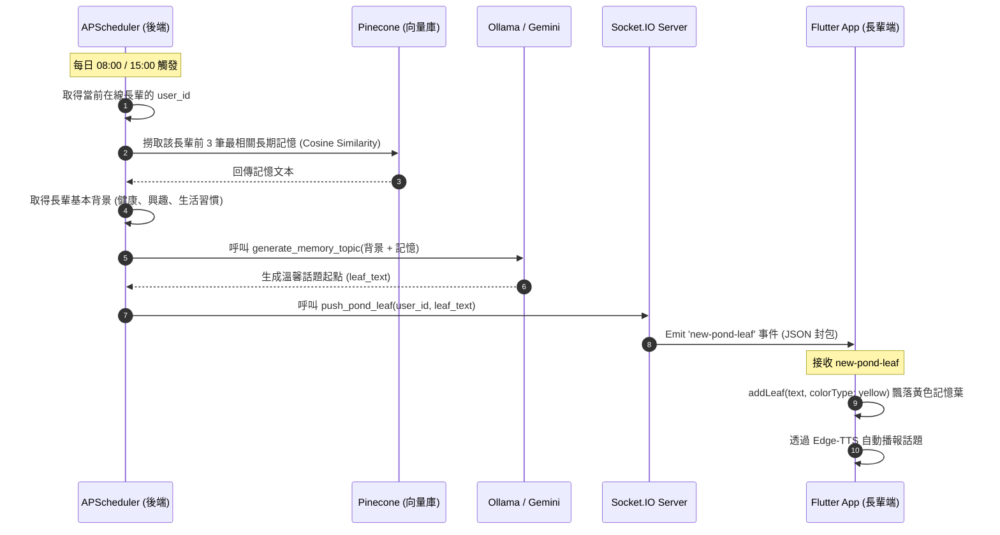

# 🐟 魚你聊聊 (Yuni Chat / Zen Pond) 系統開發與維護手冊

本手冊專為後續系統維護與優化所撰寫，詳細記錄了「魚你聊聊」非壓力型 AI 互動介面的核心理念、整體系統架構、前後端檔案職責、底層物理動畫演算法以及長期記憶 RAG 機制。

---

## 1. 核心理念與定位
「魚你聊聊」是專為長輩設計的**非壓力型 AI 互動與溫馨通知介面**。
我們將傳統條列式的沉重通知與冰冷的對話框，轉化為在水中悠閒游動的「錦鯉」，將介面塑造成一片平靜的「水池」。透過簡潔淡雅的視覺與生動的自然動態，讓長輩在跟 AI 聊天、查看子女留言時，能感受到如同養魚般的樂趣與平靜，顯著降低使用科技產品時的焦慮感與認知負擔。

---

## 2. 系統架構與資料流向 (System Architecture & Data Flow)

本系統由 **Flutter 前端 App**、**FastAPI 後端 API 服務**、**Socket.IO 即時信令中心**、**MySQL 關係型資料庫**、**Pinecone 雲端向量資料庫** 與 **AI 模型服務 (Ollama/Gemini)** 共同構成。

### A. 系統關聯架構圖
```mermaid
graph TD
    subgraph Client [Flutter App (長輩端)]
        UI[魚你聊聊 UI - ZenPondScreen]
        STT[語音識別 STT / TTS 播放]
        Controller[狀態控制 - ZenPondController]
        LocalCache[本地硬碟緩存 - SharedPreferences]
    end

    subgraph Backend [FastAPI Server]
        API[API 門戶 - uban-api]
        SocketIO[Socket.IO 服務 - socket_app.py]
        Scheduler[APScheduler 排程任務]
    end

    subgraph AI_Data [AI 與數據儲存]
        MySQL[(MySQL 資料庫)]
        Pinecone[(Pinecone 雲端向量庫)]
        Ollama[Ollama / Gemini - embedding & LLM]
    end

    %% Client 內部的連線
    UI <--> Controller
    Controller <--> LocalCache
    UI --> STT

    %% Client 與 Backend 連線
    UI <-->|Socket.IO 連線 / new-pond-leaf| SocketIO
    STT <-->|REST API / ai/chat & TTS| API

    %% Backend 與 AI_Data 連線
    API <-->|SQL 查詢 & 日誌記錄| MySQL
    API <-->|向量 upsert & query| Pinecone
    API <-->|提示合成 & 語意理解| Ollama
    Scheduler -->|08:00 & 15:00 定時觸發| Pinecone
    Scheduler -->|呼叫話題生成| Ollama
    Scheduler -->|推播落葉話題| SocketIO
```

### B. 長期記憶 RAG 話題推播流 (APScheduler Cron Job)


### C. 信令與在線狀態管理
1. **房間管理機制**：
   * 當長輩端 App 啟動並進入「魚你聊聊」時，會向後端 Socket.IO 發送 `join` 事件。
   * 後端 [socket_app.py](file:///c:/Users/tung0/Desktop/Uban/Uban-api/services/socket_app.py) 會解析 `room`、`role` (`elder`/`family`)、`userId` 與 `fcmToken`。
   * 連線物件會記錄在記憶體字典 `rooms_manager[room][sid]` 中，用於判定長輩是否在線。
2. **在線落葉推送**：
   * 後端排程發起話題時，會先走訪 `rooms_manager` 字典。若長輩目前在線（即存在活躍的 `elder_sid`），則調用 `push_pond_leaf` 發送即時 Socket.IO 事件；若長輩離線，則略過該次 Socket 推播，待長輩下次上線後由本地快取或 API 加載。

---

## 3. 檔案結構與職責說明 (File Structure)

### A. 前端 Flutter 目錄 `mobile_app/lib/screens/zen_pond/`
為提供長輩極致平滑的互動與視覺體驗，前端代碼被拆分為 UI、狀態控制器、自訂畫筆與子元件：

| 檔案路徑與連結 | 職責與核心邏輯 |
| :--- | :--- |
| ❶ [zen_pond_screen.dart](file:///c:/Users/tung0/Desktop/Uban/Uban/mobile_app/lib/screens/zen_pond/zen_pond_screen.dart) | **主入口畫布畫面**。綁定 Socket.IO 的 `new-pond-leaf` 事件接收器；整合 Speech-to-Text 原生語音錄音套件與打字對話框分流；管理「貼心小幫手」毛玻璃 Overlay 與麥克風呼吸擴散動畫。 |
| ❷ [controllers/zen_pond_controller.dart](file:///c:/Users/tung0/Desktop/Uban/Uban/mobile_app/lib/screens/zen_pond/controllers/zen_pond_controller.dart) | **狀態控制器 (ChangeNotifier)**。管理水中的 `notifications` (錦鯉) 與 `leaves` (落葉) 清單。實作本地 `SharedPreferences` 的 `loadLeaves()` / `saveLeaves()` 離線持久化與防丟機制。封裝語音播放 Edge-TTS 的音訊解碼與 Play 機制。實作雙計時器手勢分流防線。 |
| ❸ [painters/ripple_painter.dart](file:///c:/Users/tung0/Desktop/Uban/Uban/mobile_app/lib/screens/zen_pond/painters/ripple_painter.dart) | **水面漣漪畫筆**。依據動畫點擊擴散時間，計算畫筆透明度與半徑，在空白點擊處渲染擴散的同心圓物理漣漪。 |
| ❹ [painters/water_wave_painter.dart](file:///c:/Users/tung0/Desktop/Uban/Uban/mobile_app/lib/screens/zen_pond/painters/water_wave_painter.dart) | **背景水波畫筆**。利用 `BezierPath` 與多重正弦波重疊，渲染出極為溫和的水平流動效果。 |
| ❺ [widgets/interactive_ripples.dart](file:///c:/Users/tung0/Desktop/Uban/Uban/mobile_app/lib/screens/zen_pond/widgets/interactive_ripples.dart) | **點擊手勢攔截組件**。包裝了 `GestureDetector` 以截獲長輩的點擊座標，將座標傳入漣漪發射器，並呼叫 Controller 的點擊分流防線。 |
| ❻ [widgets/koi_fish_notification.dart](file:///c:/Users/tung0/Desktop/Uban/Uban/mobile_app/lib/screens/zen_pond/widgets/koi_fish_notification.dart) | **錦鯉物理游動組件**。實作錦鯉的轉向、划水與游動邊界限制。使用 `PremiumKoiPainter` 自訂畫筆繪製具有 20 節脊椎的扭動魚體。內置點擊事件攔截器以擴張長輩的觸碰感應區。 |
| ❼ [widgets/falling_leaf_message.dart](file:///c:/Users/tung0/Desktop/Uban/Uban/mobile_app/lib/screens/zen_pond/widgets/falling_leaf_message.dart) | **落葉物理浮游組件**。實作新落葉自螢幕上方的「旋轉飄落動畫 (Entrance)」與落水後的「常態正弦浮游動畫 (Idle Bobbing)」。使用 `LeafPainter` 繪製精細不對稱葉脈。 |
| ❽ [widgets/leaf_message_card.dart](file:///c:/Users/tung0/Desktop/Uban/Uban/mobile_app/lib/screens/zen_pond/widgets/leaf_message_card.dart) | **落葉大卡片組件**。點擊落葉後彈出的大型木牌風格對話卡，支持大字體顯示、照片加載、以及「向左/向右滑動關閉」的手勢分流。 |
| ❾ [widgets/lotus_leaf_card.dart](file:///c:/Users/tung0/Desktop/Uban/Uban/mobile_app/lib/screens/zen_pond/widgets/lotus_leaf_card.dart) | **水燈通知卡片組件**。點擊代表未讀訊息的錦鯉後，水面浮現的「祈福水燈卡」，用以顯示子女發來的留言。 |
| ❿ [widgets/pond_background.dart](file:///c:/Users/tung0/Desktop/Uban/Uban/mobile_app/lib/screens/zen_pond/widgets/pond_background.dart) | **漸層背景組件**。基於 `AnimatedBuilder` 將系統時間轉化為莫蘭迪色系漸層，並在中心點實施極微小的呼吸平移。 |
| ⓫ [widgets/pond_decorations.dart](file:///c:/Users/tung0/Desktop/Uban/Uban/mobile_app/lib/screens/zen_pond/widgets/pond_decorations.dart) | **池塘裝飾組件**。繪製水池邊緣的水草與寫實的灰褐色鵝卵石，使畫面整體具有禪意盆景的層次感。 |

---

### B. 後端 FastAPI 目錄 `Uban-api/`
後端主要負責在線狀態維護、RAG 記憶向量檢索以及關懷對話話題的生成：

| 檔案路徑與連結 | 職責與核心邏輯 |
| :--- | :--- |
| ❶ [services/pinecone_service.py](file:///c:/Users/tung0/Desktop/Uban/Uban-api/services/pinecone_service.py) | **向量資料庫服務**。封裝與 Pinecone 雲端 Data Plane 的連線與 Host 解析。實作 Embedding 生成：優先嘗試 Gemini `text-embedding-004`，若失效自動回退至本地 Ollama 的 `nomic-embed-text`。提供 `upsert_memory()` 與基於 `user_id` 的篩選查詢 `query_memories()`。 |
| ❷ [services/socket_app.py](file:///c:/Users/tung0/Desktop/Uban/Uban-api/services/socket_app.py) | **Socket.IO 信令中心**。負責連線、斷線、房間管理。實作 `push_pond_leaf(user_id, leaf_text)`，將生成的記憶话题以 `'new-pond-leaf'` 事件即時推送到指定的長輩客戶端。 |
| ❸ [routers/ai.py](file:///c:/Users/tung0/Desktop/Uban/Uban-api/routers/ai.py) | **AI 路由與對話處理**。 `/api/ai/chat` 負責將長輩的單次對話插入 MySQL，並將其異步寫入 Pinecone 長期記憶庫；`/api/ai/generate_pond_leaf` 與 `/api/ai/send_mock_pond_leaf` 負責檢索 Pinecone 記憶並合成落葉對話話題。 |
| ❹ [main.py](file:///c:/Users/tung0/Desktop/Uban/Uban-api/main.py) | **系統入口與排程器**。使用 `BackgroundScheduler` 管理定時任務，在每日 08:00 與 15:00 (台北時間) 觸發 `daily_pond_leaf_job`，提取在線長輩的背景與記憶，生成記憶話題後推播至前端。 |

---

## 4. 各子功能實作技術細節 (Technical Details)

### A. 日夜流動漸層 (Time-Based Pastel Gradient & Translation)
背景顏色根據系統時間自動切換。在 [pond_background.dart](file:///c:/Users/tung0/Desktop/Uban/Uban/mobile_app/lib/screens/zen_pond/widgets/pond_background.dart) 中，藉由監聽系統時間（或測試面板的模擬時間 `mockHour`）決定色彩漸層起終點，其定義為：
* **晨 (05:00 - 08:59)**：極淡晨曦黃 `Color(0xFFFFFDE7)` ✕ 淺綠 `Color(0xFFE8F5E9)`。
* **晝 (09:00 - 15:59)**：極淡青石綠 `Color(0xFFE0F2F1)` ✕ 水藍 `Color(0xFFE3F2FD)`。
* **昏 (16:00 - 18:59)**：極淡暖霞粉 `Color(0xFFFCE4EC)` ✕ 紫羅蘭 `Color(0xFFF3E5F5)`。
* **夜 (19:00 - 04:59)**：微深藍灰色 `Color(0xFFECEFF1)` ✕ 青綠 `Color(0xFFE8F8F5)`。

#### 漸層呼吸平移方程式：
為了帶給長輩最溫柔平靜的視覺感受，漸層的中心點並非固定，而是透過單一動畫控制器以 20 秒為一週期，沿著 2D 水平慢速波動：
$$x_{offset} = 0.5 + 0.08 \cdot \sin\left(\frac{t}{20000} \cdot 2\pi\right)$$
$$y_{offset} = 0.5 + 0.08 \cdot \cos\left(\frac{t}{20000} \cdot 2\pi\right)$$
該位移傳入 `RadialGradient` 或 `LinearGradient` 的 `center`，模擬出水流交融的呼吸動態。

---

### B. 高對比錦鯉物理擺尾與轉向演算法 (Koi Steering & Wiggle)
在 [koi_fish_notification.dart](file:///c:/Users/tung0/Desktop/Uban/Uban/mobile_app/lib/screens/zen_pond/widgets/koi_fish_notification.dart) 中，錦鯉的動作由**擺尾動畫**與**平滑轉向物理引擎**共同疊加。

#### 1. 品種樣式與色彩設定：
錦鯉樣式透過隨機數種子生成，在 [zen_pond_controller.dart](file:///c:/Users/tung0/Desktop/Uban/Uban/mobile_app/lib/screens/zen_pond/controllers/zen_pond_controller.dart) 的 `KoiStyle.random()` 中定義了四個品種：
* 昭和三色 (`Showa`)：魚身 `[#212121, #424242]`，魚鰭 `#CC000000` (半透明黑)，斑紋 `[#D32F2F, #FFFFFF]` (紅、白)。
* 紅鯉 (`Benigoi`)：魚身 `[#B71C1C, #D32F2F]`，魚鰭 `#CCEF5350` (半透明紅)，斑紋 `[#FFFFFF]`。
* 山吹黃金 (`Yamabuki`)：魚身 `[#FFB300, #FFE082]`，魚鰭 `#CCFFF59D` (半透明黃)，斑紋 `[#FFFDE7]`。
* 紅白 (`Kohaku`)：魚身 `[#E64A19, #FFFF8A65]`，魚鰭 `#CCFFCCBC` (半透明粉橘)，斑紋 `[#FFFFFF]`。

#### 2. 脊椎關節扭動方程式：
利用 `CustomPainter` 在畫布上計算並繪製一條由 20 個節點構成的魚身脊椎。為了達到擺尾效果（頭部幾乎不動，越往尾部擺幅越大），第 $i$ 個關節的水平偏移 $wiggle_i$ 方程式如下：
$$wiggle_i = \sin\left(\frac{i}{20} \cdot 2\pi - \theta_{anim} \cdot 2\pi\right) \cdot \text{maxWiggle} \cdot \left(\frac{i}{20}\right)^{1.8}$$
* $\theta_{anim}$：0.0 到 1.0 的時間週期動畫值（擺尾週期拉長至 $1500\text{ms}$ 以使擺尾顯得悠閒）。
* $\text{maxWiggle}$：最大偏移量限制在魚身寬度的 $11\%$，以呈現極為柔順溫和的姿態。
* $t^{1.8}$ 冪次放大器：確保頭部穩定不晃動，擺動集中於中後半段與尾巴。

#### 3. 平滑轉向物理 (Steering Physics)：
錦鯉在池塘隨機目標點之間優雅穿梭，每幀物理更新如下：
* **轉彎角速度限制 (Max Turn Speed)**：
  計算當前朝向角 $\theta_{current}$ 與目標朝向角 $\theta_{target}$ 的差值 $\Delta\theta$。轉彎角速度限制在：
  $$\Delta\theta_{steered} = \text{clamp}(\Delta\theta, -0.012, 0.012) \text{ rad/frame}$$
  這保證了魚兒在轉向時永遠呈滑順弧形，絕不發生突兀的硬偏轉。
* **速度波動 (Swimming Thrust)**：
  魚的前進速度 $v_{swim}$ 實施「轉向慢速，直線加速」原則，並在直行時引入隨時間起伏的划水推力波動：
  $$v_{swim} = v_{base} \cdot \left(1.0 + 0.3 \cdot \cos\left(\frac{\text{EpochMillis}}{1200}\right)\right)$$
  這逼真地模擬出真實魚類一下、一下划水前進的動態特徵。

---

### C. 落葉飄落與浮游動畫 (Leaf Physics & Idle Bobbing)
在 [falling_leaf_message.dart](file:///c:/Users/tung0/Desktop/Uban/Uban/mobile_app/lib/screens/zen_pond/widgets/falling_leaf_message.dart) 中，落葉在池塘中有兩種運作物理狀態：

#### 1. 登場飄落動畫 (Entrance Animation, 0 - 2500ms)：
當新的落葉被加入時，會觸發一個 $2500\text{ms}$ 的一次性物理動畫，此時落葉的座標與外觀為：
* **Y軸軌跡**：自螢幕頂端上方（$-100\text{px}$）緩慢降落至水面靜止高度 $Y_{resting}$：
  $$Y_{current}(t) = -100 + (Y_{resting} + 100) \cdot t$$
* **X軸Sine搖擺**：落葉在飄落時會進行正弦左右搖擺，且越接近水面搖擺幅度越小，模擬空氣阻力：
  $$X_{current}(t) = X_{resting} + \sin(t \cdot 3\pi) \cdot 35 \cdot (1 - t)$$
* **自轉打轉**：落葉在空中緩緩自轉約 3 圈（$6\pi$ 弧度）：
  $$\text{Rotation}(t) = (1 - t) \cdot 6\pi + \text{SeedAngle}$$
* **縮放與淡入**：尺寸從微小的 $0.2$ 展開到 $1.0$，透明度淡入到 $1.0$。

#### 2. 常態水面浮動 (Idle Bobbing, 登場完畢後)：
一旦落水，落葉便轉入基於 $5000\text{ms}$ 慢速週期的二維常態浮流，模擬水面微風吹拂：
* **二維正弦平移**：
  $$Y_{bobbing} = Y_{resting} + \sin(\theta_{idle}) \cdot 4.0\text{ px}$$
  $$X_{bobbing} = X_{resting} + \cos(\theta_{idle}) \cdot 2.0\text{ px}$$
* **微幅角度晃動**：維持在 $-3^\circ$ 到 $+3^\circ$ 之間的微小晃動，增加自然感：
  $$\text{Rotation}_{bobbing} = \sin(\theta_{idle}) \cdot 0.05\text{ rad} + \text{SeedAngle}$$

---

### D. 點擊分流防線 (Gesture Debouncing & SOS Colddown)
為了防止長輩在觸發「🚨 SOS 緊急求救」時誤點開 AI 語音對話，[zen_pond_controller.dart](file:///c:/Users/tung0/Desktop/Uban/Uban/mobile_app/lib/screens/zen_pond/controllers/zen_pond_controller.dart) 設計了雙計時器手勢分流防線：

1. **連擊計數器與定時清零**：
   * 當長輩點擊水面時，`_tapCount` 累加 1。同時取消舊的 `_tapTimer` 並設定一個 1 秒的計時器，若 1 秒內沒有新的點擊，`_tapCount` 會被清零。
2. **350ms 單擊延遲防禦 (`_singleTapTimer`)**：
   * 在第一次點擊時，系統會開啟一個 `_singleTapTimer` 延遲 $350\text{ms}$ 執行。
   * 若長輩的意圖是「連擊 5 次 SOS」，他會在 $350\text{ms}$ 內快速點擊。一旦計數器 `_tapCount` 達到 5，系統會**立即取消 `_singleTapTimer`**，直接切換到 `_triggerSOS()` 警報模式，成功防護誤觸！
   * 若 $350\text{ms}$ 內點擊數低於 5 次（代表長輩是一般的單點互動），計時器到期便會觸發單擊事件，開啟 AI 語音 Overlay (`isAiOverlayVisible = true`)。
3. **SOS 求救冷卻機制**：
   * SOS 模式一旦觸發，整個畫布會覆蓋紅色半透明遮罩並鎖定互動。持續 5 秒後，系統會自動將 `isSOSMode` 設回 `false`，解除警報並重設狀態。

---

### E. RAG 長期記憶話題流程 (RAG Pipeline Details)

本功能為「魚你聊聊」的核心主動關懷邏輯。其技術重點如下：

```
[對話/留言/日誌] ──> nomic-embed-text (Ollama) ──> 寫入 Pinecone
                                                     │
[台北時間 08:00/15:00] ──> Pinecone 語意查詢 ───> LLM 話題合成
                                                     │
長輩端 Flutter <─── Socket.IO (new-pond-leaf) <──────┘
```

#### 1. 記憶寫入 (Upsert Memory)
後端在長輩聊天結束或家屬留下小幫手日誌後，於背景線程調用 `pinecone_service.py` 的 `upsert_memory`：
* **Embedding 生成雙回退策略**：
  * **第一防線**：呼叫 Google Gemini 的 `models/text-embedding-004` (生成 1536 維度向量)。
  * **自動回退防線**：若 API 額度用盡或網路連線失敗，會自動回退調用本地 Ollama 的 `nomic-embed-text` (生成 768 維度向量)。
* **ID 唯一性與分組**：
  * Upsert 向量的 ID 格式固定為 `user_{user_id}_log_{log_id}`。
  * Metadata 中寫入 `user_id`、`log_id`、`text`、`category` (`chat`/`health`/`family_message`)，檢索時透過 `{"user_id": {"$eq": int(user_id)}}` 篩選，確保多租戶環境下長輩的記憶絕對隔離。

#### 2. 定時話題合成 (Memory Retrieval & Generation)
定時任務 `daily_pond_leaf_job` 運作邏輯如下：
* **種子查詢詞 (Seed Query)**：
  使用包含強烈生活屬性的詞彙 `"長輩最近說過的話、曾經提到的往事、生活習慣、健康狀況"` 作為查詢詞。
* **餘弦相似度查詢**：
  將種子詞向量化後，向 Pinecone 發起 topK=3 的相似度計算，撈出歷史中最相關的記憶文本。
* **關懷話題合成提示詞 (Prompt Specification)**：
  後端會將「長輩基本背景 + 昨日活動步數 + 檢索出的3條長期記憶」組裝，呼叫 LLM 進行生成：
  ```
  [System Role]
  你是一個溫馨且耐心的陪伴型機器人。請根據以下長輩的個人資料與記憶，生成一句關切的話。

  長輩背景：{context_str}
  歷史長期記憶：
  {memories_str}

  請遵守以下規範：
  1. 語氣必須溫和親切、尊稱長輩。
  2. 結合長期記憶中的人事物（如：秀珠、花鐘、鄧麗君）。
  3. 字數控制在 30 ~ 70 字內，句尾適度使用溫暖的問句引導聊天。
  ```
  生成的關懷話題透過 Socket.IO 發送至前端，由長輩點擊黃色葉片（記憶葉）後播報。

---

## 5. 未來維護與擴充開發指引 (Extensibility Guide)

### A. 如何新增全新的錦鯉花紋與品種
若未來需要加入全新的錦鯉花色（例如「寫實黃金」或「大正三色」）：
1. **擴充 Enum 品種**：
   在 [zen_pond_controller.dart](file:///c:/Users/tung0/Desktop/Uban/Uban/mobile_app/lib/screens/zen_pond/controllers/zen_pond_controller.dart) 中的 `KoiPattern` 新增一個名稱，例如 `taisho` (大正)。
2. **在 Controller 中定義顏色配置**：
   在 `KoiStyle.random()` 中加入對應的 `switch` 分支，設定專屬的 `bodyColors`、`finColor`、與 `spotColors`。
3. **在 CustomPainter 中設計斑紋形狀**：
   在 [koi_fish_notification.dart](file:///c:/Users/tung0/Desktop/Uban/Uban/mobile_app/lib/screens/zen_pond/widgets/koi_fish_notification.dart) 的 `PremiumKoiPainter.paint` 方法中，加入對新品種的花紋渲染：
   ```dart
   else if (style.pattern == KoiPattern.taisho) {
     // 大正三色：雪白底色上，點綴橘紅斑與墨黑小斑塊
     // 1. 使用 Paint 取得 style.spotColors[0] (紅) 與 style.spotColors[1] (黑)
     // 2. 利用 canvas.drawPath() 或 canvas.drawCircle() 繪製交錯的流線型斑紋
   }
   ```

### B. 如何微調水池中落葉的物理參數
落葉的物理表現直接決定了界面的平靜感，如需微調請修改以下檔案：
* **減慢或加速落葉的浮動週期**：
  在 [falling_leaf_message.dart](file:///c:/Users/tung0/Desktop/Uban/Uban/mobile_app/lib/screens/zen_pond/widgets/falling_leaf_message.dart) 的 `initState()` 中調整常態 `_idleController` 的 `duration`（當前為 `5000ms`）。
* **微調落水打轉圈數與擺動範圍**：
  在同一檔案中搜尋 `entranceController` 動畫構造塊，修改 `xSwing` 的正弦倍數（當前為 `3 * math.pi` 決定擺動次數，`35` 決定擺動寬度）與 `currentRotation` 的自轉倍數。
* **調整落葉的池塘安全活動區**：
  在 [zen_pond_controller.dart](file:///c:/Users/tung0/Desktop/Uban/Uban/mobile_app/lib/screens/zen_pond/controllers/zen_pond_controller.dart) 的 `addLeaf()` 方法中，落葉的隨機坐標範圍設定為 $X \in [0.15, 0.85]$ 且 $Y \in [0.20, 0.70]$，這能有效防止葉子飄入邊緣大鵝卵石下方。如需調整安全區邊界，請在此處修改。

### C. 隱藏/啟用開發者測試面板 (Dev Panel)
目前為了方便開發與 QA 測試，左上角保留了「時間模擬切換」與「模擬家人傳訊」按鈕。
* **正式發佈 (Release) 的隱藏方案**：
  在 [zen_pond_screen.dart](file:///c:/Users/tung0/Desktop/Uban/Uban/mobile_app/lib/screens/zen_pond/zen_pond_screen.dart) 中，將該 Positioned Dev Panel 的 `child` 加上 Flutter `kDebugMode` 的條件包裹：
  ```dart
  import 'package:flutter/foundation.dart';
  // ...
  if (kDebugMode) // 僅在 Debug 模式下實體化 Dev Panel，Release 模式會被編譯優化 tree-shaking 剔除
    Positioned(
      left: 20,
      top: 50,
      child: ...
    )
  ```
