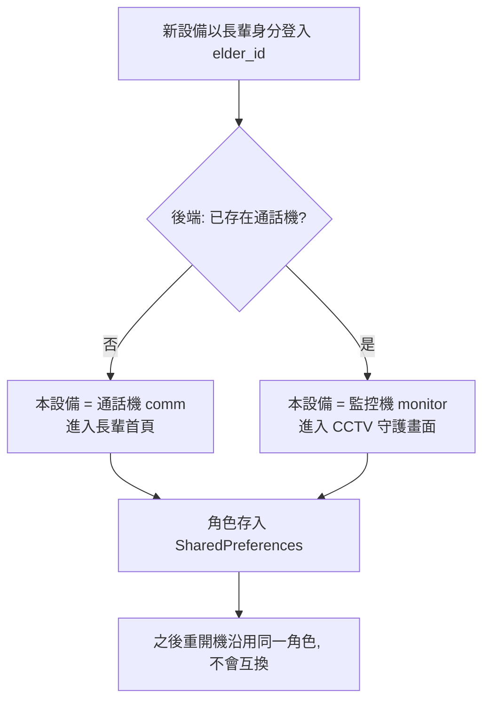

# 監控機（CCTV）新增與使用指南

## 概述

Uban 的長輩端設備分兩種角色：

| 角色 | 說明 | 房間 |
|------|------|------|
| 通話機（comm） | 一般雙向視訊通話、AI 對話、查看照片等完整功能 | `comm_elder_{elder_id}` |
| 監控機（monitor / CCTV） | 被動單向視訊監控（「CCTV 守護中」），供家屬遠端查看畫面 | `monitor_elder_{elder_id}` |

> 「設備」不存在於資料庫，只存在於後端的記憶體連線狀態（socket + FCM token）。
> 因此新增監控機**不需要新增任何資料庫欄位或資料表**。

## 角色如何決定（自動，免手動選擇）

設備第一次以某位長輩身分登入時，App 會詢問後端
「這位長輩是否已經有通話機？」並自動決定角色：

- **第一台**登入的設備 → 自動成為**通話機**。
- 在已有通話機的情況下，**之後**任何用同一個 `elder_id` 登入的設備 → 自動成為**監控機**。
- 決定後角色會記在該設備本機（`saved_is_cctv`），日後重開機直接沿用，**不會**因為開機順序而角色互換。

判斷依據是後端 REST 端點 `GET /api/elder/{elder_id}/has-comm-device`，
純記憶體判斷（線上 socket + 已知 FCM token），不碰資料庫。

## 操作步驟：新增一台監控機

### 前提
- 兩台裝置都已完成家屬綁定流程（家屬端用配對碼把該長輩加入）。
- **要當通話機的裝置（裝置 A）必須先登入並保持在線**，監控機的判斷才會成立。

### 裝置 A（通話機，例如長輩的主手機）
1. 以長輩身分登入（配對碼或「快速登入同一長輩」）。
2. 第一台登入 → 自動成為通話機，進入長輩首頁。保持 App 開著、在線。

### 裝置 B（要新增的監控機，例如放房間的舊手機）
1. 用**同一位長輩**的身分登入（同一個 elder_id / 配對到同一位長輩）。
2. 因為裝置 A（通話機）已在線，後端回報「已有通話機」→ 裝置 B **自動成為監控機**，
   直接進入「**CCTV 守護中**」畫面。中途不會再跳出任何模式選擇視窗。

> 小提醒：監控機的裝置名稱會自動帶「○○○的監控機」，與通話機「○○○的設備」區隔，
> 兩台才能同時在線而不互相踢線。

## 操作步驟：家屬端觀看監控畫面（裝置 B 的家屬端介面）

1. 進入家屬端 →「**設定**」分頁。
2. 在「已配對長輩」區塊點 **「監控設備」**（紫色攝影機圖示）。
   - 若綁定多位長輩，先選擇要查看的長輩。
3. 進入該長輩的「設備」清單，監控機會顯示為「**監控模式**」（紅色攝影機圖示）。
4. 按監控機那一列右側的 **藍色攝影機圖示** → 進入即時監控畫面（單向觀看）。

> 也可從家屬主畫面的「選擇監控對象」進入同一個設備清單。

## 常見問題

| 問題 | 說明 |
|------|------|
| 裝置 B 登入後變成通話機，不是監控機 | 登入當下裝置 A（通話機）不在線。請先讓裝置 A 上線，再於裝置 B 重新登入。 |
| 想把監控機改回通話機 | 在該裝置重新登入（清除登入狀態後再登入）；若當下沒有其他通話機在線，它會重新成為通話機。 |
| 兩台一直互相踢線 | 確認兩台裝置名稱不同（監控機會自動加「監控機」後綴）。 |
| 看不到監控畫面 | 確認監控機（裝置 B）目前在線且停在「CCTV 守護中」畫面。 |

## 相關程式碼

| 位置 | 作用 |
|------|------|
| `uban-api/uban-api/routers/user.py` → `GET /elder/{elder_id}/has-comm-device` | 查詢是否已有通話機 |
| `uban-api/uban-api/services/socket_app.py` → `has_comm_elder_device()` | 記憶體判斷邏輯 |
| `mobile_app/lib/services/api_service.dart` → `hasCommDevice()` | 前端查詢 |
| `mobile_app/lib/screens/elder_pairing_display_screen.dart`、`role_selection_screen.dart` | 登入時自動決定角色 |
| `mobile_app/lib/screens/device_selection_screen.dart` | 家屬端觀看監控畫面 |

## 更新日誌

- 2026-05-31：改為「自動決定角色」機制——移除綁定/登入時的「通話機／CCTV」選擇視窗；
  改為依後端「是否已有通話機」自動指派，第一台為通話機、之後皆為監控機，無需資料庫欄位。
