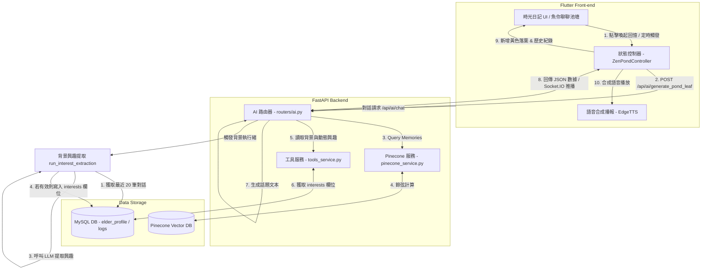

# 時光日記目錄與 RAG 自動回憶落葉功能設計與技術紀錄

* 建立日期：2026-05-25
* 最近更新：2026-05-27
* 適用版本：v1.2.0
* 負責組件：前端 App (Flutter)、後端 API (FastAPI)、AI 記憶檢索 (Pinecone)、關懷話題分析 (MySQL + LLM)

---

## 1. 功能背景與設計初衷

### 1.1 時光日記分頁目錄 (Diary Directory)
在之前的版本中，長輩與 AI 的對話全數平鋪在一個單一的列表中。隨著使用時間變長，長輩在向上翻看歷史紀錄時會面臨以下問題：
* **視覺與認知超載**：長列表資訊密度過高，長輩不易辨識對話發生的具體日期。
* **效能滑動瓶頸**：一次性載入過多歷史泡泡會增加 GPU 繪圖負載。
為解決此問題，我們重構了時光日記 Dialog，引進了**「分頁歸檔目錄」**概念。對話紀錄按日期自動彙整為卡片（如：今天、昨天、某月某日），並提供簡短的內容預覽與訊息條數。長輩可以輕鬆點選特定日期閱讀，並隨時返回目錄，降低其大腦認知負荷，操作更符合長輩的 UX 直覺。

### 1.2 RAG 長期記憶自動話題落葉 (RAG Memory Leaves)
傳統 AI 陪伴系統多為「被動式對答」，長輩不主動說話時，AI 無法主動發起具備關聯性的話題。
* 為打破被動交流，我們將 RAG（檢索增強生成）結合池塘視覺。後端在長輩離線或特定排程時，從 **Pinecone 向量資料庫** 語意檢索該長輩的長期記憶（例如：喜好、親人姓名、過往生命故事）。
* 將回憶碎片合成為一句充滿關懷的「話題開場白」，並在前端以**金黃色（回憶色）落葉**形式飄落於池塘。
* 在時光日記目錄頁底部增設**「🍂 喚起腦海中的回憶落葉」**大型功能按鈕，長輩主動點擊即可手動向後端觸發話題生成，讓金黃色的回憶葉飄落並播放 TTS，喚起過去的溫暖回憶。

### 1.3 動態興趣特徵分析 (Dynamic Interest Profiling - 方案 B)
在原有的 RAG 機制中，話題生成僅能簡單地將歷史對話紀錄片段重新拼湊。若長輩對話次數過少，或是對話紀錄中充斥著無意義的寒暄（如「你好」、「在嗎」），直接進行 RAG 檢索容易生成重複、品質低落且不符合語境的話題。
為解決此問題，我們實作了**「非同步動態興趣分析」**。系統不直接生硬地複製長輩講過的對話，而是在每次對話後，由背景執行緒分析長輩最近的語意，從中抽取出高層次的興趣特徵（如愛吃的食物、想念的人、感興趣的活動），存入 `elder_profile` 表中的 `interests` 欄位。話題落葉生成器（Leaf Generator）在生成話題時，便能將這些興趣與長期記憶融合，提供更富變化、富有一貫性的話題開場白。

---


## 2. 系統架構與資料流向 (Architecture & Data Flow)

### 2.1 系統連結架構圖


### 2.2 RAG 話題生成介面規格
* **REST Endpoint**：`POST /api/ai/generate_pond_leaf?user_id={userId}`
* **傳輸協定**：HTTP/1.1 (HTTPS)
* **API 連線逾時設定**：45 秒 (TimeoutException)
* **請求引數**：
  * `user_id` (Query String, int, 必填)：長輩帳號 ID。
* **回傳成功 JSON 範例 (200 OK)**：
  ```json
  {
    "status": "success",
    "data": {
      "leaf_text": "秀珠，今天台北的天氣很溫暖呢。您上次提到想念陽明山上的花鐘，找天我們一起去走走好嗎？",
      "memories_used": 3,
      "user_id": 1
    }
  }
  ```
* **錯誤處理與防線**：若連線逾時或後端拋出 500 異常，API 服務會捕捉錯誤並回傳本地預設關懷句：`"您今天過得如何？有什麼想聊聊的嗎？"`，確保前端體驗不中斷。

### 2.3 背景動態興趣提取流程與技術規格
每次長輩端與 AI 完成對答（ `/api/ai/chat` 或 `/api/ai/chat_stream` 請求成功完成後），後端會自動調用 FastAPI 的 `BackgroundTasks` 啟動背景分析程序：
1. **日誌拉取**：背景分析執行緒 `run_interest_extraction(elder_id)` 首先向 MySQL 查詢該長輩最近的 20 筆聊天紀錄。
2. **語意過濾與對話長度門檻**：
   - 僅篩選並格式化長輩的發言（格式為：`長輩：[內容]`），將 AI 助手自己的發言完全濾除，防止 AI 提取自身言論導致語意退化（AI Self-Feedback Loop）。
   - 若對話長度少於 3 句，或聊天內容僅為簡單的寒暄問候，則直接提前終止提取，不修改資料庫。
3. **大模型興趣歸納**：
   - 將格式化後的長輩對話內容輸入至 AI 模型。系統會優先使用本地運行的 Ollama (gemma4:e4b)，並在本地服務異常時，自動回退至 Google Gemini 2.0 Flash 備援。
   - LLM 根據專用 Prompt 提取出長輩長期關注的事物，如「喜愛甜食(紅豆湯)、關心孫子阿明、想念陽明山花鐘」。
4. **防噪保護與資料寫入**：
   - 如果 LLM 無法從最新對話中歸納出任何具體的長效興趣，則必須回傳 `[NO_VALID_INTEREST]`。
   - 系統若檢測到回傳值為 `[NO_VALID_INTEREST]`，會**跳過**對 MySQL 資料庫的更新，以此保護長輩的興趣特徵表不被噪音（如問候語、符號、亂碼）污染。
   - 若有有效提取結果，則覆寫 `elder_profile` 表中的 `interests` 欄位，作為該長輩的長期畫像標籤。

---

## 3. 代碼修改與路徑定義

在本次升級中，主要影響了以下檔案：

### 前端 App (Flutter)
1. **[MODIFY]** [api_service.dart](file:///c:/Users/tung0/Desktop/Uban/Uban/mobile_app/lib/services/api_service.dart)
   * 負責聲明 `generatePondLeaf(int userId)` 靜態 REST API 方法，設定 45 秒超時上限，處理 JSON 解碼與例外捕獲。
2. **[MODIFY]** [zen_pond_controller.dart](file:///c:/Users/tung0/Desktop/Uban/Uban/mobile_app/lib/screens/zen_pond/controllers/zen_pond_controller.dart)
   * 負責實作 `generateAndAddRagLeaf(int userId)` 方法。當 API 回傳話題文本時，呼叫 `addLeaf(colorType: LeafColorType.yellow)`，同時呼叫 `addHistory(sender: 'ai')` 存入時光日記。
3. **[NEW]** [sound_wave_indicator.dart](file:///c:/Users/tung0/Desktop/Uban/Uban/mobile_app/lib/screens/zen_pond/widgets/sound_wave_indicator.dart)
   * 將播放朗讀時的音符波形動畫獨立封裝至此 Widget，利用單一動畫控制器進行正弦規模伸縮，解決舊版效能缺陷。
4. **[NEW]** [diary_dialog.dart](file:///c:/Users/tung0/Desktop/Uban/Uban/mobile_app/lib/screens/zen_pond/widgets/diary_dialog.dart)
   * 將日記對話 Dialog 的邏輯與 UI 完整抽離為獨立組件（約 600 行），使主畫面程式碼架構更清晰。
5. **[MODIFY]** [zen_pond_screen.dart](file:///c:/Users/tung0/Desktop/Uban/Uban/mobile_app/lib/screens/zen_pond/zen_pond_screen.dart)
   * 移除了冗長的 `_DiaryDialogContent` 和 `SoundWaveIndicator` 程式碼，直接匯入外部組件，程式碼大幅瘦身。

### 後端 API (FastAPI)
1. **[MODIFY]** [routers/ai.py](file:///c:/Users/tung0/Desktop/Uban/Uban-api/routers/ai.py)
   * `/chat` 與 `/chat_stream` 路由增加非同步背景任務，執行長輩興趣特徵分析。
   * 實作背景執行緒核心處理器 `run_interest_extraction(db_cursor_func, elder_id)`，用以從最近日誌提取興趣特徵，並更新至資料庫。
2. **[MODIFY]** [services/tools_service.py](file:///c:/Users/tung0/Desktop/Uban/Uban-api/services/tools_service.py)
   * 修改 `get_elder_context` 內部的 SQL 查詢語句，拉取並整合 `elder_profile` 表中的 `interests` 欄位，傳遞給 LLM 對話模型。
3. **[NEW]** [tests/test_ai_fallback.py](file:///c:/Users/tung0/Desktop/Uban/Uban-api/tests/test_ai_fallback.py)
   * 實作背景興趣提取的測試套件，包含對話太短跳過測試、`[NO_VALID_INTEREST]` 拒絕寫入資料庫測試、以及成功寫入更新測試，並妥善模擬 (mock) 避免外部網路及 Pinecone 調用。

---

## 4. 核心數學公式與分頁分群演算法

### 4.1 時間軸日記分類分群演算法
前端將一維平鋪對話歷史 `List<Map<String, dynamic>>` 依據毫秒時間戳記（Timestamp）轉換為按「天」分組的 Map，以實現目錄管理。
其時間對應關係為：
對於歷史列表中的任一訊息項目 $M_k$，其時間戳為 $t_k$（毫秒）。
1. 轉換為 DateTime 物件：
   $$D_k = \text{DateTime.fromMillisecondsSinceEpoch}(t_k)$$
2. 提取分群 Key（日期字串格式）：
   $$\text{Key}_k = Y(D_k) + \text{"年"} + M(D_k) + \text{"月"} + D(D_k) + \text{"日"}$$
   其中 $Y$、$M$、$D$ 分別代表年份、月份和日期。
3. 分群歸納邏輯：
   若歷史紀錄中有多個訊息，其歸納映射關係為 $f: M \to \text{Key}$，其演算法時間複雜度為 $O(N)$，空間複雜度為 $O(N)$，保證在 1000 條以上歷史數據下依然流暢。

---

## 5. UI/UX 視覺美學與無障礙規範

### 5.1 視覺配色方案 (Color Palettes)
時光日記採用了經典的莫蘭迪禪意配色，營造安詳的書寫氛圍：
* **日記主背景**：`Color(0xFFFCFBF7)` (溫暖宣紙白，降低長輩雙眼高對比疲勞)
* **目錄卡片背景**：`Color(0xFFFFFDF0)` (古樸淡米黃)
* **卡片分割線與邊框**：`Color(0xFFEFEBE9)` (細微青石灰)
* **文字與主要標題**：`Color(0xFF3E2723)` (禪意暖焦褐)
* **喚起回憶大按鈕**：`Color(0xFFF5EBE6)` (底色) ✕ 漸層橘黃 `Color(0xFFFFB74D)` (按鈕主色)

### 5.2 銀髮族無障礙規範 (Accessibility)
* **大字體設計**：對話列表中的對話泡泡文字大小設定為 **`24pt`**（`GoogleFonts.notoSansTc`），清空確認視窗與目錄標題文字為 **`22pt`**，副標題為 **`18pt`**，方便長輩閱讀。
* **高彈性觸控**：所有目錄卡片及底部按鈕的點擊感應高度皆 $\ge 64\text{px}$，避免因長輩手指發抖而造成誤觸。
* **微動畫與音波**：語音朗讀播放時，不使用生硬旋轉的 `CircularProgressIndicator`，而使用溫柔律動的綠色波形動畫（`SoundWaveIndicator`），以每週期 1.0 秒的速度做正弦起伏，提供溫和的視覺反饋。

---

## 6. 安全性防護與防誤觸機制

* **按鈕防重按機制**：
  在觸發 RAG 請求時，元件內置的 `_isGeneratingRag` 布林狀態會立即設為 `true`。此時「喚起回憶」按鈕的 `onPressed` 被重置為 `null`（按鈕將變為灰色停用狀態，且內部旋轉圈載入中），有效防止長輩因為網路遲滯而反覆點按，造成後端 API 負載超限。
* **長期記憶查詢隔離**：
  在呼叫 Pinecone 查詢時，後端會強行帶入 metadata 篩選器：
  $$\text{Filter} = \{ \text{"user\_id"}: \{ \text{"\$eq"}: \text{user\_id} \} \}$$
  這保證了在多用戶高併發環境下，AI 絕對不會混淆不同長輩的長期回憶。
* **防髒數據與興趣分析污染保護**：
  - **對話發言人過濾**：在進行興趣提取時，系統僅擷取對話日誌中 `event_type='chat'` 且發言人為長輩的發言（`長輩：...`），完全排除 AI 的話語，避免 AI 產生「自我增強的興趣幻覺」（Feedback Loop）。
  - **防髒數據門檻**：設有「最少 3 條對話」的基本門檻，且 LLM 必須明確輸出或以 `[NO_VALID_INTEREST]` 作為退回標記，確保資料庫 `elder_profile.interests` 不會被寫入「打招呼」、「無意義字符」或幻覺數據。

---

## 7. 測試與驗證計畫 (Test Checklist)

在將代碼合併或發佈時，必須進行以下測試：

### 前端功能驗驗
* [x] **靜態代碼分析**：在 `mobile_app/` 底下執行 `flutter analyze`，確認無 static error 且 `SoundWaveIndicator` 及 `_DiaryDialogContent` 無 Context 安全警告。
* [x] **空對話狀態測試**：清空本地對話歷史，確認日記顯示：「目前還沒有對話日記喔，快與小幫手聊聊天吧 😊」提示。
* [x] **RAG話題飄落測試**：點擊「喚起回憶」，等待 API 回傳，確認畫面彈出「已為您在池塘中落下新的回憶話題 🍂」Snackbar，且畫面跳轉至今日對話。
* [x] **水面金黃落葉測試**：確認 RAG 觸發後，池塘中會新增一片金黃色落葉，且點擊落葉後會播放 TTS。
* [x] **分群歸納測試**：發送多條不同日期的模擬訊息，確認目錄頁會按天正確分組（例如今天、昨天、某月某日分別歸類）。

### 後端功能與單元測試
* [x] **背景興趣提取單元測試**：在 `Uban-api` 執行 `py -3.12 -m pytest tests/test_ai_fallback.py`，確認 3 項關於動態興趣分析的單元測試順利通過。
* [x] **系統整合回歸測試**：在 `Uban-api` 執行 `py -3.12 -m pytest tests/`，確保全部 24 個單元測試均 100% 通過，無破壞性回歸。
