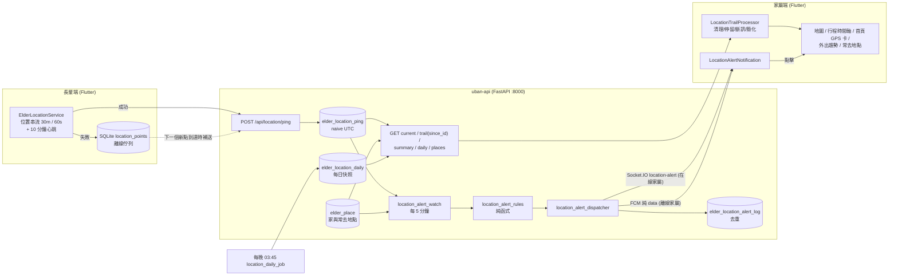

# 戶外 GPS 定位與移動軌跡 技術設計與實作紀錄
* 建立日期：2026-10-01
* 最近更新：2026-10-03
* 適用版本：App `1.0.0+1`（`pubspec.yaml`）／後端 `uban-api` main（migrations 015–019、021）
* 負責組件：[前端（長輩端採集＋家屬端呈現）/後端/信令（Socket.IO＋FCM）]

> 本文件是**戶外 GPS 子系統的唯一權威參考**，內容逐項對照程式碼撰寫。
> `README.md`／`uban-api/readme.md` 的更新日誌是「當時做了什麼」的流水帳，數值與行為衝突時以本文件與程式碼為準；
> [`GPS_TRAIL_RENDERING_PLAN.md`](GPS_TRAIL_RENDERING_PLAN.md) 是 2026-09-30 的規劃紀錄，只保留歷史價值。

---

## 1. 範圍與名詞（Scope）

**本文件涵蓋**：長輩手機的 GPS 採集與回報、後端儲存與讀取 API、家屬端的軌跡地圖／行程時間軸／停留點／常去地點／今日摘要卡／外出趨勢、安心提醒（晚歸／失聯／遠離家）、長輩端「帶我回家」、地圖底圖設定、隱私與保存期限。

**⚠️ 與室內定位（IPS）是兩個完全不同的子系統，不要混用、不要共用資料表**：

| | 戶外 GPS（本文件） | 室內 IPS（[`INDOOR_POSITIONING_SYSTEM.md`](INDOOR_POSITIONING_SYSTEM.md)） |
|---|---|---|
| 資料來源 | 長輩**手機**的 GPS 經緯度 | **監視機**畫面＋YOLO 姿態推估房間 |
| 粒度 | 公尺級座標＋軌跡 | 房間級（多邊形區域） |
| 後端 | `routers/location.py`、`elder_location_*`、`elder_place` | `routers/ips.py`、`elder_zone_*` |
| 命名地點 | **place（地點）**：經緯度＋半徑 | **zone（區域）**：房間名稱 |

> **命名鐵律**：戶外的命名地點一律叫 `place`（`elder_place`、`ElderPlace`、`/location/places`），**絕對不要叫 zone**；
> 反過來室內房間也不要叫 place。兩邊 UI 也刻意用不同標題與圖示（首頁 GPS 卡片 vs 房間偵測卡片），避免家屬搞混。

---

## 2. 功能背景與設計初衷

* **痛點**：長輩外出時，家屬只能打電話問「你在哪」；長輩走失、迷路或晚歸時缺乏即時掌握行蹤的方式，也沒有「他今天有沒有出門」這種低壓力的安心訊號。
* **照護價值與 UX 考量**：
  1. **分享開關在長輩手上**：預設開啟，但只有長輩本人能關（家屬無法代為切換），關閉後家屬連過去的軌跡都看不到，也不會收到任何位置提醒。
  2. **讀取端清理、原始資料照存**：後端保留原始點供稽核與調參，離群點、停留、斷訊都在家屬端（與後端摘要）以純函式處理。
  3. **安心而非驚嚇**：晚歸／失聯／遠離家是「安心提醒」，通知強度刻意一般（見 §8.4），不吵醒子女。
  4. **長輩端零負擔**：長輩只有一個大按鈕「帶我回家」（若家屬設定了家），其餘全自動。
  5. **銀髮無障礙**：長輩端「帶我回家」按鈕高 72、26pt 大字、`Flexible`＋ellipsis 防系統字放大溢位；家屬端各畫面遵守鐵律 #14（動態字串可收縮、`Wrap`）。

---

## 3. 系統架構與資料流向

### 3.1 資料流總圖

文字版流程：

1. **採集**：長輩端 `ElderLocationService`（位置串流＋10 分鐘心跳）→ 成功送 `POST /api/location/ping/{elder_id}`；失敗寫入本機 SQLite `location_points` 佇列，下一個新點到達時依序補送。
2. **儲存**：原始點寫入 `elder_location_ping`（naive UTC；寫入端**不檢查**分享開關）。
3. **家屬讀取**（一律在讀取端檢查分享開關）：`/current`（最新點）、`/trail`（指定日完整軌跡，靜默輪詢用 `since_id` 增量）、`/summary`（今日摘要）、`/daily`（7／30 天逐日）、`/places`（常去地點，不受分享開關限制）。
4. **家屬端呈現**：`/trail` 原始點 → `LocationTrailProcessor.process` → 地圖折線／停留膠囊／行程時間軸；`/summary` → 首頁 GPS 卡；`/daily` → 外出趨勢長條圖；`/places` → 地圖上的範圍圓與名稱標籤。
5. **安心提醒**：`location_alert_job`（每 5 分鐘）→ `location_alert_watch.run_once` 逐位長輩載入設定／家／最新點 → `location_alert_rules.evaluate`（純函式）→ `dispatch_location_alert`（先寫 log 去重，再 Socket／FCM）→ 家屬端 `LocationAlertNotification.show` → 點擊導向 `ElderLocationMapScreen`。
6. **每晚快照與清理**：03:30 清除 90 天前的 ping、03:45 為「昨天有回報點」的長輩算好每日快照並清 90 天前快照。

### 3.2 時區約定（Time Zone Convention）⚠️ 最容易出事的地方

> **歷史原因**：2026-09-30 家屬端 GPS 的「最後更新」固定顯示「8 小時前（已過期）」。根因是後端 `recorded_at` 存 naive UTC、回傳時**沒帶 `Z`**，
> Dart 的 `DateTime.parse` 把無時區字串當**本地時間**（UTC+8）解析，於是差了整整 8 小時；同時 `/trail` 用 `DATE(recorded_at)`（UTC 日切分）取「某一天」，
> 台灣 00:00–08:00 的軌跡被歸到前一天。以下規則就是為了根除這兩個問題，**改動任何一環前請整條鏈一起看**。

| 環節 | 規則 | 程式位置 |
|---|---|---|
| 儲存 | `elder_location_ping.recorded_at` 一律是**不帶時區的 UTC**（`TIMESTAMP`） | `routers/location.py::_parse_recorded_at` |
| 長輩端送出 | `recordedAt.toUtc().toIso8601String()`（結尾 `Z`）；離線佇列也存 UTC ISO 字串 | `location_api.dart::sendPing`、`elder_location_service.dart::_sendOrQueue` |
| 寫入解析 | 接受 `Z`／`±HH:MM`，一律轉 naive UTC；**不帶時區視為 UTC**；無法解析或省略則用伺服器 UTC 現在時間（並記 warning） | `_parse_recorded_at` |
| 回傳 | 所有 `recorded_at`／`last_update` 以 `_format_utc` 補上 `Z`（`2026-09-30T08:15:00Z`） | `routers/location.py::_format_utc` |
| 前端解析 | `LocationApi.parseRecordedAt`：字串結尾非 `Z` 且無 `±HH:MM` 時（舊版後端），把第一個空白換成 `T` 並補 `Z`，再 `toLocal()`。**所有顯示 `recorded_at` 的地方都必須經過它，不可直接 `DateTime.parse`** | `location_api.dart::parseRecordedAt` |
| 「某一天」的範圍 | 呼叫端傳本地日期 `date=YYYY-MM-DD` 與 `tz_offset`（分鐘，台灣＝480，預設 480，合法範圍 -840..840，否則 400）→ 換算成 UTC 區間 `[utc_start, utc_end)`。480 時 `2026-09-30` ＝ `[2026-09-29 16:00:00, 2026-09-30 16:00:00)` | `location_daily.utc_day_range`（`/trail`、`/summary`、`/daily` 共用） |
| 前端怎麼帶 | `tz_offset = (date ?? now).timeZoneOffset.inMinutes`；`getSummary` **一律明確帶日期**，不讓後端以 UTC 日期解讀「今天」 | `LocationApi.getTrail／getSummary／getDaily` |
| 每日快照 | `elder_location_daily.date` 是 **Asia/Taipei 當地日**（tz_offset=480）。呼叫端帶其他 `tz_offset` 時**不讀不寫快照表**、全部即時計算 | `location_daily.build_daily_series` |
| 安心提醒 | 規則內的 `'HH:MM'`、「現在」、最新點時間一律是 **Asia/Taipei 當地時間**（naive）；由 `assume_utc()` 標記後轉換 | `location_alert_watch.py`、`location_alert_rules.py` |

---

## 4. 資料表（migrations 015–019、021）

所有 migration 由 `main.py::run_sql_migrations()` **每次開機重跑一次**（沒有已執行追蹤表），因此全部是 `CREATE TABLE IF NOT EXISTS` 或「重複執行無害」的語句；
MySQL 8.0 不支援 `ADD COLUMN IF NOT EXISTS`，015 的 `ALTER TABLE ... ADD COLUMN` 第二次起會失敗但只記 log、不中斷（專案既有慣例）。
SQLite 備援版本寫在 `database.py::init_sqlite_db()`，**兩邊 schema 必須保持一致**。

| 表（migration） | 欄位 | 用途與約束 |
|---|---|---|
| `elder_location_ping`（015） | `id` AUTO_INCREMENT PK、`elder_id VARCHAR(16)`、`latitude DOUBLE`、`longitude DOUBLE`、`accuracy_m FLOAT NULL`、`recorded_at TIMESTAMP`（naive UTC）、`created_at`；索引 `idx_location_ping_elder_time (elder_id, recorded_at)` | 每次回報一列的**原始點**。`id` 單調遞增，是 `/trail` 增量查詢的游標 |
| `elder_profile.location_sharing_enabled`（015 新增、016 改預設） | `TINYINT(1) NOT NULL`，015 預設 0、**016 起預設 1** | 長輩本人的分享開關。016 **刻意只 `SET DEFAULT`、不 UPDATE 既有列**（否則每次後端重啟都會把長輩自己關掉的開關重新打開）；既有長輩若要開啟需手動跑一次性 SQL |
| `elder_profile.location_device_status`／`location_device_status_at`（021 新增） | `VARCHAR(32) NULL`／`TIMESTAMP NULL`（naive UTC） | 長輩手機回報的定位權限／服務狀態（`ok`／`permission_denied`／`permission_denied_forever`／`service_disabled`／`foreground_only`，API 驗證白名單、DB 無 CHECK）與回報時間。NULL＝從未回報（舊版 App）。只存「目前值」，非歷史。欄寬 32：`permission_denied_forever` 為 25 字元。與 015 同樣是裸 `ALTER TABLE ... ADD COLUMN`，重啟時「欄位已存在」的失敗 log 屬預期；SQLite 備援同步於 `init_sqlite_db()` |
| `elder_place`（017） | `id` PK、`elder_id VARCHAR(16)`、`name VARCHAR(32)`、`latitude`、`longitude`、`radius_m INT DEFAULT 150`、`is_home TINYINT(1)`、`created_by INT NULL`、`created_at`、`updated_at`；索引 `idx_elder_place_elder` | 家與常去地點。「每位最多一個 `is_home=1`」由 API 在同一個 `db_cursor` 內先清其餘再設定（DB 不加唯一索引）；每位最多 50 個、半徑 50–1000 m、名稱 1–32 字，由 API 驗證 |
| `elder_location_alert_setting`（018） | `elder_id` PK、`late_return_enabled`(1)、`late_return_time CHAR(5)`('21:00')、`no_update_enabled`(1)、`no_update_hours INT`(3)、`no_update_start`('07:00')、`no_update_end`('22:00')、`far_enabled`(0)、`far_km DECIMAL(5,1)`(3.0)、`updated_by`、`updated_at` | 每位長輩一列規則設定。**缺列＝預設值**（GET 與排程都退回預設，GET 不會建列），不需為既有長輩 backfill |
| `elder_location_alert_log`（018） | `id` PK、`elder_id`、`rule VARCHAR(24)`、`dedupe_key VARCHAR(64)`、`message VARCHAR(255)`、`created_at`；`UNIQUE (elder_id, rule, dedupe_key)` | 已送提醒紀錄，**兼去重依據**（見 §8.2） |
| `elder_location_daily`（019） | PK `(elder_id, date)`、`distance_m INT`、`outing_count INT NULL`、`outside_minutes INT NULL`、`point_count INT`、`has_home TINYINT(1)`、`computed_at` | 已結束日子的摘要**快照**。`date` 是 Asia/Taipei 當地日；以「計算當下」的家算出，之後改家**不回頭重算**；今天永遠即時算、不落地；沒有回報點的日子也存一列（`distance_m=0`、`point_count=0`） |

另有前端本機表 `location_points`（`database_helper.dart`，SQLite：`id`、`latitude`、`longitude`、`accuracy_m`、`recorded_at` TEXT(UTC ISO)、`synced`）作為長輩端離線佇列。

---

## 5. REST API 規格

* Base：`/api/location`（前端 `ApiClient` 自動補 `/api`；後端 Port 8000；前端逾時 **15 秒**）。回應皆為 `success_response`（`{status:'success', data:{…}}`）。
* **授權**：「linked」＝`call_security.is_user_linked_to_elder()`（長輩本人**或**已配對家屬）；「家屬限定」＝再排除長輩本人；「長輩限定」＝`call_security.is_elder_self()`。
  無權**一律回 404**（`Elder not found`），不回 403，避免 elder_id 被列舉。參數不合法回 400。
* **分享開關門檻**：「是」＝`elder_profile.location_sharing_enabled=0` 時不回實際資料（見 §9）。

| 方法 | 路徑 | 誰可呼叫 | 分享門檻 | 主要參數／回應 |
|---|---|---|---|---|
| POST | `/ping/{elder_id}` | linked（實務上為長輩裝置） | 否（寫入端不擋） | body `{user_id, latitude, longitude, accuracy_m?, recorded_at?}` → `{elder_id, stored:true}` |
| GET | `/current/{elder_id}?user_id=` | linked | 是 | `{elder_id, sharing_enabled, point:{latitude, longitude, accuracy_m, recorded_at(Z)}\|null, stale_after_ms, device_status\|null, device_status_at(Z)\|null}`；`stale_after_ms` 固定 `1200000`（20 分鐘），關閉分享時為 `null`；`device_status*` 只在分享開啟時帶出（見 `/device-status`） |
| GET | `/trail/{elder_id}?user_id=&date=&tz_offset=480&since_id=` | linked | 是 | `{elder_id, sharing_enabled, date, points:[{latitude, longitude, accuracy_m, recorded_at}], cursor}`；`points` 依 `recorded_at` 遞增；`cursor`＝本次回傳列的最大 `id`，沒有新點則原樣回 `since_id`（未帶為 0）；關閉分享時 `points=[]` 且仍回 `cursor` |
| GET | `/summary/{elder_id}?user_id=&date=&tz_offset=480` | linked | 是 | `{sharing_enabled, date, distance_m, outing_count, outside_minutes, at_home, last_update(Z), has_home, point_count, device_status\|null, device_status_at(Z)\|null}`；`device_status*` 只在分享開啟時帶出；無家時 `outing_count／outside_minutes／at_home` 為 `null`；關閉分享只回 `{sharing_enabled:false, date}` |
| GET | `/daily/{elder_id}?user_id=&days=7&tz_offset=480` | linked | 是 | `days` 只接受 **7 或 30**（否則 400）→ `{sharing_enabled, has_home, days:[{date, distance_m, outing_count, outside_minutes, point_count}]}`，**遞增、恰好 `days` 筆、最後一筆是今天（統計中）**；關閉分享只回 `{sharing_enabled:false}` |
| POST | `/device-status/{elder_id}` | **長輩限定**（家屬／他人 404） | **否**（寫入不看開關） | body `{user_id, status}`，`status` ∈ `ok`／`permission_denied`／`permission_denied_forever`／`service_disabled`／`foreground_only`，其餘 400（純函式 `validate_device_status`）→ `{status, updated_at(Z)}`；單一 UPDATE 寫入 `elder_profile.location_device_status`／`_at`（UTC now）。長輩端 App 啟動與切換開關時呼叫，很輕量 |
| GET | `/sharing/{elder_id}?user_id=` | **長輩限定** | — | `{elder_id, location_sharing_enabled}` |
| PUT | `/sharing/{elder_id}` | **長輩限定** | — | body `{user_id, enabled}` → `{elder_id, location_sharing_enabled}` |
| GET | `/places/{elder_id}?user_id=` | linked | **否** | `{places:[{id, name, latitude, longitude, radius_m, is_home}]}`，「家」排最前、其餘依名稱 |
| POST | `/places/{elder_id}` | **家屬限定** | 否 | body `{user_id, name, latitude, longitude, radius_m=150, is_home=false}` → `{place}`；已達 50 個回 400 |
| PUT | `/places/{elder_id}/{place_id}` | **家屬限定** | 否 | body 所有欄位選填（未帶者保持原值）→ `{place}`；不存在回 404 `Place not found` |
| DELETE | `/places/{elder_id}/{place_id}?user_id=` | **家屬限定** | 否 | → `{deleted:true}`；不存在回 404 |
| GET | `/alert-settings/{elder_id}?user_id=` | **家屬限定** | 否（設定本身不受限；**提醒是否發送**由排程只巡檢分享開啟者決定） | `{settings:{late_return_enabled, late_return_time, no_update_enabled, no_update_hours, no_update_start, no_update_end, far_enabled, far_km}, has_home}` |
| PUT | `/alert-settings/{elder_id}` | **家屬限定** | 否 | body `{user_id, …任意子集}` → `{settings}`；與現有（或預設）合併後整組驗證，`INSERT ... ON DUPLICATE KEY UPDATE`；驗證：`HH:MM`（00:00–23:59）、`no_update_hours` 1–12、`far_km` 0.5–50（四捨五入到 0.1）→ 否則 400 |

`/trail` 增量游標為何用 `id` 而非時間：避開時區換算問題，也能撈到長輩端離線佇列補傳、`recorded_at` 很舊但「剛寫入」的點。

### Socket.IO 事件

| 事件 | 方向 | 角色 | Payload |
|---|---|---|---|
| `location-alert` | Server → Client | **僅家屬**（後端只送在線家屬；前端 `Signaling` 以連線當下 `_role == 'family'` 再守一次） | `{elder_id, elder_name, rule, message, alert_id, latitude?, longitude?, recorded_at?(Z)}` |

FCM（離線家屬，**純 `data` payload、無 `notification` block**、android priority `normal`、ttl 2 小時）：
`{type:'location-alert', elderId, elderName, rule, title:'安心提醒', body, alertId}`（刻意不放座標，點進 App 後再即時查詢）。

---

## 6. 長輩端採集（`ElderLocationService`）

與 `elder_profile_tab.dart` 為計步／寵物成長做的 `getPositionStream()` 是**兩條獨立串流**（那條 2 m／1 s、Kalman、純本機），刻意不共用。

| 項目 | 值／行為 |
|---|---|
| 生命週期 | `ElderHomeScreen.initState` → `startIfEnabled(userId)`（讀後端分享開關，開啟才啟動；關閉時**不會索取定位權限**）；`dispose` → `stop()`。不綁特定分頁，家屬才看得到整天軌跡 |
| 開關 | `elder_profile_tab.dart` 開關 → `setSharingEnabled(bool)`：先 `PUT /sharing`，成功才啟動／停止；失敗維持原狀不樂觀更新 |
| 串流設定 | Android：`accuracy high`、`distanceFilter 30 m`、`intervalDuration 60 s`、前景通知「Uban 位置分享中／正在與家人分享您的位置」＋ WakeLock；iOS／macOS：`high`、`distanceFilter 30`、`allowBackgroundLocationUpdates`、`showBackgroundLocationIndicator`、`pauseLocationUpdatesAutomatically:false` |
| 採集過濾（`_onPosition`） | `accuracy <= 0` 或 `> 50 m`（`_maxAccuracyMeters`）丟棄；與上一個接受點相距 `> 300 m` 且間隔 `< 10 s` 丟棄（因取樣 60 s，此條件**幾乎不會成立**，見 §12） |
| 心跳 | `Timer.periodic(10 分鐘)`；若 `_lastSentAt` 距今 `< 9 分鐘` 就略過，否則 `Geolocator.getCurrentPosition(high, timeLimit 30 s)` 補點，同樣套用 50 m 精確度門檻，走同一個 `_sendOrQueue`；逾時／權限／定位服務關閉一律靜默略過。`_lastSentAt` 在「送出或排入佇列」時更新，離線時不會狂補 |
| 離線佇列 | `LocationApi.sendPing` 失敗 → 寫入本機 `location_points`（`synced=0`）；每次有新點時先 `_flushQueue`：依 `recorded_at ASC` 取最多 **50** 筆補送，成功就刪，遇失敗停止本輪 |
| 權限 | `_requestPermission`：`denied` 先請求；`whileInUse` 再請求一次（嘗試升級為「一律允許」）；`always`／`whileInUse` 都算通過 |

心跳存在的原因：`distanceFilter` 讓靜止的長輩完全不送點，後端「長時間沒有位置」提醒會因此誤報。

---

## 7. 家屬端：軌跡處理、地圖與呈現

### 7.1 `LocationTrailProcessor` 常數（純函式、不碰 UI）

> 後端 `services/location_summary.py` 的清洗門檻刻意與下表的**速度／尖刺**門檻一致，改這裡要同步改那裡（見 §7.4）。

| 常數 | 值 | 意義 |
|---|---|---|
| `maxSpeedMps` | 40 m/s | 相鄰兩點推算速度上限，超過視為 GPS 跳點。時間差 ≤ 0 時改用 `spikeMinLegM` 當距離門檻 |
| （寫死）連續丟棄上限 | 3 點 | 連續丟掉 3 點後，下一點改採納為新錨點（錨點本身可能才是壞點） |
| `spikeMinLegM` | 80 m | 尖刺判斷：A→B、B→C 都 > 80 m **且** A↔C < 0.5 × min(AB, BC)（寫死比值 0.5）→ 剔除 B |
| `lineAccuracyMaxM` | 35 m | `accuracy_m` 超過者**只參與停留判斷、不畫進線裡** |
| `stayRadiusM` | 50 m | 與起點相距在此範圍內視為同一個地方 |
| `stayMinDuration` | 5 分鐘 | 在半徑內待滿才算一次停留 |
| `gapMinDuration` | 10 分鐘 | 相鄰兩點相隔超過才可能是斷訊或長時間靜止 |
| `gapMinDistanceM` | 200 m | 超過 10 分鐘且距離 **> 200 m** ＝斷訊（畫淡色虛線）；距離 **≤ 200 m** ＝長時間沒回報但位置沒變，視為**停留**（裝置只在移動／心跳時回報） |
| `stayClusterRadiusM` | 100 m | 停留中心與既有群集中心相距在此範圍內歸為同一群（比 `stayRadiusM` 寬，容許同地點多次停留中心偏移） |
| `simplifyToleranceM` | 8 m | Douglas-Peucker 簡化容差（區域等距圓柱投影換算公尺） |

處理步驟：① 依時間排序 → ② 速度離群剔除 → ③ 尖刺剔除（一輪）→ ④ 停留偵測（以區間起點為錨、在 50 m 內延伸，滿 5 分鐘成立；另加「>10 分鐘無回報但 ≤200 m」的相鄰點對為停留；重疊區間合併；停留中心＝成員點平均）→
⑤ 建路線（停留區間只留一個中心；精確度 > 35 m 的點不進線）→ ⑥ 斷訊分段並同時產生時間軸事件 → ⑦ 停留聚合 → ⑧ 每段簡化。

**輸出 `ProcessedTrail`**：`segments`（每段 `Polyline`）、`gaps`（虛線）、`stays`、`events`、`stayClusters`、`start`、`totalDistanceMeters`（各段 move 距離總和，簡化前、不含斷訊缺口）、`firstTime／lastTime`。

* **事件 `TrailEvent`**：`depart`（出發）／`move`（移動，帶距離）／`stay`（停留）／`gap`（訊號中斷），依時間排列，供「今日行程」底部面板使用。
* **停留群集 `StayCluster`**：依時間順序貪婪歸群（100 m），中心為成員中心平均，`totalDuration`、`count` 供地圖畫「每個地點一顆」的琥珀色膠囊（`35 分`、`1 時 20 分`，多次加 `×N`）。
* **`matchPlace(point, places)`**：只考慮點落在該地點 `radiusM` 內（邊界含）的地點；範圍重疊取**圓心最近**者（**不因為是「家」就優先**——家旁邊的超市若圓心更近就該算超市）；距離相同取清單較前者；無則 `null`。用於時間軸「在公園・停留 35 分鐘」與底部資訊列「目前在家・已停留 2 小時 15 分鐘」。

### 7.2 畫面與入口

| 畫面 | 內容 |
|---|---|
| `ElderLocationMapScreen`（地圖） | 目前位置（紅色定位針，過期變灰）＋當日處理後軌跡（白色外框、由淺到深漸層）＋綠色起點＋停留膠囊＋虛線斷訊＋常去地點範圍圓（`CircleLayer`，`useRadiusInMeter`；家綠、其他靛）與名稱標籤。AppBar：常去地點、前一天／後一天（90 天上限、今天上限）、日期選擇器（`initialDate` 可由外出趨勢帶入）。右側按鈕：回到目前位置、顯示整段軌跡。底部資訊列：摘要／目前停留狀態，點擊開「今日行程」時間軸（點列聚焦地圖）。**長按地圖任一點＝新增常去地點**。左下 `RichAttributionWidget` 版權標示 |
| 輪詢 | 查看今天時每 **45 秒**靜默輪詢：只取 `since_id=cursor` 的新點併入既有原始點再重算；**絕不移動鏡頭**。切換日期／下拉重新整理／尚無游標時做完整查詢並重設游標；以序號 `_loadSeq` 丟棄過期回應 |
| `ElderPlacesScreen`（常去地點） | 地點清單（家最前、「半徑 N 公尺」）、編輯／設為家／刪除；下方「安心提醒」區塊三個開關。共用對話框 `showPlaceEditorDialog`：名稱必填 ≤32 字、半徑 100／150／300／500 m（預設 150）、「設為家」開關 |
| `HomeGpsTrailCard`（首頁卡） | 用 `getSummary`（今天）顯示「今天外出 N 次・X.X 公里」＋「目前在家／目前外出中・最後更新 N 分鐘前」；未設家提示「到地圖設定家的位置，就能看到外出次數」；另有未分享、無法讀取狀態；點擊進地圖 |
| `OutingTrendsScreen`（外出趨勢） | 7／30 天切換，`fl_chart` 三張長條圖（每日移動公里、外出次數、在外小時）。今天以淡色標「統計中」且**不計入平均**；無家時不編造 0 次，改顯示設定家的引導卡；點某天長條開該日地圖。入口在家屬「資料」分頁（`family_data_tab.dart`，靜態文字，不預先打 API） |
| 長輩端「帶我回家」 | `elder_home_tab.dart` 最上方大按鈕（僅已設家時出現）→ Google 地圖步行導航（`https://www.google.com/maps/dir/?api=1&destination=lat,lng&travelmode=walking`）；開不了顯示「無法開啟地圖，請確認已安裝 Google 地圖」 |

**「家」的本機快取（`ElderHomePlaceService`）**：SharedPreferences 鍵 **`elder_home_place_v2`**，存 `{elder_id, place}`（連同 elder_id 存，同一支手機換長輩帳號時不會顯示前一位的家）；舊鍵 `elder_home_place_v1` 為 legacy，讀寫 v2 時一併清除。啟動先讀快取立即顯示、再向後端同步（成功但無家＝清快取；抓取失敗＝保留快取）。目的：長輩迷路時通常也是訊號最差時，仍能立刻顯示按鈕。

### 7.3 時間顯示

所有時間經 `LocationApi.parseRecordedAt` 轉本地。「最後更新」分級：剛剛／N 分鐘前／N 小時前／N 天前。`stale_after_ms=1200000`（20 分鐘）超過時，地圖定位針變灰並顯示「已過期，可能不是即時位置」；門檻大於靜止時心跳的最壞間隔（約 19 分鐘），所以靜止長輩不會被誤標過期（見 §12）。

### 7.4 後端摘要演算法（`services/location_summary.py`，純函式）

清洗與前端同門檻（速度 40 m/s＋連續丟 3 點採納、尖刺 80 m／0.5）；另丟棄比「現在」晚超過 **5 分鐘**的未來時間壞點。

| 項目 | 規則 |
|---|---|
| `distance_m` | **錨點法**：只有與「最後一次計入的錨點」相距 `> max(15 m, min(accuracy, 50 m))` 才計入並移動錨點（靜止漂移不累積假里程、慢速步行仍會被計入）；相鄰點間隔 `> 10 分鐘` 且位移 `> 200 m` ＝資料斷層，不計、錨點直接移到新點 |
| 在家判定 | 與家距離 `<= radius_m` |
| 一次外出 | 連續「不在家」的點形成區段，自第一個在外點算到下一個回家點（尚未回家則到最後一點）；持續 **≥ 10 分鐘**才計一次（倒垃圾、GPS 邊界抖動不算）。`outside_minutes` ＝各次外出總和（分鐘取整） |
| 無家 | `outing_count／outside_minutes／at_home` 皆為 `null`，`has_home=false` |
| `point_count` | 清洗後保留的點數 |

> 注意：地圖底部的「移動 X 公里」（前端 `totalDistanceMeters`，沿清理後路線逐點累加）與後端 `distance_m`（錨點法）算法不同，兩者數字可能有些微差異。

---

## 8. 安心提醒（晚歸／失聯／遠離家）

### 8.1 規則與預設值（`services/location_alert_rules.py`，純函式）

| 規則 `rule` | 預設 | 觸發條件 | `dedupe_key` |
|---|---|---|---|
| `late_return` 晚歸 | 開、`21:00` | 有設「家」、現在已過設定時間、**最新點在 30 分鐘內**（代表「現在」真的在外面）且在家半徑**之外** | 當天日期（同一天只提醒一次） |
| `no_update` 失聯 | 開、3 小時、`07:00`–`22:00` | **近 7 天內有回報過**（避免對根本沒在用的長輩狂發）、現在落在 `[start, end)`、最新點距今 `>= no_update_hours` | `ping:{最新點 id}`（同一筆回報之後只提醒一次；收到新回報 id 改變即**自動重新武裝**） |
| `far_from_home` 遠離家 | **關**、3.0 公里 | 有設「家」、最新點在 30 分鐘內、距家 `> far_km` | 當天日期 |

* 任一規則 `enabled` 為假整條跳過；晚歸與遠離家**必須有家**才會生效（App UI 在未設家時停用這兩個開關並提示「先設定「家」才能使用」）。
* ⚠️ **失聯時間窗只支援同日窗（start < end）**；`start >= end`（跨午夜）視為無效設定、整條跳過——API 不阻擋，預設值與 App UI 都是同日窗。
* 訊息以字面佔位符 `{elder}` 表示長輩名字，呼叫端以 `str.replace` 填入（刻意不用 `str.format`，避免名字含大括號出錯）。

### 8.2 去重語意

`elder_location_alert_log` 的 `UNIQUE (elder_id, rule, dedupe_key)`。`dispatch_location_alert` 先 `SELECT` 確認沒送過再 `INSERT`（避免每 5 分鐘重複評估出同一則時，因唯一鍵例外刷 ERROR log）；INSERT 仍撞唯一鍵（兩輪併發競態）同樣視為已送過、靜默回 `False`。
**先寫紀錄、後通知**：通知失敗不會重送——寧可漏一則，不要每 5 分鐘重複打擾。

### 8.3 巡檢與派送

* `main.py::location_alert_job`：每 **5 分鐘**（`misfire_grace_time=60`）→ `location_alert_watch.run_once`：只巡檢 `location_sharing_enabled=1` 的長輩；每位 3 個小查詢（設定、家、最新點）；單一長輩失敗不影響其他人；模組層級 `threading.Lock` 防重入（上一輪沒跑完就略過）。
* DB 查詢是同步的，跑在 APScheduler 執行緒；只有「通知家屬」那步透過 `asyncio.run_coroutine_threadsafe`（逾時 30 s）橋接到主事件迴圈（比照 `alert_watchdog`，避免 DB 抖動卡住通話信令）。
* 派送：`dispatch_location_alert` → Socket.IO `location-alert` 給**在線家屬**；FCM 純 data 給**未連線**家屬（`_get_family_fcm_tokens` 只收 socket 不在線者，在線者走 Socket，不重複）。**只送家屬**，長輩本人不會收到；**不寫 `emergency_alerts`**。

### 8.4 通知強度為何刻意「一般」（比照「長輩提問轉交」，**不要**對齊跌倒警報）

這是「安心」提醒而不是人身安全警報。用警報等級打擾子女，只會讓他們把整個 App 的通知關掉，**連真正的跌倒警報都收不到**。因此：

| 面向 | 安心提醒 | 跌倒警報（`CctvAlertNotification`） |
|---|---|---|
| FCM priority | `normal` | `high` |
| FCM ttl | 2 小時（晚好幾小時才看到就沒意義） | 5 分鐘 |
| 通知 channel | `uban_location_alert`、`Importance.defaultImportance`、`Priority.defaultPriority`、category `status` | 鬧鐘音量、繞過勿擾、鎖屏可見 |
| 不做的事 | 不 `fullScreenIntent`、不繞過勿擾、不改音量、不 `AndroidIntent`／`bringToFront` | — |

並呼應專案硬規則：**強制開啟只准長輩端**（`CLAUDE.md` §3.1 第 13 條）；FCM 一律純 `data`（硬規則 14，系統不會自動彈通知，必須由前端消費端顯示）。

### 8.5 角色守門：fail-closed

長輩機若因 prefs 殘留／token 漂移誤收到，絕不能彈出「某某長輩晚歸」這種含長輩行蹤的通知。`LocationAlertNotification.isFamilyDevice()`：

1. `user_role` 與 `saved_role` 兩個鍵「**有值的**」必須**全部**是 `family`，且至少一個有值；任一為 `elder`／其他值＝角色矛盾 → 不顯示。
2. `saved_is_cctv == true`（本機是監控機）一定是長輩端 → 不顯示。
3. 讀 prefs 本身失敗 → 不顯示。

（背景 FCM isolate 沒有 `Signaling._role`，只能讀 prefs；而這兩把鍵有第十六輪記載的漂移史，所以規則刻意從嚴。代價是「家屬機 prefs 異常時漏通知」，可由 App 內定位畫面補查。）
Socket 通路另在 `Signaling` 以連線當下 `_role == 'family'` 再守一次。

### 8.6 三條呼叫路徑與點擊導航

三條路徑全部收斂到 `LocationAlertNotification.show()`（角色守門只有這一處）；通知 id 由 `alertId` 決定（`1200000000 + alertId % 900000000`），同一則提醒重送、Socket＋FCM 雙通路都不會疊出多條。

| 路徑 | 位置 |
|---|---|
| 背景／被殺死的 FCM | `firebase_bg_handler.dart`（`type == 'location-alert'` 分支，排在 call-request 之前並 `return`） |
| 前景 FCM | `main.dart`（排在所有來電處理之前並 `return`，不碰來電去重 token 與 pending 狀態） |
| Socket（家屬 App 開著） | `Signaling.onLocationAlert` → `FamilyMainScreen._ownLocationAlert`（欄位 snake_case 轉成通知 API 的 camelCase；刻意不檢查 `mounted`；`dispose` 以 `identical()` 守衛歸還回呼，護欄 G102） |

**點擊導航**（payload `{type:'location-alert', elderId, elderName}`）：

* **暖啟動（App 活著）**：`LocationAlertNotification._onResponse` → `onTapOpenMap`（由 `main.dart::_setupLocationAlertTap` 指派）→ 以全域 `navigatorKey` push `ElderLocationMapScreen`。`splashActive` 期間、有待接聽來電（`pendingAcceptedCall`）、讀不到 `caregiver_id`、`isAppReady` 為 false 時不導航。
* **冷啟動（App 被殺死）**：`FamilyMainScreen._maybeOpenLocationAlertFromLaunch` 於 Splash 結束後呼叫 `consumeLaunchTap()`（讀 launch details，一次啟動只消費一次，內含角色守門）；等待 `splashActive` 最多 20 秒（200 ms 輪詢）；有待接聽來電則**放棄**導航。刻意放在家屬主畫面而非 `main.dart`，不改動既有冷啟動導航（護欄 G13）。

### 8.7 ⚠️ 不可破壞來電背景「拒接」處理

`FlutterLocalNotificationsPlugin` 是**全域單例**，`initialize()` 的回呼是「最後一次呼叫者獨佔」，重新 `initialize` 會整組覆寫。因此 `LocationAlertNotification._registerPlugin`：

* 初始化設定必須與 `LocalCallNotification._ensureInit` **逐項一致**（只有 Android、icon 同為 `@mipmap/ic_launcher`、沒有 Darwin 設定），不可降級；
* 必須同時傳 `onDidReceiveBackgroundNotificationResponse: notificationBackgroundTapHandler`（頂層 `@pragma('vm:entry-point')`）——App 被殺死時備援來電通知的「拒接」action 靠它處理，漏帶會讓拒接在被殺死狀態失效；
* `_onResponse` 遇到「不是安心提醒」的 payload 要**原樣交還** `notificationBackgroundTapHandler`，不可吞掉；
* `ensureTapHandler()` 只在家屬端（`isFamilyDevice()`）才註冊，避免覆蓋長輩端排程提醒等通知的點擊回呼。

---

## 9. 隱私原則

1. **分享開關是長輩本人的**：預設開啟（016），但僅 `PUT /sharing` 由長輩本人可呼叫，家屬無法代為切換。
2. **開關閉鎖所有家屬讀取與提醒**：`/current`、`/trail`、`/summary`、`/daily` 一律在**讀取端**強制檢查（defense-in-depth，即使 DB 已有歷史資料也回「尚未分享」）；提醒排程只巡檢 `location_sharing_enabled=1` 的長輩。寫入端（`/ping`）刻意不擋，簡化「回報途中開關剛被關」的競態，防線永遠在讀取端。
3. **常去地點是家屬輸入的資料，不受分享開關限制**：`/places` 讀取不看分享開關（長輩端「帶我回家」要用，離線也要用快取）；寫入僅限已配對家屬（長輩本人寫入也回 404）。`/alert-settings` 同為家屬限定。
4. **不外流**：位置僅供已配對家屬與長輩本人查看；不提供第三方、不用於廣告；道路吸附（map matching）會把位置送第三方，因此暫不做（§12）。地圖底圖是第三方圖磚服務，僅收到畫面範圍的圖磚請求，不會收到長輩身分或軌跡。
5. **保存期限 90 天**：`cleanup_old_location_pings_job` 每日 03:30（Asia/Taipei）`DELETE FROM elder_location_ping WHERE recorded_at < DATE_SUB(NOW(), INTERVAL 90 DAY)`；`location_daily_job` 每日 03:45 清 `elder_location_daily` 中早於「今天 − 90 天」的列。（`NOW()` 取決於 MySQL `time_zone`，與 naive UTC 的 `recorded_at` 邊界可能差數小時，不影響保存期限的語意。）前端日期選擇器同樣限制 90 天。
6. **隱私權政策第 9 節「位置資訊與移動軌跡」**（`mobile_app/lib/data/privacy_policy_content.dart`）：說明收集什麼（背景持續回報、系統常駐通知、常去地點）、為什麼（含每日外出摘要與三種提醒）、由誰決定（預設開啟、僅長輩可關、分享關閉一律不提醒）、怎麼保護（含第三方圖磚說明）、保存多久（90 天）。同意版本鍵 **`privacy_policy_accepted_v3`**（`PrivacyPolicyScreen.prefsKey`）；2026-09-30 將 `_v2` 升為 `_v3`，後續補充的條文（地點、摘要、提醒、圖磚）都併入 v3、沒有再升版——**日後只要實質改動位置相關條文，就要把版本再升一級**，所有使用者下次啟動才會重新同意。

---

## 10. 地圖底圖（`config/map_tiles.dart`）

* 圖磚網址由 **`--dart-define=MAP_TILE_URL=`** 注入（與 `SERVER_IP` 同模式，不寫死在程式碼）。**未設定時退回 OSM 公用圖磚** `https://tile.openstreetmap.org/{z}/{x}/{y}.png`——該服務的使用政策不允許大量／商業流量，**只限開發；正式版必須帶 `MAP_TILE_URL`**（例如 MapTiler）。未設定時 debug 版在 console 提醒（`MapTiles.warnIfFallback`，release 不輸出）。
* `userAgentPackageName = 'tw.uban.family'`。
* 版權標示（`RichAttributionWidget`，左下角、避開底部資訊列與右側按鈕列）：永遠有「© OpenStreetMap contributors」；網址含 `maptiler` 時另加「© MapTiler」，皆可點擊開啟授權頁。
* **為何尚未自架 PMTiles**：自架向量圖磚（PMTiles）需要 `vector_map_tiles` 套件，評估時發現它對 `flutter_map` 8 仍僅有 beta 版，目前專案為 `flutter_map ^8.2.2`，穩定度風險較高，故先以點陣圖磚 URL 注入；待該套件穩定後再評估（外部套件相容性結論，程式碼內沒有對應實作）。

---

## 11. 除錯輔助

* **原始點疊圖（僅 debug 版）**：地圖右側按鈕列最上方「顯示原始點（除錯）」（`kDebugMode`）。開啟後在處理後軌跡之上疊畫未經清理的原始點（灰點；誤差 > 35 m 為橘點）與細灰連線，底部資訊列多一行「原始 N 點 ・ 誤差>35m K 點 ・ 最大間隔 X 秒 / Y 公尺 @ HH:mm」。release 版不顯示。用途：判斷長直線是原始資料缺漏、還是被處理器丟掉。
* **`[TrailRaw]` console 行**：debug 版每次完整載入（非靜默）時 `debugPrint('[TrailRaw] 原始 N 點，最大相鄰跳躍前 5：')` 與前 5 大相鄰跳躍（時間、秒數／公尺、前後誤差）。
* API 日誌：`ApiClient` debug 日誌只印回應 body 前 300 字，超過附註 `…（共 N 字）`，避免軌跡大型回應洗版（僅影響日誌）。

---

## 12. 已知限制與未來工作

1. **長輩端採樣品質（`GPS_TRAIL_RENDERING_PLAN.md` 第二階段）尚未實作**：`_maxAccuracyMeters` 仍為 50（計畫 30）、跳點過濾仍是 `>300 m 且 <10 s` 的寫法（幾乎不會成立）、沒有「靜止抑制」（心跳是另外做的、間隔 10 分鐘而非計畫的 5 分鐘）、沒有加密取樣（`60 s`／`30 m` 未改，轉角仍會被抄直線）。目前靠讀取端處理器補救。
2. **道路吸附（map matching）未做**：需要外部服務（OSRM／Mapbox）會把位置送第三方，與隱私政策衝突；若要做，優先評估自架 OSRM（資料不出自家機器）。
3. **iOS 背景心跳受限**：心跳用 `Timer.periodic`，App 被系統凍結／終止時不會觸發；iOS 背景定位僅靠位置串流本身喚醒，靜止時可能整段沒有點，進而可能誤觸發「失聯」提醒。Android 以前景服務通知維持執行。
4. **失聯規則不支援跨午夜時間窗**（`start >= end` 整條跳過，API 不阻擋）。
5. **改家不回頭重算**：`elder_location_daily` 是快照，家改位置後過去日子的外出次數／在外時間維持舊值。
6. **「已過期」門檻為 20 分鐘**：移動中約每分鐘回報；靜止時只靠 10 分鐘心跳（最壞間隔約 19 分鐘），故 `stale_after_ms` 定為 1200000 以涵蓋心跳，靜止長輩不會被誤標「已過期」。超過 20 分鐘仍無新點才代表手機真的停止回報（沒電／關機／沒網路），長時間無回報另由失聯提醒（以小時計）處理。
7. **開關與權限脫鉤（已有回報機制，2026-10-03）**：長輩開啟分享但拒絕定位權限（或系統定位服務關閉、只授權「使用 App 期間」）時，`PUT /sharing` 仍會成功、開關仍顯示開啟，服務仍不會啟動；差別是長輩端會用 `POST /device-status` 回報手機狀態（`permission_denied`／`permission_denied_forever`／`service_disabled`／`foreground_only`），家屬讀 `/current`、`/summary`（分享開啟時）會拿到 `device_status`／`device_status_at`，可據此顯示「為什麼沒有資料」。仍屬限制：舊版 App 從不回報（欄位為 null，家屬端無法區分）；狀態只在 App 啟動／切換開關時更新，之後使用者在系統設定改權限，要等 App 下次回報才會反映；狀態與「沒有點」並無自動連動（例如 `ok` 但手機沒電、沒網路，仍由「已過期」與失聯提醒處理）。
8. **FCM token 來源為記憶體**（`room_fcm_tokens`）：後端重啟後，離線家屬要等其 App 重新 `join` 才收得到 FCM 型的安心提醒。
9. **前後端距離算法不同**（§7.4 注意事項）：地圖底部公里數與首頁卡／後端 `distance_m` 可能有些微落差。
10. **graphify 尚未同步此功能**：依 `CLAUDE.md` 規則，連接／跳轉邏輯（新端點、`location-alert` 事件與 FCM type、新畫面路由）應增量更新雙端 `graphify-out/`；本功能尚未執行，須待 `/graphify . --update` 後覆蓋兩端。
11. 隱私政策第 9 節已寫明「移動中約每分鐘或移動一段距離記錄一次、靜止時約每 10 分鐘記錄一次」（2026-10-01 補充心跳說明，`prefsKey` 未升版）；日後調整採樣策略（第二階段）時應一併檢視條文並視需要升版。

---

## 13. 檔案地圖

### 13.1 前端（`Uban/mobile_app/lib/`）

| 標記 | 檔案 | 職責 |
|---|---|---|
| [NEW] | [elder_location_service.dart](file:///c:/Users/tung0/Desktop/Uban/Uban/mobile_app/lib/services/elder_location_service.dart) | 長輩端串流、心跳、離線佇列、分享開關切換 |
| [NEW] | [location_trail_processor.dart](file:///c:/Users/tung0/Desktop/Uban/Uban/mobile_app/lib/services/location_trail_processor.dart) | 軌跡清理純函式、事件、停留群集、`matchPlace` |
| [NEW] | [location_api.dart](file:///c:/Users/tung0/Desktop/Uban/Uban/mobile_app/lib/services/api/location_api.dart) | 全部 `/location/*` 端點封裝、`parseRecordedAt` |
| [NEW] | [location_alert_notification.dart](file:///c:/Users/tung0/Desktop/Uban/Uban/mobile_app/lib/services/location_alert_notification.dart) | 安心提醒通知、角色守門、點擊導航、保留來電背景 handler |
| [NEW] | [elder_home_place_service.dart](file:///c:/Users/tung0/Desktop/Uban/Uban/mobile_app/lib/services/elder_home_place_service.dart) | 「帶我回家」的家快取／同步／導航 |
| [NEW] | [elder_place.dart](file:///c:/Users/tung0/Desktop/Uban/Uban/mobile_app/lib/models/elder_place.dart) | 不可變 `ElderPlace` |
| [NEW] | [map_tiles.dart](file:///c:/Users/tung0/Desktop/Uban/Uban/mobile_app/lib/config/map_tiles.dart) | 圖磚網址、UA、版權標示 |
| [NEW] | [elder_location_map_screen.dart](file:///c:/Users/tung0/Desktop/Uban/Uban/mobile_app/lib/screens/family/elder_location_map_screen.dart) | 地圖、時間軸、輪詢、除錯疊圖 |
| [NEW] | [elder_places_screen.dart](file:///c:/Users/tung0/Desktop/Uban/Uban/mobile_app/lib/screens/family/elder_places_screen.dart) | 常去地點管理、安心提醒設定、`showPlaceEditorDialog` |
| [NEW] | [outing_trends_screen.dart](file:///c:/Users/tung0/Desktop/Uban/Uban/mobile_app/lib/screens/family/outing_trends_screen.dart) | 外出趨勢 7／30 天長條圖 |
| [NEW] | [home_gps_trail_card.dart](file:///c:/Users/tung0/Desktop/Uban/Uban/mobile_app/lib/screens/family/home/widgets/home_gps_trail_card.dart) | 家屬首頁 GPS 今日摘要卡 |
| [MODIFY] | [elder_home_tab.dart](file:///c:/Users/tung0/Desktop/Uban/Uban/mobile_app/lib/screens/elder_tabs/elder_home_tab.dart) | 「帶我回家」按鈕 |
| [MODIFY] | [elder_home_screen.dart](file:///c:/Users/tung0/Desktop/Uban/Uban/mobile_app/lib/screens/elder_home_screen.dart) | `initState` 啟動／`dispose` 停止定位服務 |
| [MODIFY] | [elder_profile_tab.dart](file:///c:/Users/tung0/Desktop/Uban/Uban/mobile_app/lib/screens/elder_tabs/elder_profile_tab.dart) | 長輩「與家人分享我的位置」開關 |
| [MODIFY] | [family_data_tab.dart](file:///c:/Users/tung0/Desktop/Uban/Uban/mobile_app/lib/screens/family/family_data_tab.dart) | 「外出趨勢」入口卡 |
| [MODIFY] | [firebase_bg_handler.dart](file:///c:/Users/tung0/Desktop/Uban/Uban/mobile_app/lib/services/firebase_bg_handler.dart) | 背景 FCM `location-alert` 分支 |
| [MODIFY] | [main.dart](file:///c:/Users/tung0/Desktop/Uban/Uban/mobile_app/lib/main.dart) | 前景 FCM 分支、暖啟動點擊導航 |
| [MODIFY] | [signaling.dart](file:///c:/Users/tung0/Desktop/Uban/Uban/mobile_app/lib/services/signaling.dart) | `onLocationAlert` 與 `location-alert` 事件（家屬角色守門） |
| [MODIFY] | [family_main_screen.dart](file:///c:/Users/tung0/Desktop/Uban/Uban/mobile_app/lib/screens/family_main_screen.dart) | Socket 回呼顯示通知、冷啟動點擊導航 |
| [MODIFY] | [database_helper.dart](file:///c:/Users/tung0/Desktop/Uban/Uban/mobile_app/lib/services/database_helper.dart) | 本機 `location_points` 離線佇列表 |
| [MODIFY] | [privacy_policy_content.dart](file:///c:/Users/tung0/Desktop/Uban/Uban/mobile_app/lib/data/privacy_policy_content.dart) | 第 9 節位置條文 |

### 13.2 後端（`uban-api/`）

| 標記 | 檔案 | 職責 |
|---|---|---|
| [NEW] | [location.py](file:///c:/Users/tung0/Desktop/Uban/uban-api/routers/location.py) | 全部 `/api/location/*` 端點與授權 |
| [NEW] | [location_summary.py](file:///c:/Users/tung0/Desktop/Uban/uban-api/services/location_summary.py) | 今日摘要純函式（清洗、距離、外出判定、`haversine_m`） |
| [NEW] | [location_daily.py](file:///c:/Users/tung0/Desktop/Uban/uban-api/services/location_daily.py) | `utc_day_range`、每日快照、`build_daily_series`、每晚排程 `run_nightly` |
| [NEW] | [location_alert_rules.py](file:///c:/Users/tung0/Desktop/Uban/uban-api/services/location_alert_rules.py) | 三條規則純函式、預設值、設定正規化 |
| [NEW] | [location_alert_watch.py](file:///c:/Users/tung0/Desktop/Uban/uban-api/services/location_alert_watch.py) | 每 5 分鐘巡檢（排程執行緒＋事件迴圈橋接） |
| [NEW] | [location_alert_dispatcher.py](file:///c:/Users/tung0/Desktop/Uban/uban-api/services/location_alert_dispatcher.py) | 去重寫 log、Socket／FCM 派送 |
| [NEW] | [015_elder_gps_location.sql](file:///c:/Users/tung0/Desktop/Uban/uban-api/scripts/migrations/015_elder_gps_location.sql) 至 [019_location_daily.sql](file:///c:/Users/tung0/Desktop/Uban/uban-api/scripts/migrations/019_location_daily.sql)、[021_location_device_status.sql](file:///c:/Users/tung0/Desktop/Uban/uban-api/scripts/migrations/021_location_device_status.sql) | 六支 migration（見 §4；020 屬警報位置，非本子系統） |
| [MODIFY] | [main.py](file:///c:/Users/tung0/Desktop/Uban/uban-api/main.py) | 掛載 router；三個排程 `cleanup_old_location_pings_job`（03:30）、`location_daily_job`（03:45）、`location_alert_job`（每 5 分鐘） |
| [MODIFY] | [database.py](file:///c:/Users/tung0/Desktop/Uban/uban-api/database.py) | SQLite 備援 schema 與 `location_sharing_enabled`、`location_device_status(_at)` 欄位 |

---

## 14. 測試與驗證計畫

* **靜態分析**：`cd Uban/mobile_app && flutter analyze lib`（須 0 error）。
* **單元測試**：
  * 前端：`test/services/location_trail_processor_test.dart`（室內漂移合併為單一停留、尖刺與速度離群點剔除、斷訊分段、同地長時間靜默視為停留、正常步行簡化、空／單點輸入、事件順序與距離加總、停留群集、`matchPlace` 半徑內外／重疊取最近／空清單）、`test/screens/family/outing_trends_screen_test.dart`。
  * 後端：`tests/test_location_summary.py`、`tests/test_location_alert_rules.py`、`tests/test_location_daily.py`、`tests/test_location_device_status.py`；執行 `DISABLE_DB=true python -m pytest tests/test_location_*.py -q`（⚠️ `.env` 的 `DB_HOST` 指向正式庫，務必帶 `DISABLE_DB=true`）。
* **功能測試 Checklist**：
  1. 長輩端分享開啟 → 家屬地圖出現目前位置與當日軌跡；長輩關閉開關 → 家屬地圖顯示「長輩已關閉位置分享」、首頁卡顯示「長輩尚未開啟位置分享」、提醒停止。
  2. 長輩斷網步行 → 恢復網路後下一個新點到達時，離線佇列補送、軌跡補齊。
  3. 台灣 00:00–08:00 之間回報的點出現在**當天**而非前一天；「最後更新」不再固定差 8 小時。
  4. 長時間靜止（> 10 分鐘）→ 心跳補點，地圖顯示「目前已在此停留 N」而非斷訊虛線；整天關機 → 虛線標示訊號中斷。
  5. 設定家 → 首頁卡顯示外出次數與在家／外出狀態；未設家只顯示移動距離與引導文字；長輩端出現「帶我回家」，離線仍能顯示（快取）。
  6. 安心提醒：設定晚歸時間為當前時間之前 → 最多 5 分鐘內收到通知；同一天不重複；失聯時間窗設成跨午夜 → 不發。App 開著／背景／被殺死三種狀態各驗一次，點擊導向地圖；長輩機收不到任何安心提醒通知。
  7. 來電迴歸：觸發一次安心提醒通知後，App 被殺死狀態下的備援來電通知「拒接」按鈕仍有效（§8.7）。
  8. 外出趨勢：7／30 天切換、今天標示「統計中」且不計入平均、無家時顯示引導卡、點長條開該日地圖。
  9. 窄螢幕（360dp）各畫面不得出現 RenderFlex 溢位（鐵律 #14）。
