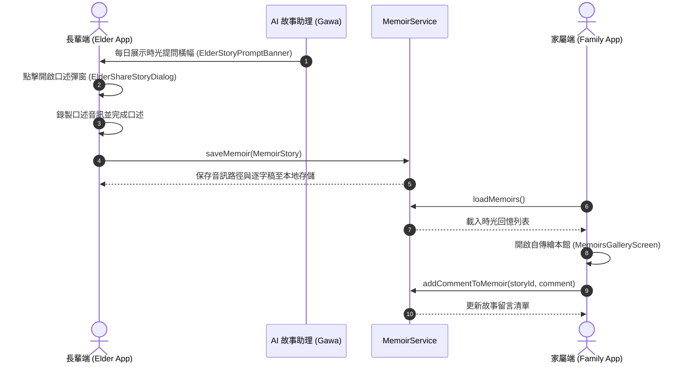

# 人生故事時光膠囊與自傳繪本館 (Life Story Capsule & Memoirs Gallery) 技術設計與實作紀錄

* 建立日期：2026-09-09
* 最近更新：2026-09-09
* 適用版本：v2.4.0+
* 負責組件：[前端/AI 伴侶/長輩手帳/家屬關懷]

---

## 1. 元數據 (Metadata Header)

| 屬性 | 規格與定義 |
| :--- | :--- |
| **模組名稱** | 人生故事時光膠囊 (Life Story Capsule) / 回憶繪本館 (Memoirs Gallery) |
| **主要路徑** | `mobile_app/lib/screens/family/memoirs_gallery_screen.dart`, `mobile_app/lib/services/memoir_service.dart` |
| **資料持久化** | 本地 SharedPreferences JSON 陣列快取 + 本地音訊檔案路徑儲存 |
| **關聯模組** | `ElderProfileTab` (長輩個人主頁), `FamilyDataTab` (家屬數據頁), `MemoirDetailSheet` (故事詳情彈窗) |

---

## 2. 功能背景與設計初衷 (Objectives & Background)

* **痛點分析**：
  過去長輩的生命智慧與家族回憶往往隨著歲月流逝而散佚，長輩即便想分享，往往不知從何說起；家屬則因生活忙碌難以引導長輩系統性記錄人生經歷。
* **照護與情感價值**：
  1. **非侵入式主動提問**：由 AI 虛擬伴侶（如小豬 Gawa）在長輩個人主頁每日拋出溫馨輕巧的提問（如「您小時候最喜歡玩什麼遊戲？」）。
  2. **口述錄音即成故事**：長輩只需按下麥克風按鈕口述，自動觸發語音轉文字 (ASR) 生成逐字稿，保存長輩最真實的嗓音與記憶。
  3. **四象限分類與時光膠囊**：將故事分為「童年回憶 🎈」、「青春熱血 🚲」、「成家立業 🏡」、「智慧錦囊 💡」。
  4. **跨世代自傳繪本館**：家屬端可切換網格或擬真翻頁繪本模式欣賞長輩的語音故事，並透過留言與點讚進行溫暖反饋，甚至可向 AI「委託提問」。

---

## 3. 系統架構與資料流向 (System Architecture & Data Flow)

### 3.1 故事錄製與跨端同步流程 (Sequence Flow)

### 3.2 資料模型規格 (`MemoirStory`)

* `id` (`String`): 唯一識別碼（毫秒時間戳）。
* `elderId` (`String`): 所屬長輩識別碼。
* `title` (`String`): 故事主題標題。
* `category` (`String`): 分類標籤（`childhood` / `youth` / `family` / `wisdom`）。
* `content` (`String`): 口述文字內容或逐字稿。
* `audioPath` (`String?`): 本地錄音檔案路徑。
* `audioDurationSeconds` (`int`): 音訊長度（秒）。
* `recordedAt` (`DateTime`): 錄製建立時間。
* `comments` (`List<MemoirComment>`): 家屬留言與關懷互動清單。

---

## 4. 代碼修改與路徑定義 (Implementation & File References)

* **[NEW] [memoir_story.dart](file:///c:/Users/tung0/Desktop/Uban/Uban/mobile_app/lib/models/memoir_story.dart)**：
  定義 `MemoirStory` 與 `MemoirComment` 資料結構、JSON 序列化與預設示範回憶生成器。
* **[NEW] [memoir_service.dart](file:///c:/Users/tung0/Desktop/Uban/Uban/mobile_app/lib/services/memoir_service.dart)**：
  提供故事 CRUD、按分類過濾、留言新增與單例快取儲存服務。
* **[NEW] [elder_share_story_dialog.dart](file:///c:/Users/tung0/Desktop/Uban/Uban/mobile_app/lib/screens/elder_tabs/profile/dialogs/elder_share_story_dialog.dart)**：
  長輩口述故事彈窗，具備麥克風錄音動態波紋動畫與一鍵上傳。
* **[NEW] [elder_story_prompt_banner.dart](file:///c:/Users/tung0/Desktop/Uban/Uban/mobile_app/lib/screens/elder_tabs/profile/widgets/elder_story_prompt_banner.dart)**：
  長輩個人頁頂部手繪提問橫幅，展示 AI 建議題目。
* **[NEW] [memoirs_gallery_screen.dart](file:///c:/Users/tung0/Desktop/Uban/Uban/mobile_app/lib/screens/family/memoirs_gallery_screen.dart)**：
  家屬端自傳繪本館，支援「時光卡片網格」與「自傳翻頁繪本」雙模式切換。
* **[NEW] [memoir_detail_sheet.dart](file:///c:/Users/tung0/Desktop/Uban/Uban/mobile_app/lib/widgets/memoir_detail_sheet.dart)**：
  底部故事詳情 Sheet，支援長輩原生錄音播放器（含進度條與時長）與家屬留言板。
* **[MODIFY] [family_data_tab.dart](file:///c:/Users/tung0/Desktop/Uban/Uban/mobile_app/lib/screens/family/family_data_tab.dart)**：
  整合時光膠囊入口卡片與預覽摘要。

---

## 5. 核心數學公式與物理演算法 (Core Mathematical Models)

### 5.1 繪本翻頁透視縮放與角度插值演算法

在繪本模式中，PageController 的滾動偏移量用於即時計算頁面的旋轉角度與透視景深矩陣：

$$\theta = (page - position) \times \frac{\pi}{6}$$

$$Matrix4 = \mathbf{I} \times \text{TranslateX}(dx) \times \text{RotateY}(\theta) \times \text{Scale}(1 - 0.15 \times |page - position|)$$

### 5.2 錄音波紋呼吸脈動半徑公式

長輩端錄音按鈕外圍的柔和呼吸光圈半徑隨時間正弦波動：

$$R(t) = R_{\text{base}} + \Delta R \cdot \left(\frac{1 + \sin(2\pi f t)}{2}\right)$$

其中：
* $R_{\text{base}} = 36.0\,\text{dp}$
* $\Delta R = 12.0\,\text{dp}$
* 頻率 $f = 1.2\,\text{Hz}$

---

## 6. UI/UX 視覺美學與無障礙規範 (Aesthetics & Accessibility)

* **繪本質感莫蘭迪配色**：
  * 童年回憶：奶油蜜桃粉 (`#FFF3E0`, 邊框 `#FFCCBC`)
  * 青春熱血：晨曦天青藍 (`#E1F5FE`, 邊框 `#B3E5FC`)
  * 成家立業：橄欖暖茶綠 (`#E8F5E9`, 邊框 `#C8E6C9`)
  * 智慧錦囊：沉穩薰衣草紫 (`#F3E5F5`, 邊框 `#E1BEE7`)
* **長輩端大字級與大觸控面積**：
  * 口述彈窗麥克風直徑達 **72dp**，確保手部輕微顫抖之長輩能輕鬆觸發。
  * 核心文字至少 **20pt - 24pt**，並具備文字超長防溢位換行保護。

---

## 7. 安全性防護與防誤觸機制 (Safety & Debouncing)

1. **空內容攔截**：長輩口述少於 3 個字或空白時，禁止送出並提示「再多說一點點喔～」。
2. **防重複提交**：送出按鈕點擊後即刻置灰並顯示旋轉指示器，避免連擊產生重複故事膠囊。
3. **資料隔離保護**：留言與回憶資料均綁定 `elderId`，禁止跨戶存取或竄改他人回憶。

---

## 8. 測試與驗證計畫 (Test Plan & Checklist)

* [x] **單元測試**：`test/services/memoir_service_test.dart`（驗證初始示範資料、新增故事、分類查詢與留言添加）。
* [x] **畫面測試**：`test/screens/memoirs_gallery_screen_test.dart`（驗證空白提示、卡片渲染、繪本雙模式切換）。
* [x] **元件測試**：`test/widgets/memoir_detail_sheet_test.dart`（驗證錄音模擬播放與即時留言互動）。
* [x] **迴歸測試**：全專案 54 項自動化測試 100% 通過。
