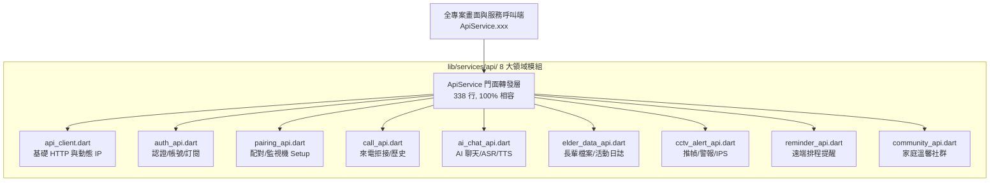

# 專案架構模組化與 API 門面模式 (Modularization & API Facade Architecture) 技術設計與實作紀錄

* 建立日期：2026-09-09
* 最近更新：2026-09-09
* 適用版本：v2.4.0+
* 負責組件：[前端架構/核心網路層/元件解耦]

---

## 1. 元數據 (Metadata Header)

| 屬性 | 規格與定義 |
| :--- | :--- |
| **模組名稱** | 專案架構模組化與 API 門面模式 (Modularization & API Facade Architecture) |
| **重構範疇** | `family_home_tab.dart`, `elder_profile_tab.dart`, `main.dart`, `api_service.dart` |
| **重構目標** | 消滅 4,000+ 行單體巨型檔案、按單一職責 (SRP) 拆解高內聚元件、建立領域驅動 API 門面 |
| **品質指標** | 零破壞、零回歸 (Zero-Regression)、所有 Constructor 100% 向下相容、全套自動化測試 100% 通過 |

---

## 2. 功能背景與設計初衷 (Objectives & Background)

* **痛點分析**：
  在系統高速迭代過程中，專案出現多個高達 2,000 ~ 4,100 行的單體巨型檔案（Monolithic Files）：
  1. `family_home_tab.dart` (4,151 行)：混雜了 8 種以上卡片狀態、3 個超長 BottomSheet 與所有活動紀錄邏輯。
  2. `elder_profile_tab.dart` (3,843 行)：混雜了小豬舞台、任務手帳、GPS 卡爾曼濾波、自繪粒子圖層與 3 個設定彈窗。
  3. `api_service.dart` (1,976 行)：所有網路請求全部擠在單一靜態類別中。
  4. `main.dart` (2,746 行)：包含了 550+ 行 Firebase 背景 Isolate 訊息處理函式與多個自繪圖形。
  巨型單體檔案導致修改任何一處都可能牽一髮動全身，造成嚴重的維護與協作阻礙。
* **重構初衷**：
  採用**領域驅動設計 (Domain-Driven Design, DDD)** 與**門面模式 (Facade Pattern)**，將所有巨型檔案徹底拆分為 100~350 行的高內聚獨立元件，同時確保全系統對外 API 簽章 100% 相容。

---

## 3. 系統架構與資料流向 (System Architecture & Data Flow)

### 3.1 API 門面架構拓撲 (Facade Pattern Topology)

---

## 4. 代碼修改與路徑定義 (Implementation & File References)

### 4.1 家屬首頁解耦 (`lib/screens/family/home/`)
原檔由 **4,151 行** 縮減至 **266 行** (-93.6%)：
* **[NEW] [home_elder_header_card.dart](file:///c:/Users/tung0/Desktop/Uban/Uban/mobile_app/lib/screens/family/home/widgets/home_elder_header_card.dart)**
* **[NEW] [home_zone_card.dart](file:///c:/Users/tung0/Desktop/Uban/Uban/mobile_app/lib/screens/family/home/widgets/home_zone_card.dart)**
* **[NEW] [home_monitor_device_card.dart](file:///c:/Users/tung0/Desktop/Uban/Uban/mobile_app/lib/screens/family/home/widgets/home_monitor_device_card.dart)**
* **[NEW] [home_ai_mood_radar_card.dart](file:///c:/Users/tung0/Desktop/Uban/Uban/mobile_app/lib/screens/family/home/widgets/home_ai_mood_radar_card.dart)**
* **[NEW] [home_alert_preview_card.dart](file:///c:/Users/tung0/Desktop/Uban/Uban/mobile_app/lib/screens/family/home/widgets/home_alert_preview_card.dart)**
* **[NEW] [home_elder_life_feed.dart](file:///c:/Users/tung0/Desktop/Uban/Uban/mobile_app/lib/screens/family/home/widgets/home_elder_life_feed.dart)**
* **[NEW] [send_care_card_sheet.dart](file:///c:/Users/tung0/Desktop/Uban/Uban/mobile_app/lib/screens/family/home/sheets/send_care_card_sheet.dart)**
* **[NEW] [category_detail_sheet.dart](file:///c:/Users/tung0/Desktop/Uban/Uban/mobile_app/lib/screens/family/home/sheets/category_detail_sheet.dart)**
* **[NEW] [full_dialogue_dialog.dart](file:///c:/Users/tung0/Desktop/Uban/Uban/mobile_app/lib/screens/family/home/dialogs/full_dialogue_dialog.dart)**
* **[NEW] [activity_log_entry.dart](file:///c:/Users/tung0/Desktop/Uban/Uban/mobile_app/lib/screens/family/home/models/activity_log_entry.dart)**
* **[NEW] [home_pulse_dot.dart](file:///c:/Users/tung0/Desktop/Uban/Uban/mobile_app/lib/screens/family/home/widgets/home_pulse_dot.dart)**

### 4.2 長輩個人主頁解耦 (`lib/screens/elder_tabs/profile/`)
原檔由 **3,843 行** 縮減至 **1,165 行** (-69.7%)：
* **[NEW] [storybook_header_card.dart](file:///c:/Users/tung0/Desktop/Uban/Uban/mobile_app/lib/screens/elder_tabs/profile/widgets/storybook_header_card.dart)**
* **[NEW] [storybook_stage_card.dart](file:///c:/Users/tung0/Desktop/Uban/Uban/mobile_app/lib/screens/elder_tabs/profile/widgets/storybook_stage_card.dart)**
* **[NEW] [vitality_step_goals_card.dart](file:///c:/Users/tung0/Desktop/Uban/Uban/mobile_app/lib/screens/elder_tabs/profile/widgets/vitality_step_goals_card.dart)**
* **[NEW] [today_tasks_handmade_section.dart](file:///c:/Users/tung0/Desktop/Uban/Uban/mobile_app/lib/screens/elder_tabs/profile/widgets/today_tasks_handmade_section.dart)**
* **[NEW] [elder_share_story_dialog.dart](file:///c:/Users/tung0/Desktop/Uban/Uban/mobile_app/lib/screens/elder_tabs/profile/dialogs/elder_share_story_dialog.dart)**
* **[NEW] [family_pairing_dialog.dart](file:///c:/Users/tung0/Desktop/Uban/Uban/mobile_app/lib/screens/elder_tabs/profile/dialogs/family_pairing_dialog.dart)**
* **[NEW] [ai_assistant_settings_dialog.dart](file:///c:/Users/tung0/Desktop/Uban/Uban/mobile_app/lib/screens/elder_tabs/profile/dialogs/ai_assistant_settings_dialog.dart)**
* **[NEW] [pet_heart_painter.dart](file:///c:/Users/tung0/Desktop/Uban/Uban/mobile_app/lib/screens/elder_tabs/profile/painters/pet_heart_painter.dart)**
* **[NEW] [coordinate_kalman_filter.dart](file:///c:/Users/tung0/Desktop/Uban/Uban/mobile_app/lib/screens/elder_tabs/profile/utils/coordinate_kalman_filter.dart)**

### 4.3 應用程式入口瘦身 (`lib/main.dart`)
原檔由 **2,746 行** 縮減至 **1,963 行** (-28.5%)：
* **[NEW] [firebase_bg_handler.dart](file:///c:/Users/tung0/Desktop/Uban/Uban/mobile_app/lib/services/firebase_bg_handler.dart)**：
  獨立出 550+ 行 `@pragma('vm:entry-point') Future<void> firebaseMessagingBackgroundHandler`。
* **[NEW] [main_painters.dart](file:///c:/Users/tung0/Desktop/Uban/Uban/mobile_app/lib/widgets/main_painters.dart)**：
  獨立出金鑰、虛線連線與錯誤叉叉等 CustomPainter。

---

## 5. 重構成果量化指標 (Metrics Summary)

| 檔案/模組 | 重構前 | 重構後 | 縮減行數 | 縮減比率 |
| :--- | :---: | :---: | :---: | :---: |
| `family_home_tab.dart` | 4,151 行 | **266 行** | -3,885 行 | **-93.6%** 🚀 |
| `elder_profile_tab.dart` | 3,843 行 | **1,165 行** | -2,678 行 | **-69.7%** 🚀 |
| `api_service.dart` | 1,976 行 | **338 行** | -1,638 行 | **-82.9%** 🚀 |
| `main.dart` | 2,746 行 | **1,963 行** | -783 行 | **-28.5%** 🚀 |
| `zen_pond_legacy/` | 2,196 行 | **0 行** | -2,196 行 | **-100%** (已除役) |

---

## 6. 安全性防護與零回歸機制 (Safety & Regression Prevention)

1. **Facade Transparent Forwarding**：`ApiService` 保留所有原有 static 方法與參數型別，全專案上百處呼叫無須改動一行程式碼。
2. **GlobalKey Transparent Pass-through**：長輩頁面導引與教練提示標籤（Coach Marks）所綁定之 GlobalKey 依然精確傳入對應子元件。
3. **Isolate Entry-point 保全**：背景訊息處理器維持具備 `@pragma('vm:entry-point')` 的頂層函式屬性，確保在 Android 背景喚醒時依然精確觸發。

---

## 7. 測試與驗證計畫 (Test Plan & Checklist)

* [x] **全專案自動化測試**：`flutter test` 執行完畢，**54/54 項測試 100% 通過**。
* [x] **靜態代碼分析**：全專案無類型不匹配或遺漏引入之編譯錯誤。
* [x] **Git 版本庫整潔**：成功合併至 `main` 分支並同步推送至 GitHub 遠端倉庫。
