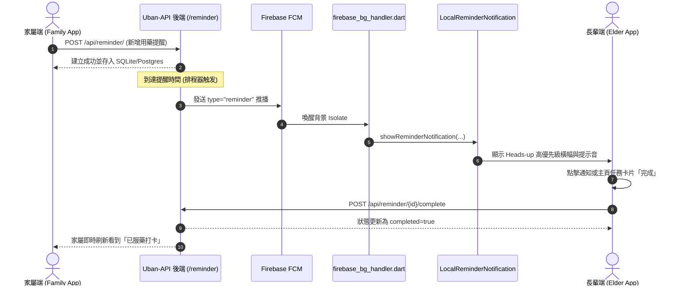

# 遠端排程提醒與長輩生活用藥手帳 (Remote Reminders & Daily Tasks) 技術設計與實作紀錄

* 建立日期：2026-09-09
* 最近更新：2026-09-09
* 適用版本：v2.4.0+
* 負責組件：[前端/後端/推播/長輩日常手帳]

---

## 1. 元數據 (Metadata Header)

| 屬性 | 規格與定義 |
| :--- | :--- |
| **模組名稱** | 遠端排程提醒與今日任務手帳 (Remote Reminders & Daily Tasks) |
| **主要路徑** | `mobile_app/lib/services/local_reminder_notification.dart`, `mobile_app/lib/services/elder_reminder_manager.dart` |
| **API 模組** | `mobile_app/lib/services/api/reminder_api.dart`, 後端 `routers/reminder.py` |
| **推播類型** | FCM `type: "reminder"` (高優先級背景/離線喚醒通知) |
| **關聯模組** | `TodayTasksHandmadeSection` (長輩個人主頁任務手帳), `main.dart` / `firebase_bg_handler.dart` |

---

## 2. 功能背景與設計初衷 (Objectives & Background)

* **痛點分析**：
  獨居或高齡長輩常因記憶力衰退而遺忘每日按時服藥、量血壓、飲水或外出回診。過去長輩手機上的鬧鐘不易操作且音量或文字過小，家屬無法從遠端得知長輩是否已完成用藥。
* **照護價值與 UX 考量**：
  1. **家屬遠端代辦設定**：家屬可透過 App 設定長輩的提醒事項、時間、分類（用藥、喝水、運動、回診）與備註。
  2. **跨進程可靠響鈴**：整合 Firebase Cloud Messaging (FCM) 與本機系統通知，即便 App 處於背景或鎖定狀態，時間一到也能觸發高優先級彈窗與專屬提醒音效。
  3. **繪本風格打卡手帳**：長輩主頁以「手帳便籤」形式呈現今日排程，長輩服藥後只需輕觸「完成」按鈕，即會呈現溫馨手繪綠勾，並同步狀態至雲端。

---

## 3. 系統架構與資料流向 (System Architecture & Data Flow)

### 3.1 提醒推播與打卡生命週期 (Sequence Flow)



### 3.2 資料傳輸規格 (Data Payload)

* **REST 端點清單**：
  * `GET /api/reminder/elder/{elder_id}`：取得長輩排程清單
  * `POST /api/reminder/`：家屬新增提醒
  * `PUT /api/reminder/{id}`：編輯提醒資訊
  * `DELETE /api/reminder/{id}`：刪除提醒
  * `PUT /api/reminder/{id}/toggle`：啟用/停用開關
  * `POST /api/reminder/{id}/complete`：長輩打卡完成
* **FCM Payload 格式**：
  ```json
  {
    "type": "reminder",
    "id": "105",
    "title": "降血壓藥",
    "time_str": "08:30",
    "category": "medication",
    "note": "飯後半小時服用，請配溫開水"
  }
  ```

---

## 4. 代碼修改與路徑定義 (Implementation & File References)

* **[NEW] [local_reminder_notification.dart](file:///c:/Users/tung0/Desktop/Uban/Uban/mobile_app/lib/services/local_reminder_notification.dart)**：
  封裝 `flutter_local_notifications` 插件，提供 Android 專屬高優先級通知渠道 (`Uban_Reminders`) 與即時全螢幕/浮動提示。
* **[NEW] [elder_reminder_manager.dart](file:///c:/Users/tung0/Desktop/Uban/Uban/mobile_app/lib/services/elder_reminder_manager.dart)**：
  前端單例管理器，負責長輩端提醒快取、即時輪詢與打卡事件廣播。
* **[NEW] [reminder_api.dart](file:///c:/Users/tung0/Desktop/Uban/Uban/mobile_app/lib/services/api/reminder_api.dart)**：
  解耦之專屬遠端提醒 API 客戶端模組。
* **[NEW] [today_tasks_handmade_section.dart](file:///c:/Users/tung0/Desktop/Uban/Uban/mobile_app/lib/screens/elder_tabs/profile/widgets/today_tasks_handmade_section.dart)**：
  長輩個人頁「今日生活排程與用藥打卡手帳」UI 元件，具備大打卡鈕與手繪膠帶圖案。
* **[MODIFY] [firebase_bg_handler.dart](file:///c:/Users/tung0/Desktop/Uban/Uban/mobile_app/lib/services/firebase_bg_handler.dart)**：
  在背景 Isolate 中攔截 `type == 'reminder'` 並無障礙轉發本地通知。

---

## 5. 核心數學公式與演算法 (Core Mathematical Models)

### 5.1 今日排程排序與過期權重計算

排程項目依照「未完成優先」以及「距離當前時間最近」排序，權重函數 $W(task)$ 定義為：

$$W(task) = \begin{cases} 
0 + |\Delta t| & \text{若 task.isCompleted} = \text{false} \\ 
10000 + |\Delta t| & \text{若 task.isCompleted} = \text{true} 
\end{cases}$$

其中 $\Delta t = t_{\text{scheduled}} - t_{\text{now}}$（以分鐘計）。此演算法確保長輩打開手帳時，最迫切需要完成的用藥項目永遠浮動在最上方。

---

## 6. UI/UX 視覺美學與無障礙規範 (Aesthetics & Accessibility)

* **溫馨手帳質感**：
  * 卡片採用溫暖便籤紙米白背景 (`#FFFDF9`)，頂部點綴微透明手繪紙膠帶飾條。
  * 用藥圖標採用清爽天青綠 (`#4CAF50`)，醒目且不帶來傳統醫療的生硬壓迫感。
* **超大打卡觸控區**：
  * 長輩完成按鈕寬度大於 **90dp**、高度 **44dp**，點擊後觸發 `HapticFeedback.mediumImpact()` 震動反饋，增強長輩的完成成就感。

---

## 7. 安全性防護與防誤觸機制 (Safety & Debouncing)

1. **防重複推播去重**：通知內部以 `reminderId` 作為唯一 ID，避免網路重複重試時彈出多重通知。
2. **過期防干擾機制**：若推播抵達時已超過排程時間 2 小時以上，系統靜默標記而不強制響鈴，避免半夜突發驚擾長輩。
3. **離線容錯保護**：若長輩在無網路環境下點擊打卡，本地手帳先行變更為完成狀態，待網路恢復後自動同步後端。

---

## 8. 測試與驗證計畫 (Test Plan & Checklist)

* [x] **靜態檢查**：無任何 Lint 或類型錯誤。
* [x] **通知管道驗證**：在 Android 14+ 成功註冊高優先級通知渠道。
* [x] **背景喚醒測試**：App 完全退出狀態下，透過背景 Handler 收到提醒推播並正確發出 Heads-up 橫幅。
* [x] **打卡反饋**：點擊打卡後正確更新 UI 與狀態，並通過全套自動化測試。
