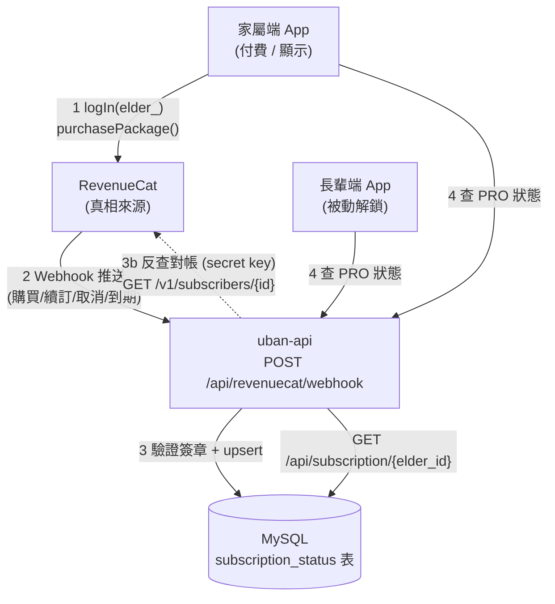

# 訂閱會員系統 (RevenueCat) 技術設計與實作紀錄

* 建立日期：2026-07-27
* 最近更新：2026-07-29
* 適用版本：v1.1.0
* 負責組件：後端 (uban-api) + 家屬端 (Flutter) + 長輩端 (Flutter)
* 文件狀態：**已實作並通過端到端驗證（2026-07-29）**

> 本文件為「家屬替長輩訂閱 PRO 進階照護」的正式架構設計。
> 後端 Webhook 落地、查詢端點、家屬端綁定購買、長輩端功能鎖（金豬徽章）皆已完成，
> 並於 Android 模擬器 + RevenueCat Test Store 完成端到端驗證（詳見 ❽ 測試結果）。

---

## ❷ 功能背景與設計初衷 (Objectives & Background)

### 為了解決什麼痛點

1. **狀態不及時**：目前若只靠客戶端 RevenueCat SDK 的 `getCustomerInfo()`，SDK 會本地快取，
   在後台（RevenueCat / 商店）取消或到期後，App 端可能仍顯示 PRO，無單一即時真相來源。
2. **家屬買、長輩用的跨身分斷層（核心痛點）**：付費行為發生在**家屬**的帳號 / 裝置，
   但要解鎖進階照護的是**長輩**的 App。兩者是不同 `user_id`、不同裝置，
   因此**不能只靠單一裝置的 SDK entitlement** —— 長輩端無法從自己的 SDK 得知「家屬幫我開通了」。
3. **與既有欄位脫節**：資料庫 `user_account_data` 已有 `user_authority`（`enum('Normal','Sub1',...)`）
   與 `payment_channel`，但目前無機制把 RevenueCat 的真實訂閱狀態同步進來。

### 照護價值與 UX 考量

* 家屬替長輩付費，長輩端須**即時、被動地**解鎖 AI 深度洞察等進階功能，長輩本人不需操作任何付費流程。
* PRO 狀態要能被**後端**掌握，才能做伺服器端功能鎖、到期提醒推播、以及跨兩端一致的顯示。

---

## ❸ 系統架構與資料流向 (System Architecture & Data Flow)

### 架構拓撲：以「後端為單一真相來源」

RevenueCat 為訂閱真相來源；透過 **Webhook 推送**，把狀態落地到 uban-api 的 MySQL，
家屬端與長輩端一律向 **uban-api** 查 PRO 狀態，而非各自跟 RevenueCat 對帳。



### App User ID 綁定策略（關鍵）

* 家屬在為**某位長輩**開啟付費前，先呼叫 `Purchases.logIn("elder_<elderId>")`，
  使該筆訂閱掛在該長輩的 RevenueCat 身分上。
* Webhook 回傳的 `app_user_id` = `elder_<elderId>`，後端據此解析出 `elder_id` 並更新該長輩的會員狀態。
* 長輩端**完全不需**整合購買 SDK，只需向 uban-api 查 `GET /api/subscription/{elder_id}`。

### 資料傳輸規格

#### (A) RevenueCat → 後端：Webhook

| 項目 | 規格 |
|------|------|
| 路由 | `POST /api/revenuecat/webhook` |
| Port | 8000（沿用） |
| 認證 | HTTP Header `Authorization: <RC_WEBHOOK_SECRET>`（於 RevenueCat 後台設定，後端逐一驗證） |
| 逾時 | 後端須於數秒內回 200；重運算移背景執行緒 |

關注的事件類型（`event.type`）：`INITIAL_PURCHASE`、`RENEWAL`、`PRODUCT_CHANGE`、
`CANCELLATION`、`EXPIRATION`、`BILLING_ISSUE`、`SUBSCRIPTION_PAUSED`、`TEST`（Test Store）。

Webhook Payload（節錄，實際以 RevenueCat 文件為準）：
```json
{
  "event": {
    "type": "INITIAL_PURCHASE",
    "id": "UNIQUE_EVENT_ID",
    "app_user_id": "elder_0343",
    "product_id": "sub1month",
    "entitlement_ids": ["Uban-pro"],
    "purchased_at_ms": 1785146941000,
    "expiration_at_ms": 1785150541000,
    "store": "TEST_STORE",
    "environment": "SANDBOX"
  }
}
```

#### (B) 前端 → 後端：查詢會員狀態

| 方法 | 路由 | 回傳 |
|------|------|------|
| GET | `/api/subscription/{elder_id}` | `{ elder_id, is_pro, entitlement, product_id, expires_at }` |

```jsonc
// 200 OK（success_response 標準格式）
{ "status": "success",
  "data": { "elder_id": "0343", "is_pro": true, "entitlement": "Uban-pro",
            "product_id": "sub1month", "expires_at": "2026-07-27T10:54:01Z" },
  "error": null }
```

---

## ❹ 代碼修改與路徑定義 (Implementation & File References)

### 後端 (uban-api)

* **[DB-確認]** 新增資料表 `subscription_status`（**依 DATABASE_SCHEMA_CRITICAL.md 規範，需使用者確認後才可建立**）：
  ```sql
  CREATE TABLE subscription_status (
    id                   INT AUTO_INCREMENT PRIMARY KEY,
    elder_id             VARCHAR(4)   NOT NULL COMMENT '受益長輩 elder_profile.elder_id',
    entitlement          VARCHAR(64)  NOT NULL COMMENT '如 Uban-pro',
    is_active            TINYINT(1)   NOT NULL DEFAULT 0,
    product_id           VARCHAR(64)           COMMENT 'sub1month/sub3month/sub1year',
    store                VARCHAR(32)           COMMENT 'TEST_STORE/PLAY_STORE/APP_STORE',
    purchased_by         INT                   COMMENT '付費家屬 user_account_data.user_id',
    original_app_user_id VARCHAR(128)          COMMENT '如 elder_0343',
    latest_event_id      VARCHAR(128)          COMMENT 'webhook 事件去重',
    purchase_at          DATETIME,
    expires_at           DATETIME,
    updated_at           DATETIME,
    UNIQUE KEY uk_elder_entitlement (elder_id, entitlement)
  );
  ```
* **[NEW]** [routers/subscription.py](file:///C:/Users/kevin/Desktop/115207/uban-api/routers/subscription.py)
  * `POST /api/revenuecat/webhook`：驗證 secret → 解析 `app_user_id` → `db_cursor()` 參數化 upsert（`%s`，禁 ORM）。
  * `GET /api/subscription/{elder_id}`：讀表回傳 `is_pro`（`is_active AND expires_at > NOW()`）。
* **[MODIFY]** [main.py](file:///C:/Users/kevin/Desktop/115207/uban-api/main.py)：`app.include_router(subscription.router)`。
* **[調和既有欄位]** 選配：webhook 更新時，同步把該長輩對應 `user_account_data.user_authority`
  設為 `Sub1`（active）/ `Normal`（到期）。**此為改動既有欄位語意，須使用者確認**。

### 前端 — 共用 (Flutter)

* **[NEW-已完成]** [services/subscription_service.dart](file:///C:/Users/kevin/Desktop/115207/Uban/mobile_app/lib/services/subscription_service.dart)：
  封裝 `GET /api/subscription/{elderId}`，供家屬 / 長輩端共用。
  * `SubscriptionStatus` 模型（`elderId / isPro / entitlement / productId / expiresAt`）。
  * `fetchStatus(elderId, {forceRefresh})`：60 秒記憶體快取，避免同頁多個 widget 重複打 API；
    逾時或任何例外一律回 `SubscriptionStatus.free()`（**後端掛掉不擋 App 正常運作**）。
  * `appUserIdFor(elderId) → "elder_<id>"`：App User ID 格式的單一來源，與後端 `_parse_elder_id` 對應。
  * `invalidate([elderId])`：購買完成 / 切換長輩時清快取。
  * ⚠️ **本檔刻意不 import `purchases_flutter`**，長輩端才能只讀狀態、不背購買 SDK。

### 前端 — 家屬端 (Flutter)

* **[MODIFY-已完成]** [subscription_test_screen.dart](file:///C:/Users/kevin/Desktop/115207/Uban/mobile_app/lib/screens/family/subscription_test_screen.dart)：
  * 新增 `elderId` / `elderName` 參數；`Purchases.configure()` 時 `appUserID` 直接設為 `elder_<id>`。
  * 若 SDK 已 configure 但目前身分不符（從別頁進來、或切換過長輩）→ `Purchases.logIn()` 換成正確身分；
    購買前再確認一次，避免開通到上一位長輩。
  * 購買成功後 `_refreshBackendStatus(retries: 4)`：每 2 秒重查後端，等 RevenueCat webhook 非同步送達。
  * 狀態卡新增「後端訂閱狀態（長輩端依此解鎖）」一列，與 SDK 狀態並列對照。
* **[MODIFY-已完成]** [family_main_screen.dart](file:///C:/Users/kevin/Desktop/115207/Uban/mobile_app/lib/screens/family_main_screen.dart)：
  AppBar 皇冠入口帶入當前長輩 `elderId: elder?.elderId ?? elder?.id.toString()`。

### 前端 — 長輩端 (Flutter)

* **[MODIFY-已完成]** [elder_tabs/elder_home_tab.dart](file:///C:/Users/kevin/Desktop/115207/Uban/mobile_app/lib/screens/elder_tabs/elder_home_tab.dart)：
  首頁會員徽章改由後端驅動。`_loadSubscription()` 以 `widget.roomId`（長輩端的 roomId **即** `elder_id`，
  來源見 `main.dart` 的 `elderIdUuid`）呼叫 `SubscriptionService.isPro()`。
  * **徽章只做「金豬」一階**：已開通 → 顯示金豬會員膠囊；未開通 → 整個膠囊不顯示。
    **不做銀豬 / 銅豬分級**（`assets/images/pig_badge_silver|bronze.png` 目前未使用）。
  * 長輩端**不整合購買 SDK**，僅以後端狀態作為功能鎖。

---

## ❺ 核心數學公式與物理演算法 (Core Mathematical Models)

無（純業務狀態同步，無動畫 / 物理 / 數值對映）。

`is_pro` 判定邏輯：
```
is_pro = subscription_status.is_active = 1  AND  expires_at > NOW()
```

---

## ❻ UI/UX 視覺美學與無障礙規範 (Aesthetics & Accessibility)

* **家屬端 Paywall**（`SubscriptionTestScreen`，2026-08-10 改版）：採「官網 Pricing 頁」骨架，
  配色沿用家屬端既有 slate + sky 色階（見檔內 `_Palette`）：
  底 `#F8FAFC`、卡片白、主文字 `#0F172A`、次要 `#64748B`、小字 `#94A3B8`、
  邊框 `#E2E8F0`、強調 `#0284C7`（亮色 `#38BDF8`）、已開通綠 `#16A34A`。
  區塊順序：Hero 標題 → 目前狀態列 → 月/季/年方案卡 → 「所有方案都包含」特色清單
  → 深色 CTA（`#0F172A`）→ 條款小字 → 開發者選項（收合）。
  * 方案卡為**自繪選取卡**（非 `RadioGroup`/`RadioListTile`），選中 2px `#0284C7` 邊框 + 淡藍陰影。
  * 比價由前端自算：`storeProduct.price ÷ 週期月數` → 「平均每月」；與月繳價相比 → 「省 xx%」，
    掛在省最多的方案上並預設選取。無月繳方案或週期不明（lifetime / custom）時整個略過比價。
  * 除錯資訊（App User ID、SDK 權限、後端狀態、切換測試 User、重新整理）一律收在
    最下方 `ExpansionTile`「開發者選項」內，預設收合。
  * 特色清單（`_features`）目前僅為 UI 文案，尚未對應真正被鎖住的功能，見 ❽「功能鎖尚未接上」。
* **長輩端**：僅呈現「已開通 / 未開通」結果，**不出現付費 UI**。
  實作上採「**有才顯示**」而非灰階降級——未開通時整個徽章不出現，
  避免在長輩畫面上製造看不懂的鎖頭或推銷入口（付費決策屬家屬端）。
  金豬膠囊：底 `#FFF1C4`、字 `#9A6B1E`、徽章圖 36px、文字 18pt w900。
* 家屬端測試頁 PRO 徽章配色：啟用綠 `#16A34A`、未啟用灰 `#64748B`。

---

## ❼ 安全性防護與防誤觸機制 (Safety & Debouncing)

1. **Webhook 驗證（最重要）**：後端必須驗證 RevenueCat 送來的 `Authorization` header 與後台設定的
   secret 相符，否則任何人都能偽造 `app_user_id` 開通 PRO。驗證失敗一律回 401。
2. **金鑰分層**：
   * 前端只用 **public SDK key**（Test Store `test_`、正式 `goog_`/`appl_`）。
   * **secret key（`sk_`）只放後端**，用於反查 `GET /v1/subscribers/{id}` 對帳，**嚴禁進前端**。
   * ⚠️ 現階段測試金鑰 `test_...` 屬 Test Store，正式上架必須換平台金鑰（見測試頁註解）。
3. **冪等性**：Webhook 可能重送。
   * ✅ **已實作**：以 `(elder_id, entitlement)` 唯一鍵 upsert（手動 `SELECT → UPDATE/INSERT`），
     重送同一事件不會產生重複列，`latest_event_id` 有記錄下來供追查。
   * ⚠️ **尚未實作（已知缺口）**：目前並**未**用 `latest_event_id` 做去重，也**未**比對 `expiration_at_ms`
     只接受較新狀態。若 RevenueCat 亂序重送（例如 `EXPIRATION` 晚於 `RENEWAL` 抵達），
     舊事件會覆蓋新狀態，造成短暫誤降級。上線前應補上「時間戳較舊則略過」的判斷。
4. **多租戶隔離**：所有查詢以 `elder_id` / `family_id` 參數化（`%s`）絕對隔離，禁字串拼接。
5. **防誤觸**：購買按鈕 Loading 鎖定（測試頁已具備 `_busy` 機制），避免重複下單。

---

## ❽ 測試與驗證計畫與結果 (Test Plan, Checklist & Results)

### 驗證結果（2026-07-29，測試長輩 `elder_6160`／家屬 BoYo，Android 模擬器 Pixel_9a）

**後端 API（`curl` 直打線上端點）**

| 項目 | 預期 | 結果 |
|------|------|------|
| `POST` webhook `INITIAL_PURCHASE` + `app_user_id=elder_6160` | 200、`is_active=1` | ✅ |
| `GET /api/subscription/6160` | `is_pro=true` | ✅ |
| `POST` webhook 帶錯誤 `Authorization` | 401 | ✅ |
| `POST` webhook `EXPIRATION` | `is_pro` 轉 `false` | ✅ |
| `POST` webhook `RENEWAL` | 轉回 `true`，且表中仍只有 1 列 | ✅ |
| `POST` webhook `app_user_id` 非 `elder_` 開頭 | `skipped:true`、不落表、仍回 200 | ✅ |
| `GET` 未訂閱長輩 `9053` | `is_pro=false`、欄位為 null | ✅ |

**端到端（真實 RevenueCat Test Store 購買）**

1. 家屬端訂閱頁顯示「綁定長輩：宇璿 / `elder_6160`」→ `Purchases.logIn` 綁定生效 ✅
2. Test Store 選 *Test valid Purchase* → SDK 轉「已解鎖 VIP (PRO)」✅
3. 後端狀態列自動轉「PRO 已開通」→ webhook 於重試視窗內送達 ✅
4. DB `latest_event_id` 為 RevenueCat 產生的 UUID（非測試用 curl 事件）→ **證明後台 Webhook 設定正確** ✅
5. 長輩端（後端 `is_pro=true`）→ 首頁金豬徽章亮起 ✅
6. 送 `EXPIRATION` 後重啟長輩端 → 徽章消失、只剩頭像 ✅（確認由後端驅動、非寫死）

**靜態分析**：`flutter analyze` 對本次 4 個異動檔皆無新增問題 ✅

### 🐛 2026-08-10 發現：webhook 自 07-30 起全數 500（已修，待部署驗證）

`revenuecat_webhook()` 第 182 行用 `entitlement_ids`，但賦值那行
（`entitlement_ids = event.get("entitlement_ids") or []`）在 07-30「Task 6」重構時被誤刪
（原始 commit `40d0b34` 有）。任何**非 TEST** 且 `app_user_id` 為 `elder_` 開頭的事件
都會 `NameError` → 500，`subscription_status` 自此不再更新。

**為什麼一直沒被發現**：TEST 事件在第 170 行就 `return`，後台「Send test event」全綠；
`GET /api/subscription/{elder_id}` 也照常回舊資料，看不出寫入已死。
線索是 elder_6160 的 `expires_at` 卡在 `2026-07-29 10:57:22`——最後一次成功寫入那天。

**教訓**：❽ 的端到端驗證是用 `curl` 直打 + 一次真實購買完成的，但**沒有留下自動化測試**
（見下方「後端尚未新增 `tests/test_subscription.py`」）。有那支測試的話，這個 NameError
在重構當下就會被擋住。補測試的優先級應提高。

---

### 已知限制與未完成項目

* **Test Store 訂閱僅約 5 分鐘到期**（實測 10:32 購買、`expires_at` 10:37），
  徽章隨後自然消失屬測試環境特性，非缺陷。
* 後端尚未新增 `tests/test_subscription.py`（本輪以 `curl` 手動驗證代替）。
* Webhook 亂序重送的時間戳保護尚未實作（見 ❼-3）。
* **功能鎖尚未接上**：`SubscriptionService` 目前只驅動長輩端金豬徽章，
  尚無任何 PRO 專屬功能被實際鎖定，待定義 PRO 功能清單後補上。
* 正式上架前須將 `test_` 金鑰換為 `goog_` / `appl_`，並把 `Purchases.configure()` 移至 `main.dart` 只做一次。

### 邊界情境（尚未逐一驗證）

`elder_id` 不存在時的外鍵拒絕行為、後端離線時前端回退顯示（程式上一律回未訂閱）、
以及跨實體裝置（長輩端不裝購買 SDK）的實機驗證。

---

## 附錄：與現有 `user_authority` 的關係（待你決策）

資料庫已有 `user_account_data.user_authority = enum('Normal','Sub1',...)`。兩種取捨：

| 方案 | 做法 | 優缺點 |
|------|------|--------|
| **A（建議）** | 新增 `subscription_status` 專表為 RevenueCat 真相落地，`user_authority` 維持不動或由 webhook 衍生更新 | 訂閱細節（到期、product、store）完整可查；不破壞既有欄位語意 |
| B | 不建新表，直接用 webhook 更新 `user_authority` | 最省，但遺失到期日/商品等資訊，且改動既有欄位語意風險高 |

> 依 `DATABASE_SCHEMA_CRITICAL.md`：**新增表 / 改動欄位語意都須你確認**後才執行。
