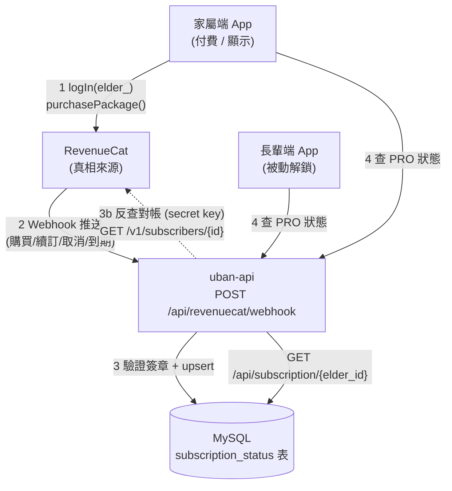

# 訂閱會員系統 (RevenueCat) 技術設計與實作紀錄

* 建立日期：2026-07-27
* 最近更新：2026-07-27
* 適用版本：v1.1.0（規劃中）
* 負責組件：後端 (uban-api) + 家屬端 (Flutter) + 長輩端 (Flutter)
* 文件狀態：**設計提案（待使用者確認後實作）**

> 本文件為「家屬替長輩訂閱 PRO 進階照護」的正式架構設計。目前已完成的 `SubscriptionTestScreen`
> （見 [subscription_test_screen.dart](file:///C:/Users/kevin/Desktop/115207/Uban/mobile_app/lib/screens/family/subscription_test_screen.dart)）
> 僅為 RevenueCat Test Store 的**前端付費流程驗證**，尚未接後端會員狀態同步；本文件描述的即為那一層。

---

## ❷ 功能背景與設計初衷 (Objectives & Background)

### 為了解決什麼痛點

1. **狀態不及時**：目前若只靠客戶端 RevenueCat SDK 的 `getCustomerInfo()`，SDK 會本地快取，
   在後台（RevenueCat / 商店）取消或到期後，App 端可能仍顯示 PRO，無單一即時真相來源。
2. **家屬買、長輩用的跨身分斷層（核心痛點）**：付費行為發生在**家屬**的帳號 / 裝置，
   但要解鎖進階照護的是**長輩**的 App。兩者是不同 `user_id`、不同裝置，
   因此**不能只靠單一裝置的 SDK entitlement** —— 長輩端無法從自己的 SDK 得知「家屬幫我開通了」。
3. **與既有欄位脫節**：資料庫 `user_account_data` 已有 `user_authority`（`enum('Normal','Sub1',...)`）
   與 `payment_channel`，但目前無機制把 RevenueCat 的真實訂閱狀態同步進來。

### 照護價值與 UX 考量

* 家屬替長輩付費，長輩端須**即時、被動地**解鎖 AI 深度洞察等進階功能，長輩本人不需操作任何付費流程。
* PRO 狀態要能被**後端**掌握，才能做伺服器端功能鎖、到期提醒推播、以及跨兩端一致的顯示。

---

## ❸ 系統架構與資料流向 (System Architecture & Data Flow)

### 架構拓撲：以「後端為單一真相來源」

RevenueCat 為訂閱真相來源；透過 **Webhook 推送**，把狀態落地到 uban-api 的 MySQL，
家屬端與長輩端一律向 **uban-api** 查 PRO 狀態，而非各自跟 RevenueCat 對帳。



### App User ID 綁定策略（關鍵）

* 家屬在為**某位長輩**開啟付費前，先呼叫 `Purchases.logIn("elder_<elderId>")`，
  使該筆訂閱掛在該長輩的 RevenueCat 身分上。
* Webhook 回傳的 `app_user_id` = `elder_<elderId>`，後端據此解析出 `elder_id` 並更新該長輩的會員狀態。
* 長輩端**完全不需**整合購買 SDK，只需向 uban-api 查 `GET /api/subscription/{elder_id}`。

### 資料傳輸規格

#### (A) RevenueCat → 後端：Webhook

| 項目 | 規格 |
|------|------|
| 路由 | `POST /api/revenuecat/webhook` |
| Port | 8000（沿用） |
| 認證 | HTTP Header `Authorization: <RC_WEBHOOK_SECRET>`（於 RevenueCat 後台設定，後端逐一驗證） |
| 逾時 | 後端須於數秒內回 200；重運算移背景執行緒 |

關注的事件類型（`event.type`）：`INITIAL_PURCHASE`、`RENEWAL`、`PRODUCT_CHANGE`、
`CANCELLATION`、`EXPIRATION`、`BILLING_ISSUE`、`SUBSCRIPTION_PAUSED`、`TEST`（Test Store）。

Webhook Payload（節錄，實際以 RevenueCat 文件為準）：
```json
{
  "event": {
    "type": "INITIAL_PURCHASE",
    "id": "UNIQUE_EVENT_ID",
    "app_user_id": "elder_0343",
    "product_id": "sub1month",
    "entitlement_ids": ["Uban-pro"],
    "purchased_at_ms": 1785146941000,
    "expiration_at_ms": 1785150541000,
    "store": "TEST_STORE",
    "environment": "SANDBOX"
  }
}
```

#### (B) 前端 → 後端：查詢會員狀態

| 方法 | 路由 | 回傳 |
|------|------|------|
| GET | `/api/subscription/{elder_id}` | `{ elder_id, is_pro, entitlement, product_id, expires_at }` |

```jsonc
// 200 OK（success_response 標準格式）
{ "status": "success",
  "data": { "elder_id": "0343", "is_pro": true, "entitlement": "Uban-pro",
            "product_id": "sub1month", "expires_at": "2026-07-27T10:54:01Z" },
  "error": null }
```

---

## ❹ 代碼修改與路徑定義 (Implementation & File References)

### 後端 (uban-api)

* **[DB-確認]** 新增資料表 `subscription_status`（**依 DATABASE_SCHEMA_CRITICAL.md 規範，需使用者確認後才可建立**）：
  ```sql
  CREATE TABLE subscription_status (
    id                   INT AUTO_INCREMENT PRIMARY KEY,
    elder_id             VARCHAR(4)   NOT NULL COMMENT '受益長輩 elder_profile.elder_id',
    entitlement          VARCHAR(64)  NOT NULL COMMENT '如 Uban-pro',
    is_active            TINYINT(1)   NOT NULL DEFAULT 0,
    product_id           VARCHAR(64)           COMMENT 'sub1month/sub3month/sub1year',
    store                VARCHAR(32)           COMMENT 'TEST_STORE/PLAY_STORE/APP_STORE',
    purchased_by         INT                   COMMENT '付費家屬 user_account_data.user_id',
    original_app_user_id VARCHAR(128)          COMMENT '如 elder_0343',
    latest_event_id      VARCHAR(128)          COMMENT 'webhook 事件去重',
    purchase_at          DATETIME,
    expires_at           DATETIME,
    updated_at           DATETIME,
    UNIQUE KEY uk_elder_entitlement (elder_id, entitlement)
  );
  ```
* **[NEW]** [routers/subscription.py](file:///C:/Users/kevin/Desktop/115207/uban-api/routers/subscription.py)
  * `POST /api/revenuecat/webhook`：驗證 secret → 解析 `app_user_id` → `db_cursor()` 參數化 upsert（`%s`，禁 ORM）。
  * `GET /api/subscription/{elder_id}`：讀表回傳 `is_pro`（`is_active AND expires_at > NOW()`）。
* **[MODIFY]** [main.py](file:///C:/Users/kevin/Desktop/115207/uban-api/main.py)：`app.include_router(subscription.router)`。
* **[調和既有欄位]** 選配：webhook 更新時，同步把該長輩對應 `user_account_data.user_authority`
  設為 `Sub1`（active）/ `Normal`（到期）。**此為改動既有欄位語意，須使用者確認**。

### 前端 — 家屬端 (Flutter)

* **[MODIFY]** [subscription_test_screen.dart](file:///C:/Users/kevin/Desktop/115207/Uban/mobile_app/lib/screens/family/subscription_test_screen.dart)：
  正式版把 App User ID 由測試用改為 `Purchases.logIn("elder_<currentElderId>")`；購買成功後呼叫後端刷新。
* **[NEW]** `services/subscription_service.dart`：封裝 `GET /api/subscription/{elderId}`，供家屬/長輩端共用。

### 前端 — 長輩端 (Flutter)

* **[MODIFY]** 長輩端進階功能入口：以 `SubscriptionService.isPro(elderId)`（查後端）作為功能鎖，
  **不整合購買 SDK**。

---

## ❺ 核心數學公式與物理演算法 (Core Mathematical Models)

無（純業務狀態同步，無動畫 / 物理 / 數值對映）。

`is_pro` 判定邏輯：
```
is_pro = subscription_status.is_active = 1  AND  expires_at > NOW()
```

---

## ❻ UI/UX 視覺美學與無障礙規範 (Aesthetics & Accessibility)

* **家屬端 Paywall**：沿用現有 `SubscriptionTestScreen` 版面（淺色卡片、`GoogleFonts.notoSansTc`、
  月/季/年 `RadioGroup`、主色 `#0EA5E9`）。
* **長輩端**：僅呈現「已開通 / 未開通」結果，**不出現付費 UI**。若顯示開通狀態文字，
  須符合長輩無障礙：核心文字 ≥ 24pt、大點擊熱區。
* PRO 徽章配色：啟用綠 `#16A34A`、未啟用灰 `#64748B`。

---

## ❼ 安全性防護與防誤觸機制 (Safety & Debouncing)

1. **Webhook 驗證（最重要）**：後端必須驗證 RevenueCat 送來的 `Authorization` header 與後台設定的
   secret 相符，否則任何人都能偽造 `app_user_id` 開通 PRO。驗證失敗一律回 401。
2. **金鑰分層**：
   * 前端只用 **public SDK key**（Test Store `test_`、正式 `goog_`/`appl_`）。
   * **secret key（`sk_`）只放後端**，用於反查 `GET /v1/subscribers/{id}` 對帳，**嚴禁進前端**。
   * ⚠️ 現階段測試金鑰 `test_...` 屬 Test Store，正式上架必須換平台金鑰（見測試頁註解）。
3. **冪等性**：Webhook 可能重送 —— 以 `latest_event_id` 去重、以 `(elder_id, entitlement)` 唯一鍵 upsert，
   並比對 `expiration_at_ms` 只接受較新的狀態，避免舊事件覆蓋新狀態。
4. **多租戶隔離**：所有查詢以 `elder_id` / `family_id` 參數化（`%s`）絕對隔離，禁字串拼接。
5. **防誤觸**：購買按鈕 Loading 鎖定（測試頁已具備 `_busy` 機制），避免重複下單。

---

## ❽ 測試與驗證計畫 (Test Plan & Checklist)

* **靜態分析**：`flutter analyze`（前端）；後端 `pytest`（新增 `tests/test_subscription.py`）。
* **Webhook 測試**：
  * RevenueCat 後台「Send test event」→ 確認 `POST /api/revenuecat/webhook` 收到並 upsert。
  * `curl` 模擬各事件型別（含錯誤 secret → 預期 401）。
* **端到端 Checklist**：
  1. 家屬 `logIn(elder_0343)` → 購買 sub1month → RevenueCat 發 `INITIAL_PURCHASE` → 表 `is_active=1`。
  2. 家屬端 / 長輩端 `GET /api/subscription/0343` → `is_pro=true`。
  3. 後台取消 / 到期 → `CANCELLATION`/`EXPIRATION` webhook → 表 `is_active=0` → 兩端即時降級（解決「不及時」）。
  4. 邊界：webhook 亂序重送（冪等）、`elder_id` 不存在、後端離線時前端回退顯示、Test Store 短時效訂閱。
  5. 跨裝置：長輩端不裝購買 SDK，僅靠後端解鎖成功。

---

## 附錄：與現有 `user_authority` 的關係（待你決策）

資料庫已有 `user_account_data.user_authority = enum('Normal','Sub1',...)`。兩種取捨：

| 方案 | 做法 | 優缺點 |
|------|------|--------|
| **A（建議）** | 新增 `subscription_status` 專表為 RevenueCat 真相落地，`user_authority` 維持不動或由 webhook 衍生更新 | 訂閱細節（到期、product、store）完整可查；不破壞既有欄位語意 |
| B | 不建新表，直接用 webhook 更新 `user_authority` | 最省，但遺失到期日/商品等資訊，且改動既有欄位語意風險高 |

> 依 `DATABASE_SCHEMA_CRITICAL.md`：**新增表 / 改動欄位語意都須你確認**後才執行。
